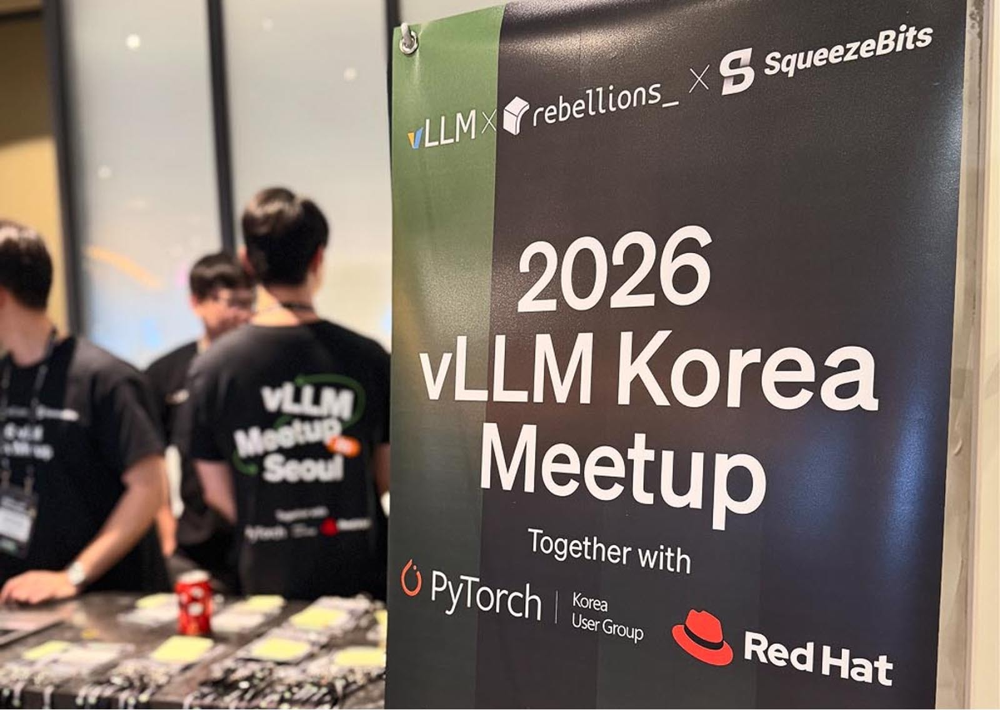
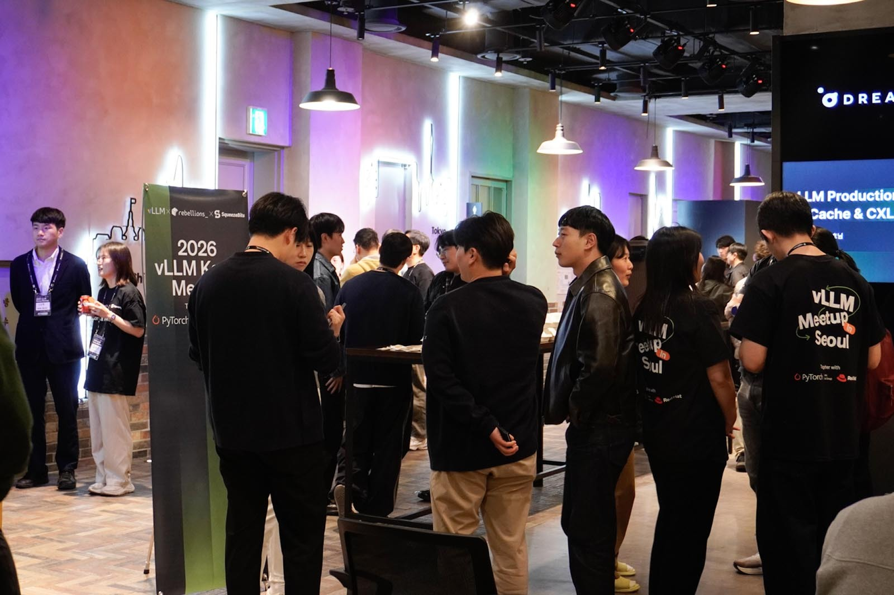
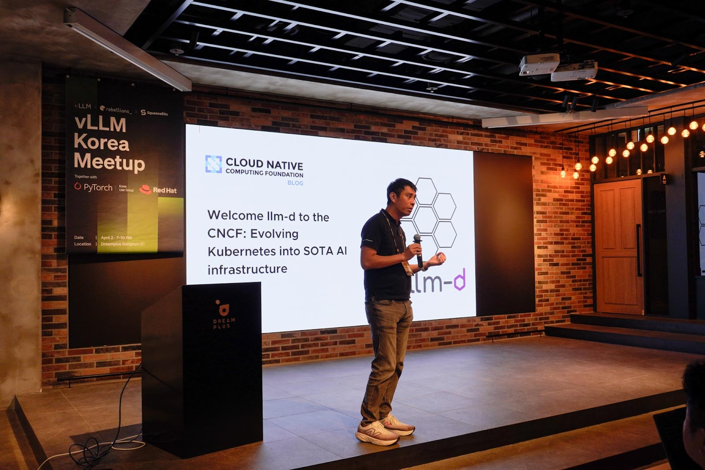
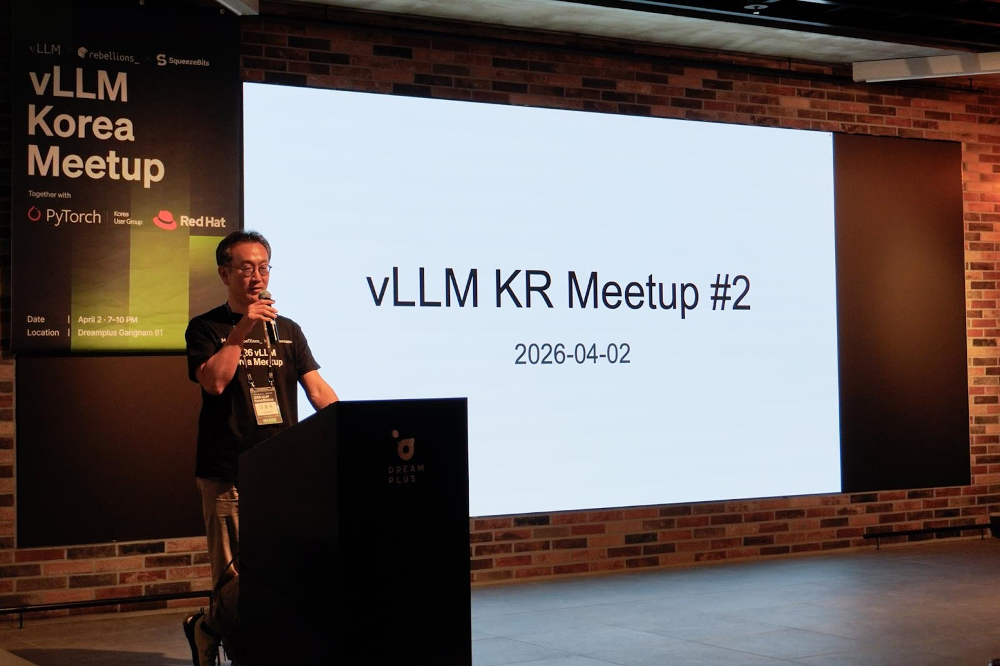
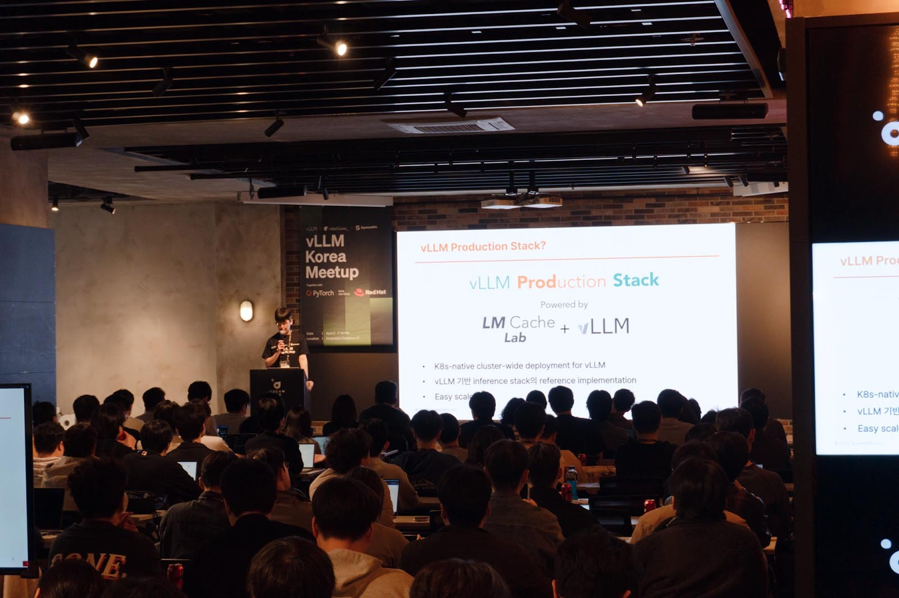
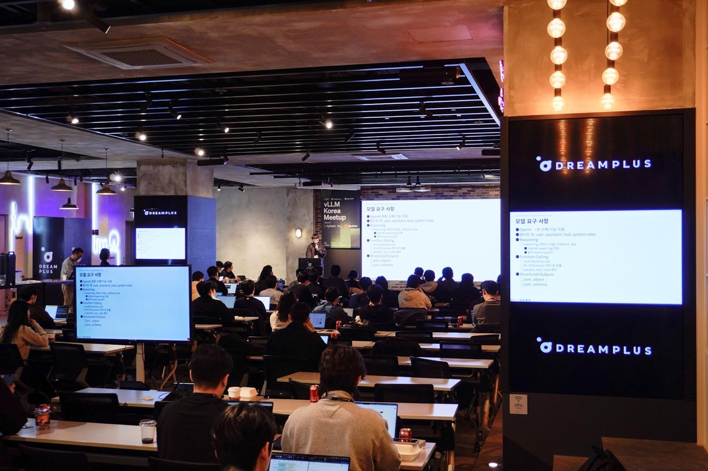

# 韩国 Meetup 2026：V1、playground、NPU 插件、Omni 拆管线

英文对照：`en/vllm/blog/serving/korea-meetup-2026.md`  
原文：https://vllm.ai/blog/2026-04-14-vllm-korea-meetup-2026  
首尔，2026-04-02。Rebellions / SqueezeBits / Red Hat APAC。

V0→V1、async scheduling、streaming、Semantic Router、vLLM-Omni。Li Ming 推 playground（140+ 旋钮的 GUI）。Rebellions：`vllm-rbln` 已有 paged attention / continuous batch，投机、分布式 KV、P/D 当时还在做。SqueezeBits 讲 production-stack。XCENA：LMCache + CXL 当 KV 扩展层。Upstage：chat template / parser 才是「能上线」。三星：内网 GPU + air-gap，4000+ 员工。NAVER HyperCLOVA Omni：encoder/LLM/decoder 拆开，vision decoder 是延迟大头，sequence parallel + kernel 约 **3×**。社区纪要，不是 kernel 论文。2025 场见 [korea-meetup-2025](korea-meetup-2025.md)。

本地图（原文版权仍归原站；学习对照用）：

