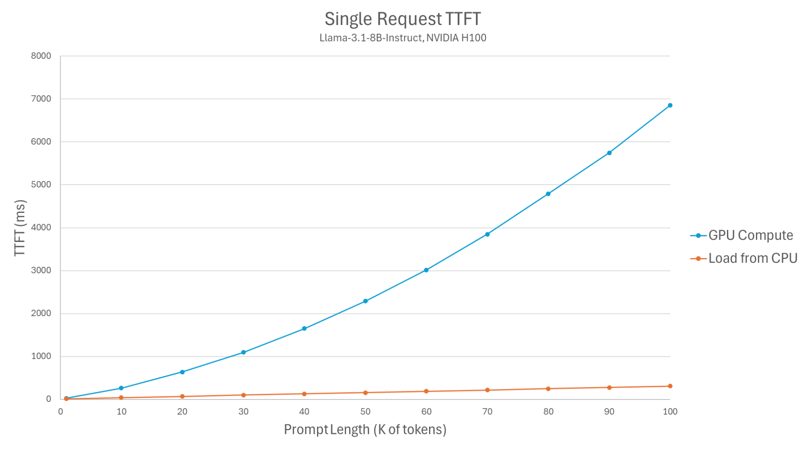
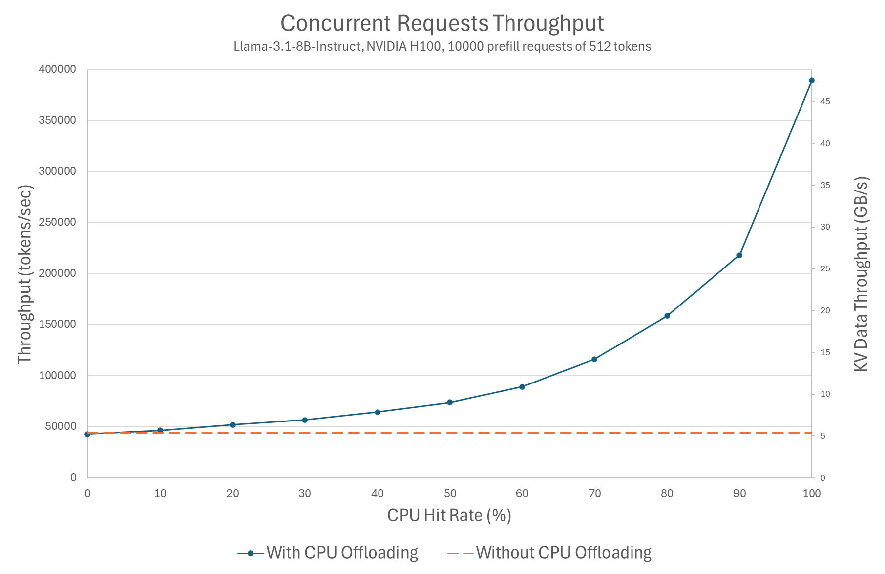
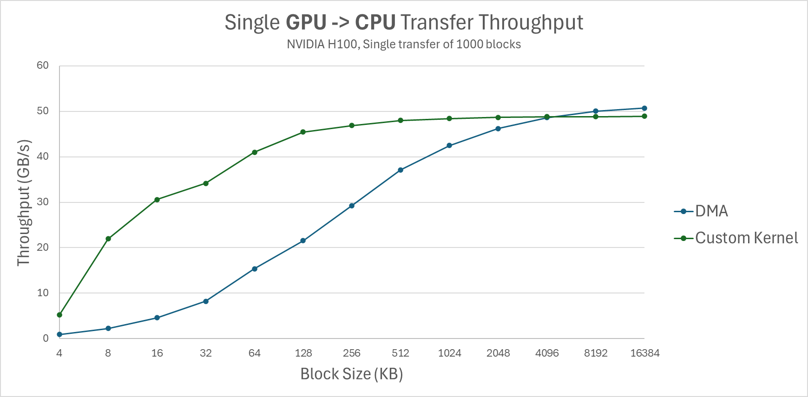
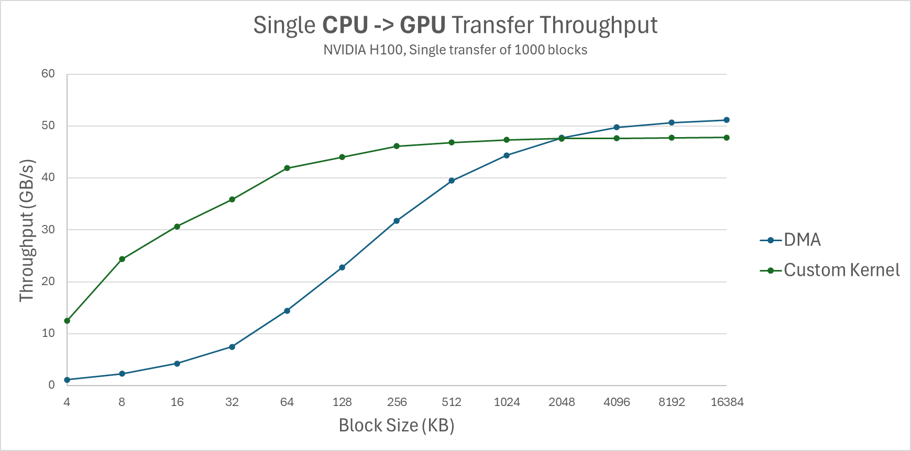
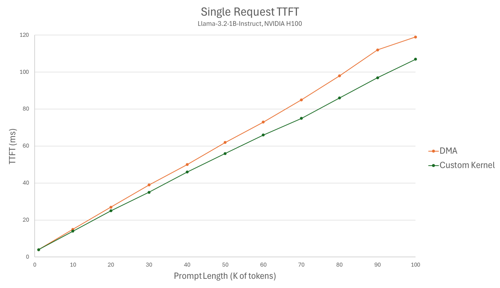
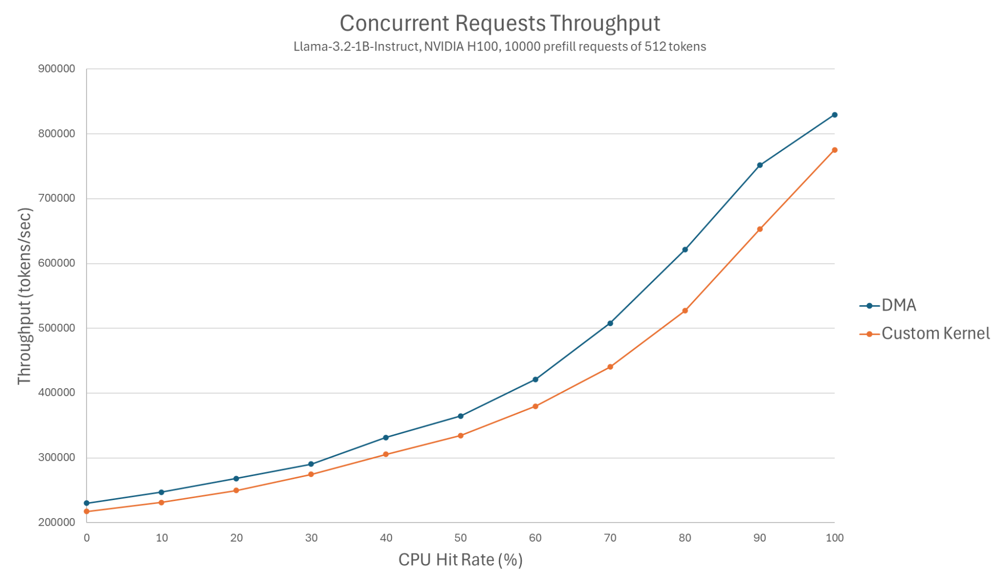

# KV Offloading Connector：抢占时把记忆寄存在 CPU

英文对照：[en/vllm/blog/serving/kv-offload.md](../../../../en/vllm/blog/serving/kv-offload.md)  
原文：https://vllm.ai/blog/2026-01-08-kv-offloading-connector  
2026-01-08。随 vLLM 0.11.0 进来；0.12.0 因物理块变大，性能跳了一档。和 [Mooncake](mooncake.md) 同一扇 **KVConnector** 门：一个寄存在本机 DRAM，一个放到集群池。

Prefix 命中：少算 prefill，TTFT 降，GPU 也能接更多人。没有共享前缀时，offload 仍有用——batch 把 GPU KV 挤满，引擎会抢占、丢掉 KV，回头再 **RECOMPUTE**。先卸到 CPU，再请回来，重算那笔可以不付。CPU RAM 几乎处处都有、比 HBM 大、PCIe 往返相对外置存储又近，还适合当再往盘上卸的中转。


本地图（原文版权仍归原站；学习对照用）：













## 异步 Connector

早年 Connector 是同步的：搬 KV 时引擎卡住，下一批进不来。0.9.0 起异步。Offloading connector 走这条路，backend 可插拔，自带 CPU backend。

较新的旗标（文中指望进 0.14.0 的 PR #24498）：

```bash
--kv_offloading_backend native --kv_offloading_size <size_in_GB>
```

更早的写法：

```bash
--kv-transfer-config '{"kv_connector":"OffloadingConnector","kv_role":"kv_both","kv_connector_extra_config":{"num_cpu_blocks": <N>}}'
```

## 成绩（Llama-3.1-8B-Instruct、H100）

单条 prefill：从 CPU 加载 KV，相对 GPU 重算，TTFT 大约 **2–22×**（随 prompt 变长）。Offload 本身异步，cache miss 几乎不伤 TTFT。

一万条互不共享的 512-token prefill、关掉 GPU prefix cache：吞吐随 CPU 命中率涨，最多大约 **9×**——比单条 TTFT 的 2× 更大，因为省下的是整卡的算力。0.12.0 同模型同卡再测：TTFT 最多约 **4×** 更好，吞吐约 **5×**。0.14.0 还想让被抢占的请求能从 CPU 请回（PR #29870），并修 offload 与计算的竞态（#31341）。

## 为什么要从 DMA，以及为什么要改布局

CPU backend 用 `cudaMemcpyAsync`（DMA），少占 SM，才能和 forward 重叠。DMA 喜欢大块连续拷贝。vLLM 默认 16 token 一块；按层、再按 K/V 切开以后，物理块只有几 KB，DMA 就输给「用 GPU 核拷 16 字节」的自定义 kernel。他们把各层 KV 收成**一块连续物理块**，有效块大约变成 `2 × num_layers` 倍：Llama-3.1-8B 从 32 KB 到 **2 MB**；70B 从 8 KB 到 1.25 MB。常见模型落在 **0.5–2 MB**。混合模型当时还没为这条 connector 优化。

端到端用最亏 DMA 的 0.5 MB 模型（Llama-3.2-1B）：单条 TTFT 自定义 kernel 略快（1K prompt 差不到 1 ms，90K 大约 15 ms）；并发时 DMA 更好——命中 0% 时自定义 kernel 甚至比**完全不开 offload** 还慢约 6%，因为它跟计算抢 SM。Llama-3.1-8B 上 DMA 吞吐最多大约领先 kernel **32%**，TTFT 打平。所以改布局不是为了好看，是为了让 DMA 配得上这块活。

下一步：CPU 当外置存储的中间层——Mooncake / PegaFlow 从另一头走同一扇门。
