# 大规模 serving：DeepSeek @ 2.2k tok/s/H200

英文对照：[en/vllm/blog/serving/large-scale.md](../../../../en/vllm/blog/serving/large-scale.md)  
原文：https://vllm.ai/blog/2025-12-17-large-scale-serving  
2025-12-17。v0.11.0 拆掉 V0 最后一行——完整迁到 [V1](../architecture/v1-alpha.md)。社区当时（2025-12-18）**1969** 位贡献者、一个月 **950+** commit。还写了进 [SemiAnalysis InferenceMax](https://inferencemax.semianalysis.com/)，以及 Meta、LinkedIn、Red Hat、Mistral、Hugging Face 的生产信任。Coreweave H200 + IB ConnectX-7，生产形态多节点，持续约 **2.2k tokens/s/H200**（早先约 1.5k）。增益他们点名：kernel（silu-mul-quant 融合、Cutlass QKV、TP attention 修复）+ Decode 上的 **DBO**。数字是这一天、这一套配方上的。

优化清单读起来像把 `optimization.md` 和 Anatomy 后半本叠在一起：async scheduling、**dual-batch overlap (DBO)**、P/D 分离、CUDA graph `FULL_AND_PIECEWISE`（`-O2` 那档）、DeepGEMM 默认、DeepEP、**EPLB**、DeepSeek-R1 的 SiLU kernel。每一项单独拧都有效；叠在 MoE 上才叫 Wide-EP。

本地图（原文版权仍归原站；学习对照用）：

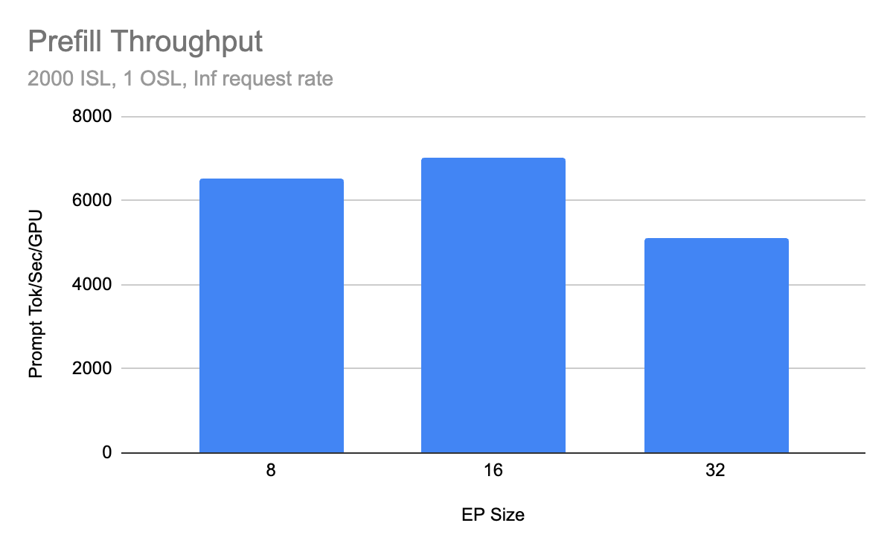

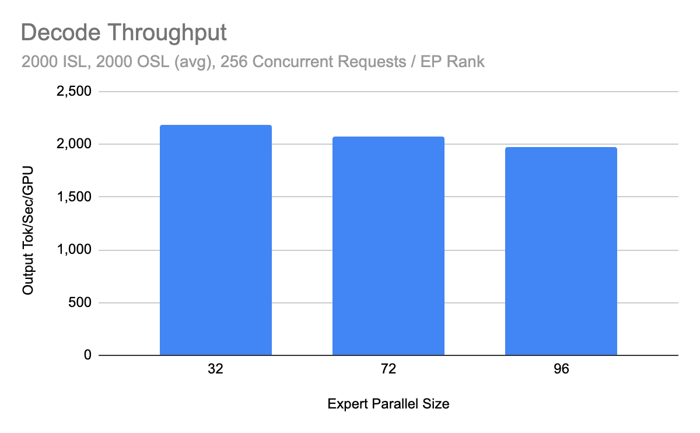

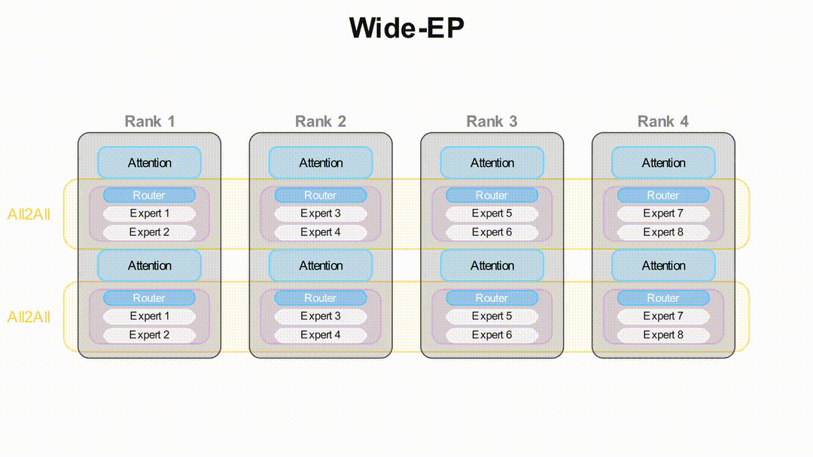

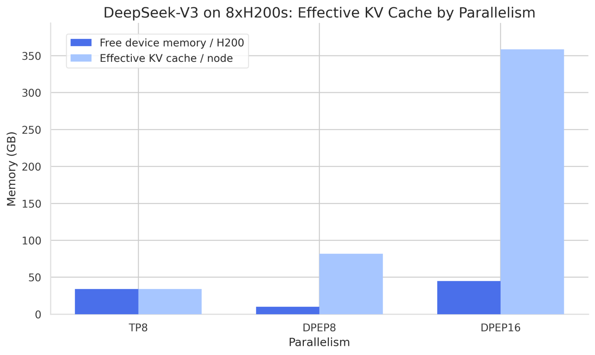

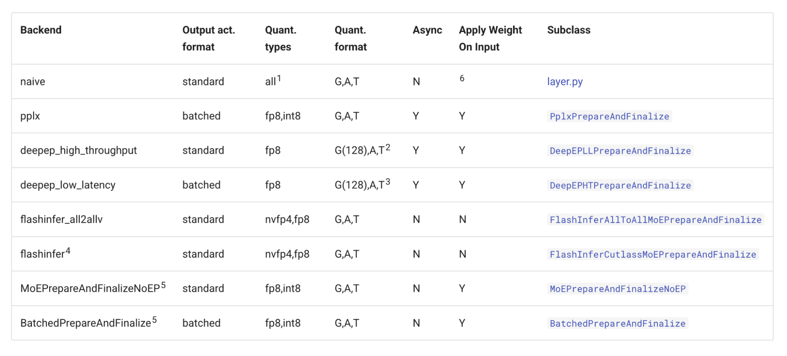

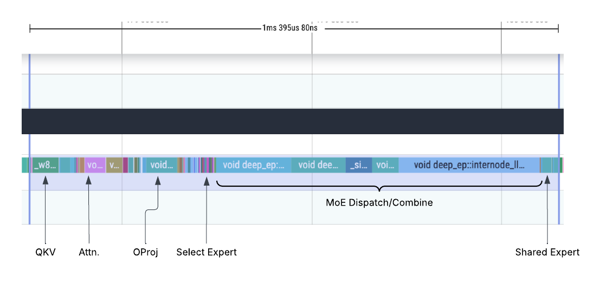

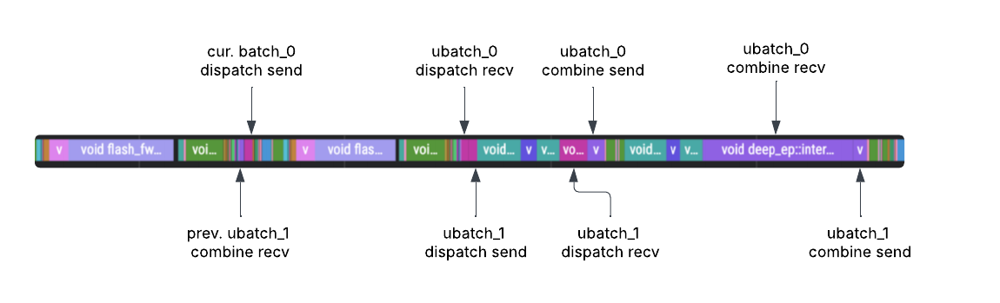

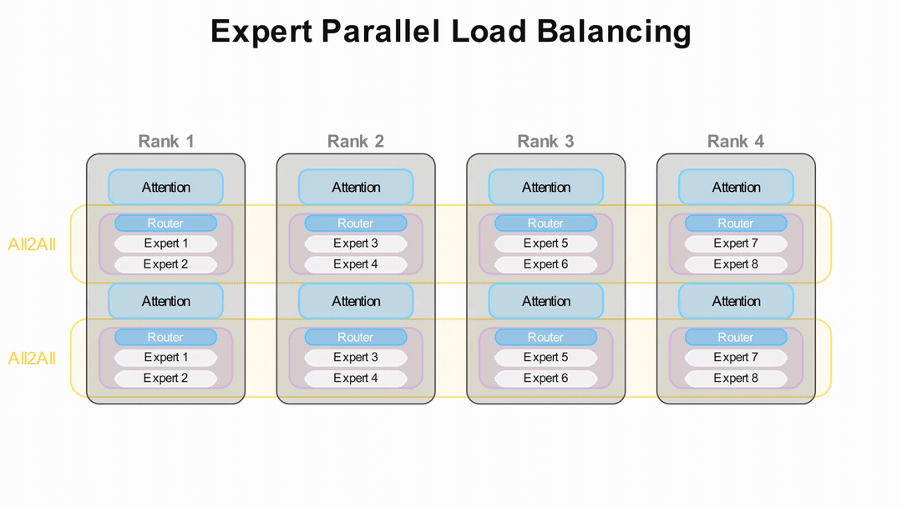

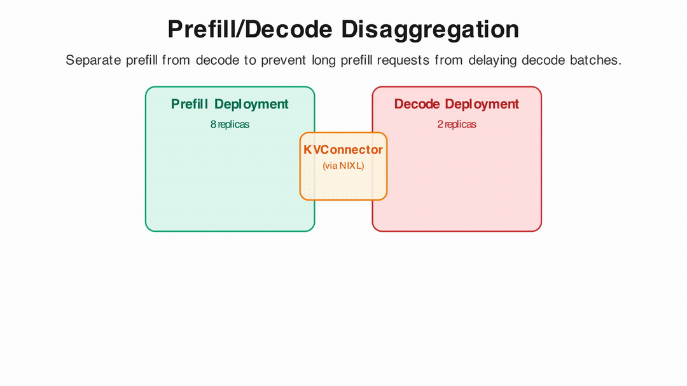

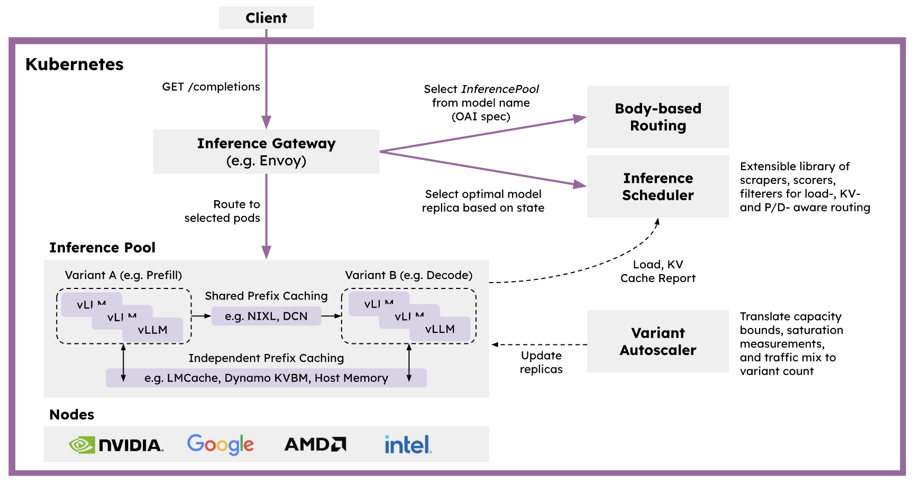

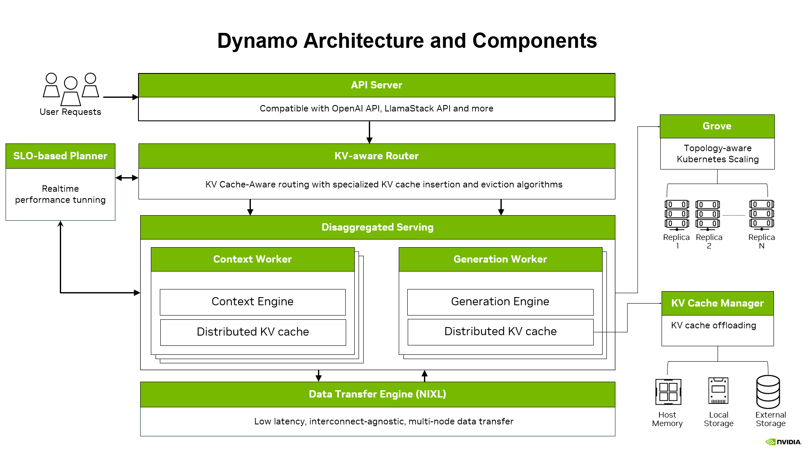

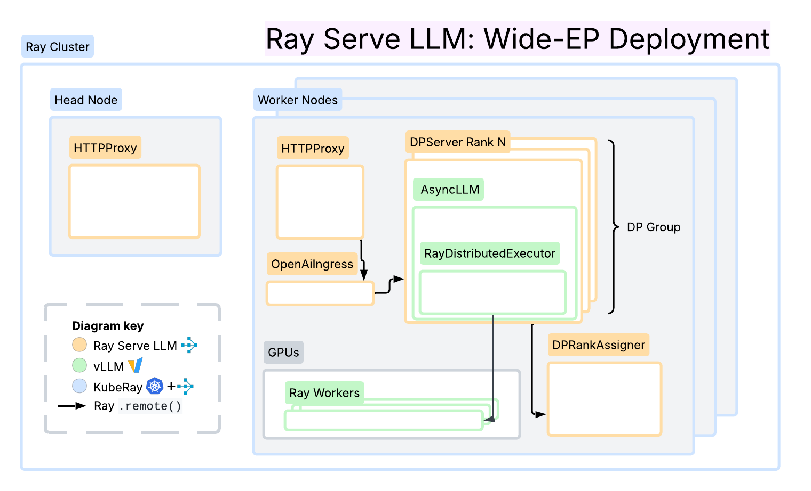

## Wide-EP

DeepSeek-R1：671B 里每步只活 **37B**。MLA 不适合纯 TP——latent 投影会在每个 shard 上复制，KV 的房子立刻变窄，和 [分布式推理](distributed-inference.md) 里「TP 给 KV 腾房间」那张超线性图反过来。`--enable-expert-parallel`：专家在 rank 间共享，token 被路由到该去的专家。Wide-EP = EP + **数据并行**（`mp` 或 `ray`）。DP 下 attention 各管各的 latent，有效 batch 才能涨。文中对照：TP 切 DeepSeek-V3 时每张 H200 大约还剩 **34GB**，但 MLA 仍会在每个 shard 上复制 latent——所以不该再加 TP。通信用 DeepEP all-to-all（高吞吐 / 低延迟两套，还有 Perplexity MoE、NCCL AllGather-ReduceScatter）。文档：vLLM MoE kernel。

口诀：密层（attention）走 DP Attention，稀疏层走 EP。组大小是 `DP × TP`。后来的 [Elastic EP](elastic-ep.md) 动的就是这个 DP 个数。

## Dual-batch overlap

`--enable-dbo`。DeepSeek 的微批策略。先 `all_reduce` 决定值不值得切微批（`--dbo-decode-token-threshold`）；主线程拉起做 CUDA graph capture 的 worker；模块化 MoE all-to-all 基类在 GPU 活还没干完时 **yield**。两个 worker 交错：一个在等 MoE dispatch 时把 GPU 借给另一个。EP 度越高，通信越胖，这刀越有用。Elastic EP 当时**还不支持 DBO**——弹性缩容和微批重叠还没焊在一起。

## EPLB

训练时专家负载是匀的；线上不是。有的专家被问得勤，有的在睡觉。`--enable-eplb`：滑动窗口统计每 token 负载，到点算新的 logical→physical 映射，**热替换权重、不重启**。DeepSeek 的 hierarchical / global 策略。Elastic EP 的 scale-up 在切换拓扑之后立刻做一次 reshuffle；scale-down 必须**先** reshuffle，免得要离开的 rank 还握着专家。

## 为什么 MoE 更需要 P/D 分离

专家散在各 rank，一条 Prefill 可能拖住**整组** EP 的 combine（没接到活的 rank 也要 dummy step）。compute-bound 的阅读和 memory-bound 的说话拆开，还能让 DeepEP 分别走高吞吐 / 低延迟 kernel。DistServe（Hao AI Lab, 2024）是这条路的名字。[Router](router.md) 是把请求送进对的那一组；这里是解释**为什么 MoE 上不拆会痛**。

## 三条部署走廊

- **llm-d**：K8s-native，「Wide EP well-lit path」可复现文中数字。
- **Dynamo**：KV-aware 路由、KV Block Manager、Planner；vLLM + wide-EP 是一等公民。
- **Ray Serve LLM**：P/D、DP attention、prefix 亲和路由；NIXL / LMCache；和 Ray 的数据 / RL 栈接在一起。Elastic EP 也依赖 Ray DP backend。

当时路线图：弹性 EP、长上下文、CPU 传 KV、确定性 / batch invariance、更大 MoE 融合、FlashInfer SwapAB、P/D 两侧独立 TP、GB200。活页：roadmap.vllm.ai。弹性 EP 和 Mooncake（CPU/远端传 KV）在几个月后各自成篇。

必读 serving 线在这里收束成一张地图：先会切卡（distributed），再有集群盘子（stack / AIBrix），再有认得 KV 和 P/D 的路由器，多模态再拆编码器，Wide-EP 把 DeepSeek 那样的稀疏 MoE 铺到多机——然后 [Mooncake](mooncake.md) 让跨实例的前缀不必重读，[Elastic EP](elastic-ep.md) 让铺开的宽度不必为了加减卡而重启。CATALOG 里还有几十篇 day-0 模型文，不是这条主线。
