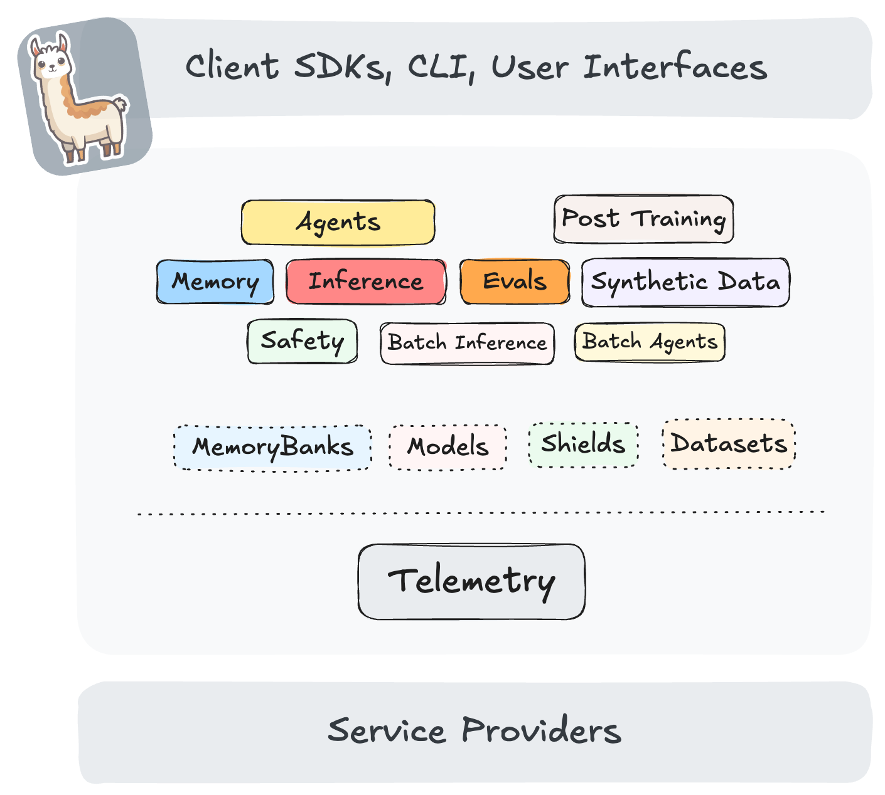

# Llama Stack × vLLM：inference 是可换的 Provider，不是另一套引擎

英文对照：[en/vllm/blog/serving/llama-stack.md](../../../../en/vllm/blog/serving/llama-stack.md)  
原文：https://vllm.ai/blog/2025-01-27-intro-to-llama-stack-with-vllm  
2025-01-27。署名 **Yuan Tang (Red Hat) and Ashwin Bharambe (Meta)**。演示：Llama-3.2-1B **CPU** 容器。Stack：[meta-llama/llama-stack](https://github.com/meta-llama/llama-stack)。当时文档：[remote vLLM distribution](https://llama-stack.readthedocs.io/en/latest/distributions/self_hosted_distro/remote-vllm.html)、[vLLM OpenAI-compatible server](https://docs.vllm.ai/en/latest/getting_started/quickstart.html#openai-completions-api-with-vllm)。容器亲戚：[docker-model-runner.md](docker-model-runner.md)。教程是 **2025-01** 的 `llama stack build` YAML，API 会漂。要点：应用生命周期同一套 API，底下引擎是可换的 **Provider**，不是第二套引擎。

本地图（原文版权仍归原站；学习对照用）：



## Llama Stack 是什么

Llama Stack 把生成式 AI 应用需要的核心积木写成可互操作的 API，每块都有 Service Provider。预打包的 **distribution** 可以在本地、手机/桌面、机房、公有云上跑——**同一套 API**，同一套开发体验。

页上点名的模型：Llama 3.3，以及 Llama Guard 这类专用模型。安全、agent、向量仍是 Stack **别的** provider。每种 API 实现叫 **Provider**；用户在配置里换。vLLM 是 **inference** API 背后的高性能实现。

## vLLM Inference Provider

两种：

1. [Remote](https://llama-stack.readthedocs.io/en/latest/distributions/self_hosted_distro/remote-vllm.html) — `remote::vllm`，打 vLLM 的 OpenAI 兼容 `/v1`。
2. [Inline](https://github.com/meta-llama/llama-stack/tree/main/llama_stack/providers/inline/inference/vllm) — 和 Stack server 同进程。

这篇教程走 **remote**。

## 教程

### 前置

Linux；用 CLI 下模型要 [Hugging Face CLI](https://huggingface.co/docs/huggingface_hub/main/en/guides/cli)；Podman 或 Docker（`llama stack` CLI 看 `CONTAINER_BINARY`）；Kubernetes 用 [Kind](https://kind.sigs.k8s.io/)；Python 环境用 [Conda](https://github.com/conda/conda)。

下面的路径是 **原文教程** 的草稿目录（`/tmp/test-vllm-llama-stack`），不是某台机器的 home。

## 用容器上手

### 起 vLLM Server

需要 Hugging Face 对 [`meta-llama/Llama-3.2-1B-Instruct`](https://huggingface.co/meta-llama/Llama-3.2-1B-Instruct) 的权限，再加 token。

```bash
mkdir /tmp/test-vllm-llama-stack
huggingface-cli login --token <YOUR-HF-TOKEN>
huggingface-cli download meta-llama/Llama-3.2-1B-Instruct \
  --local-dir /tmp/test-vllm-llama-stack/.cache/huggingface/hub/models/Llama-3.2-1B-Instruct
```

从源码打 vLLM **CPU** 镜像（演示）。别的硬件镜像见 [installation](https://docs.vllm.ai/en/latest/getting_started/installation.html)。

```bash
git clone git@github.com:vllm-project/vllm.git /tmp/test-vllm-llama-stack
cd /tmp/test-vllm-llama-stack/vllm
podman build -f Dockerfile.cpu -t vllm-cpu-env --shm-size=4g .
```

```bash
podman run -it --network=host \
   --group-add=video \
   --ipc=host \
   --cap-add=SYS_PTRACE \
   --security-opt seccomp=unconfined \
   --device /dev/kfd \
   --device /dev/dri \
   -v /tmp/test-vllm-llama-stack/.cache/huggingface/hub/models/Llama-3.2-1B-Instruct:/app/model \
   --entrypoint='["python3", "-m", "vllm.entrypoints.openai.api_server", "--model", "/app/model", "--served-model-name", "meta-llama/Llama-3.2-1B-Instruct", "--port", "8000"]' \
    vllm-cpu-env
```

冒烟：

```bash
curl http://localhost:8000/v1/models

curl http://localhost:8000/v1/completions \
    -H "Content-Type: application/json" \
    -d '{
        "model": "meta-llama/Llama-3.2-1B-Instruct",
        "prompt": "San Francisco is a",
        "max_tokens": 7,
        "temperature": 0
    }'
```

### 起 Llama Stack Server

```bash
git clone git@github.com:meta-llama/llama-stack.git /tmp/test-vllm-llama-stack/llama-stack
cd /tmp/test-vllm-llama-stack/llama-stack
conda create -n stack python=3.10
conda activate stack
pip install .
```

构建配置——inference 是 `remote::vllm`；safety / agents / vectors 等仍是 Stack 自己的 inline provider：

```
cat > /tmp/test-vllm-llama-stack/vllm-llama-stack-build.yaml << "EOF"
name: vllm
distribution_spec:
  description: Like local, but use vLLM for running LLM inference
  providers:
    inference: remote::vllm
    safety: inline::llama-guard
    agents: inline::meta-reference
    vector_io: inline::faiss
    datasetio: inline::localfs
    scoring: inline::basic
    eval: inline::meta-reference
    post_training: inline::torchtune
    telemetry: inline::meta-reference
image_type: container
EOF

export CONTAINER_BINARY=podman
LLAMA_STACK_DIR=. PYTHONPATH=. python -m llama_stack.cli.llama stack build \
  --config /tmp/test-vllm-llama-stack/vllm-llama-stack-build.yaml \
  --image-name distribution-myenv
```

把生成的 `vllm-run.yaml` 改成 `/tmp/test-vllm-llama-stack/vllm-llama-stack-run.yaml`，`models` 字段：

```
models:
- metadata: {}
  model_id: ${env.INFERENCE_MODEL}
  provider_id: vllm
  provider_model_id: null
```

跑：

```bash
export INFERENCE_ADDR=host.containers.internal
export INFERENCE_PORT=8000
export INFERENCE_MODEL=meta-llama/Llama-3.2-1B-Instruct
export LLAMA_STACK_PORT=5000

LLAMA_STACK_DIR=. PYTHONPATH=. python -m llama_stack.cli.llama stack run \
--env INFERENCE_MODEL=$INFERENCE_MODEL \
--env VLLM_URL=http://$INFERENCE_ADDR:$INFERENCE_PORT/v1 \
--env VLLM_MAX_TOKENS=8192 \
--env VLLM_API_TOKEN=fake \
--env LLAMA_STACK_PORT=$LLAMA_STACK_PORT \
/tmp/test-vllm-llama-stack/vllm-llama-stack-run.yaml
```

或者同样环境的 `podman run`：

```
podman run --security-opt label=disable -it --network host \
  -v /tmp/test-vllm-llama-stack/vllm-llama-stack-run.yaml:/app/config.yaml \
  -v /tmp/test-vllm-llama-stack/llama-stack:/app/llama-stack-source \
--env INFERENCE_MODEL=$INFERENCE_MODEL \
--env VLLM_URL=http://$INFERENCE_ADDR:$INFERENCE_PORT/v1 \
--env VLLM_MAX_TOKENS=8192 \
--env VLLM_API_TOKEN=fake \
--env LLAMA_STACK_PORT=$LLAMA_STACK_PORT \
--entrypoint='["python", "-m", "llama_stack.distribution.server.server", "--yaml-config", "/app/config.yaml"]' \
localhost/distribution-myenv:dev
```

客户端：

```bash
llama-stack-client --endpoint http://localhost:5000 inference chat-completion \
  --message "hello, what model are you?"
```

Python：

```python
import os
from llama_stack_client import LlamaStackClient

client = LlamaStackClient(base_url=f"http://localhost:{os.environ['LLAMA_STACK_PORT']}")
models = client.models.list()
print(models)

response = client.inference.chat_completion(
    model_id=os.environ["INFERENCE_MODEL"],
    messages=[
        {"role": "system", "content": "You are a helpful assistant."},
        {"role": "user", "content": "Write a haiku about coding"}
    ]
)
print(response.completion_message.content)
```

页上 `models.list()` 样例：`provider_id='vllm'`，identifier `meta-llama/Llama-3.2-1B-Instruct`。那首 haiku 是演示补全，不是质量声明。

## 部署到 Kubernetes

演示用 Kind：

```bash
kind create cluster --image kindest/node:v1.32.0 --name llama-stack-test
```

vLLM 做成 Pod + Service（把 `<YOUR-HF-TOKEN>` 换成自己的；原文 Secret 的 `data.token` 就是这个占位符）：

```
cat <<EOF |kubectl apply -f -
apiVersion: v1
kind: PersistentVolumeClaim
metadata:
  name: vllm-models
spec:
  accessModes:
    - ReadWriteOnce
  volumeMode: Filesystem
  resources:
    requests:
      storage: 50Gi
---
apiVersion: v1
kind: Secret
metadata:
  name: hf-token-secret
type: Opaque
data:
  token: "<YOUR-HF-TOKEN>"
---
apiVersion: v1
kind: Pod
metadata:
  name: vllm-server
  labels:
    app: vllm
spec:
  containers:
  - name: llama-stack
    image: localhost/vllm-cpu-env:latest
    command:
        - bash
        - -c
        - |
          MODEL="meta-llama/Llama-3.2-1B-Instruct"
          MODEL_PATH=/app/model/$(basename $MODEL)
          huggingface-cli login --token $HUGGING_FACE_HUB_TOKEN
          huggingface-cli download $MODEL --local-dir $MODEL_PATH --cache-dir $MODEL_PATH
          python3 -m vllm.entrypoints.openai.api_server --model $MODEL_PATH --served-model-name $MODEL --port 8000
    ports:
      - containerPort: 8000
    volumeMounts:
      - name: llama-storage
        mountPath: /app/model
    env:
      - name: HUGGING_FACE_HUB_TOKEN
        valueFrom:
          secretKeyRef:
            name: hf-token-secret
            key: token
  volumes:
  - name: llama-storage
    persistentVolumeClaim:
      claimName: vllm-models
---
apiVersion: v1
kind: Service
metadata:
  name: vllm-server
spec:
  selector:
    app: vllm
  ports:
  - port: 8000
    targetPort: 8000
  type: NodePort
EOF
```

日志（`kubectl logs vllm-server`；下模型可能要几分钟）：Uvicorn 在 `http://0.0.0.0:8000`。

把前面的 run YAML 拷成 `/tmp/test-vllm-llama-stack/vllm-llama-stack-run-k8s.yaml`，改 inference provider。Stack 只要填这个 URL：

```
providers:
  inference:
  - provider_id: vllm
    provider_type: remote::vllm
    config:
      url: http://vllm-server.default.svc.cluster.local:8000/v1
      max_tokens: 4096
      api_token: fake
```

```
cat >/tmp/test-vllm-llama-stack/Containerfile.llama-stack-run-k8s <<EOF
FROM distribution-myenv:dev

RUN apt-get update && apt-get install -y git
RUN git clone https://github.com/meta-llama/llama-stack.git /app/llama-stack-source

ADD ./vllm-llama-stack-run-k8s.yaml /app/config.yaml
EOF
podman build -f /tmp/test-vllm-llama-stack/Containerfile.llama-stack-run-k8s \
  -t llama-stack-run-k8s /tmp/test-vllm-llama-stack
```

```
cat <<EOF |kubectl apply -f -
apiVersion: v1
kind: PersistentVolumeClaim
metadata:
  name: llama-pvc
spec:
  accessModes:
    - ReadWriteOnce
  resources:
    requests:
      storage: 1Gi
---
apiVersion: v1
kind: Pod
metadata:
  name: llama-stack-pod
  labels:
    app: llama-stack
spec:
  containers:
  - name: llama-stack
    image: localhost/llama-stack-run-k8s:latest
    imagePullPolicy: IfNotPresent
    command: ["python", "-m", "llama_stack.distribution.server.server", "--yaml-config", "/app/config.yaml"]
    ports:
      - containerPort: 5000
    volumeMounts:
      - name: llama-storage
        mountPath: /root/.llama
  volumes:
  - name: llama-storage
    persistentVolumeClaim:
      claimName: llama-pvc
---
apiVersion: v1
kind: Service
metadata:
  name: llama-stack-service
spec:
  selector:
    app: llama-stack
  ports:
  - protocol: TCP
    port: 5000
    targetPort: 5000
  type: ClusterIP
EOF
```

原文查日志写的是 `kubectl logs vllm-server`（和 vLLM pod 同名）；Stack 侧预期是 Uvicorn 在端口 **5000**。

```bash
kubectl port-forward service/llama-stack-service 5000:5000
llama-stack-client --endpoint http://localhost:5000 inference chat-completion \
  --message "hello, what model are you?"
```

更多 provider：[Llama Stack docs](https://llama-stack.readthedocs.io)。

## 致谢

Red Hat AI Engineering：vLLM inference provider、修 bug、设计讨论。Meta 的 Llama Stack 团队和 vLLM 团队：评审和修复。
