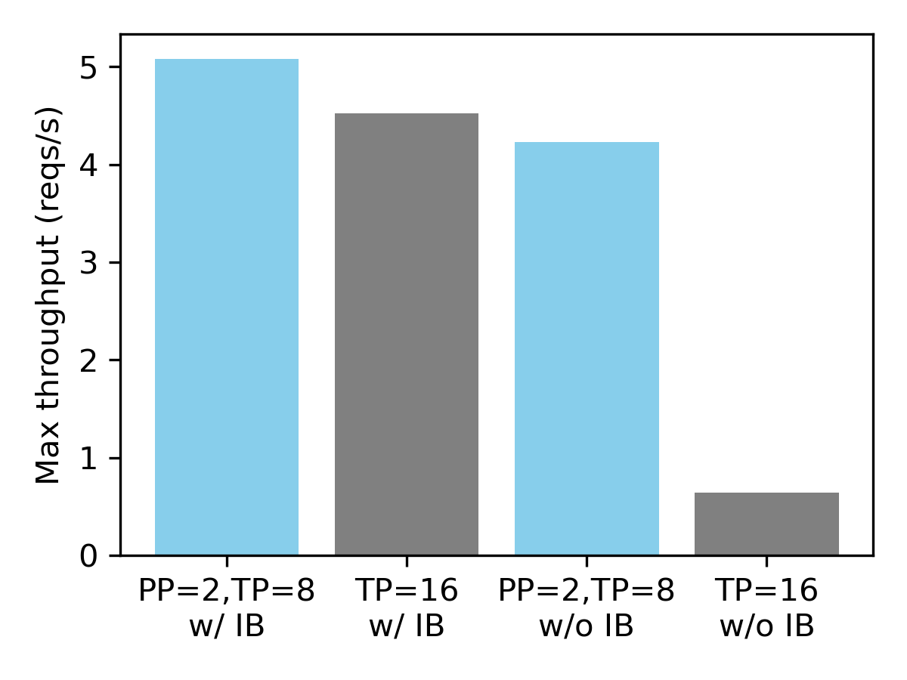

# Llama 3.1：128K 自动 chunked prefill；405B 单机走 FP8，多机优先 PP

英文对照：`en/vllm/blog/serving/llama31.md`  
原文：https://vllm.ai/blog/2024-07-23-llama31  
数字是 **早期** 参考，文内自己说几周内会再涨。

128K 开 chunked prefill：控显存，也减少长 prompt 打断正在 decode 的请求。405B-Instruct-FP8：`--tensor-parallel-size 8` 上 8×H100/A100。他们 1024/128 负载：**2.82 req/s**，输入 **2884.86 tok/s**，输出 **291.53 tok/s**。GSM8K 8-shot CoT：FP8 **95.38%** vs BF16 官方 96.8%。无量化：`--pipeline-parallel-size 2 --tensor-parallel-size 8` 跑 16 卡；没 IB 时 PP+TP 比 16-way TP 约 **6.6×**，有 IB 则接近。也可 8×MI300x / 8×H200 或 CPU offload。当时还在探更多量化和 PP 吞吐。

本地图（原文版权仍归原站；学习对照用）：

