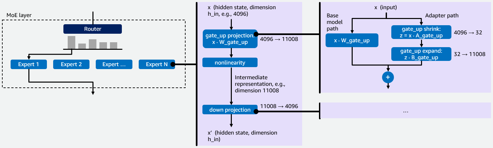
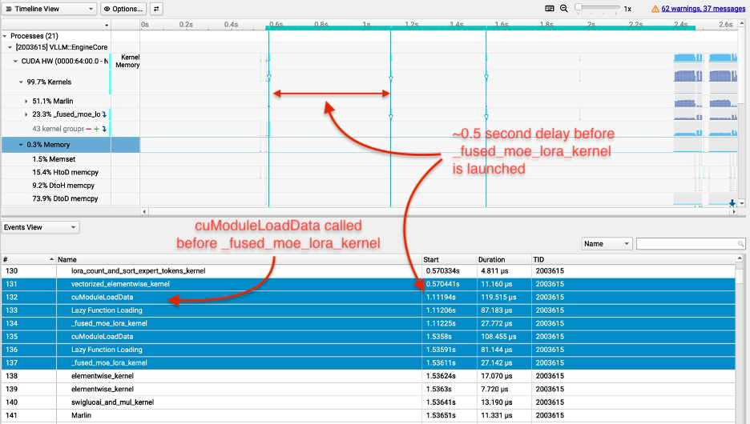
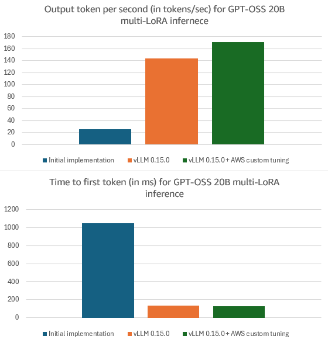

# Multi-LoRA 进 MoE：一只 GPU 侍候多套适配器

英文对照：[en/vllm/blog/serving/multi-lora.md](../../../../en/vllm/blog/serving/multi-lora.md)  
原文：https://vllm.ai/blog/2026-02-26-multi-lora  
2026-02-26。**Danielle Maddix Robinson, Florian Saupe, George Novack, Haipeng Li, Mani Kumar Adari, Xiang Song, Yu Gong（AWS AI Team）**。也发在 [AWS Blogs](https://aws.amazon.com/blogs/machine-learning/efficiently-serve-dozens-of-fine-tuned-models-with-vllm-on-amazon-sagemaker-ai-and-amazon-bedrock/)。开源路径要 **vLLM ≥ 0.15.0**。贯穿例子：**GPT-OSS 20B**。亲戚：[gpt-oss.md](gpt-oss.md)。数字是 **他们** 那条负载（输入 1600 / 输出 600，LoRA rank **32**，**8** 只适配器并行）——不是你的 SLA。

许多定制模型各自流量吃不饱一张卡，GPU 在空转。Multi-LoRA：基座冻住，请求只换小适配器。卖点：五家客户各吃一张卡的 10%，可以挤在 **一张** 卡上。

MoE 家族能用：GPT-OSS、Qwen3-MoE、DeepSeek、Llama MoE。稠密模型也受益（Llama 3.3 70B、Qwen3 32B）。SageMaker AI / Bedrock 上还有 Amazon 调过的配置：相对原版 vLLM 0.15.0，GPT-OSS 20B 他们报 **OTPS +19%**、**TTFT −8%**。

本地图（原文版权仍归原站；学习对照用）：

**Fig 1：** MoE-LoRA，例子里 hidden **4096**、中间维 **11008**、rank **r = 32**。  
**Fig 2：** `do_not_specialize` 之前的 Nsys——每次 `fused_moe_lora` 前都有 `cuModuleLoadData`，Triton 重编译时 GPU 空转。  
**Fig 3：** OTPS / TTFT：(1) 第一版，vLLM **0.11.1rc3**；(2) vLLM **0.15.0**；(3) 0.15.0 + AWS kernel 调参。

## 为什么 MoE LoRA 是四次瘦 GEMM

MoE：路由器把每个 token 送给几只专家。每只专家是 FFN：`gate_up` 撑开（例如 4096 → 11008），`down` 再压回去。vLLM 的 `fused_moe` 把这些当成 Group GEMM——这个 token 分到哪只专家，就做一次 GEMM。

LoRA：冻住 `W`，训 `A`（`h_in × r`）和 `B`（`r × h_out`），`y = xW + xAB`。**Shrink** `z = xA`；**expand** `zB`。rank 通常 **16–64**。

每只专家两条投影 × shrink+expand = **每个专家、每套适配器、每个请求四次** LoRA。一维（`r`）比 hidden / 中间维小 **100–300×**。给方阵准备的 GEMM 最恨这种形状。

他们点名的两个难题：

1. 稠密 Multi-LoRA kernel **不懂 expert routing**
2. 双重稀疏：专家路由 **再加** 这条请求用哪套适配器

办法：在 `fused_moe` 里做 `fused_moe_lora`。同一套逻辑，**网格多一维 = 激活的 LoRA 适配器**。给 `gate_up` 和 `down` 做 shrink/expand GEMM。

## 执行：那次 10× TTFT

第一版 Multi-LoRA 的 TTFT 比 GPT-OSS 20B 基座差 **10×**。Triton 把 **跟输入长度有关** 的量当成编译期常量 → **每个新的 context length 都重编译 `fused_moe_lora`**。Fig 2：`cuModuleLoadData` + 空档。

修法：给那些变量加 Triton `do_not_specialize`——编一次，所有 context length 复用。

## Kernel 上的活

- shrink 上的 **Split-K**（`xA` 是 `1×h_in` × `h_in×r`）：把长长的 K 归约拆给多组线程，atomic add 用 `sem="relaxed"`
- `lora_shrink` 上 **CTA swizzling**，让 `A` 相邻列一起跑（L2 复用）
- **`EVEN_K`**：`K` 能整除 `BLOCK_SIZE_K` 时，去掉多余的 mask / dot
- 把 LoRA+基座的加法融进 **expand** kernel（少 launch）

这些之后：GPT-OSS 20B 上 **144 OTPS**、**135 ms TTFT**（他们那条负载）。

## Amazon 调过的配置

默认 fused-MoE 的 Triton block 不适合 Multi-LoRA（多了 LoRA 下标那一维，再加上双重稀疏）。用户可以加载一文件夹自定义配置（vLLM LoRA Tuning 文档）。他们把 `gate_up_shrink` / `gate_up_expand` / `down_shrink` / `down_expand` 一起调（共享 `BLOCK_SIZE_M`）。SageMaker / Bedrock 会自动加载： **171 OTPS**、**124 ms TTFT**。

## 他们印的总账

开源路径，GPT-OSS 20B，0.15.0 对 0.11.1rc3：**OTPS +454%**，**TTFT −87%**。稠密 Qwen3 32B 的 OTPS 也大约 **+99%**（同一套调参 + CTA swizzle 里的一部分）。Amazon 额外相对 0.15.0：**OTPS +19%**，**TTFT −8%**。

## 致谢

vLLM：Jie Li、Chen Wu、Varun Sundar Rabindranath、Simon Mo、Robert Shaw。AWS：Xin Yang、Sadaf Fardeen、Ashish Khetan、George Karypis。
