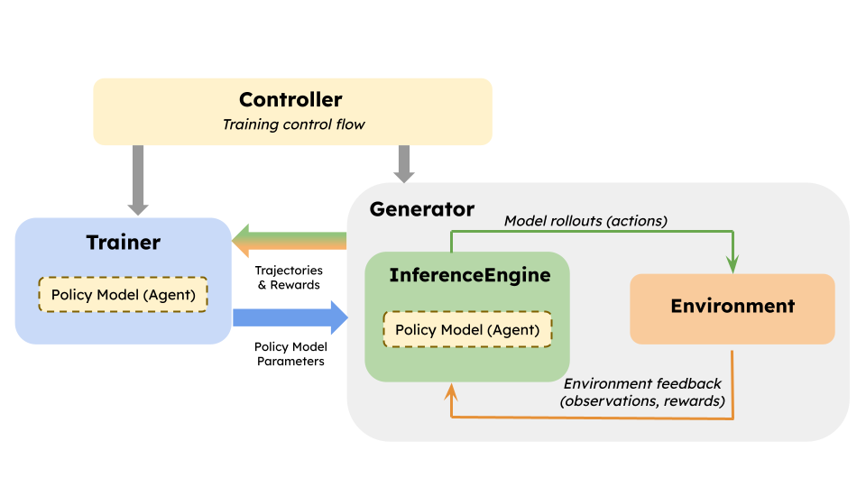
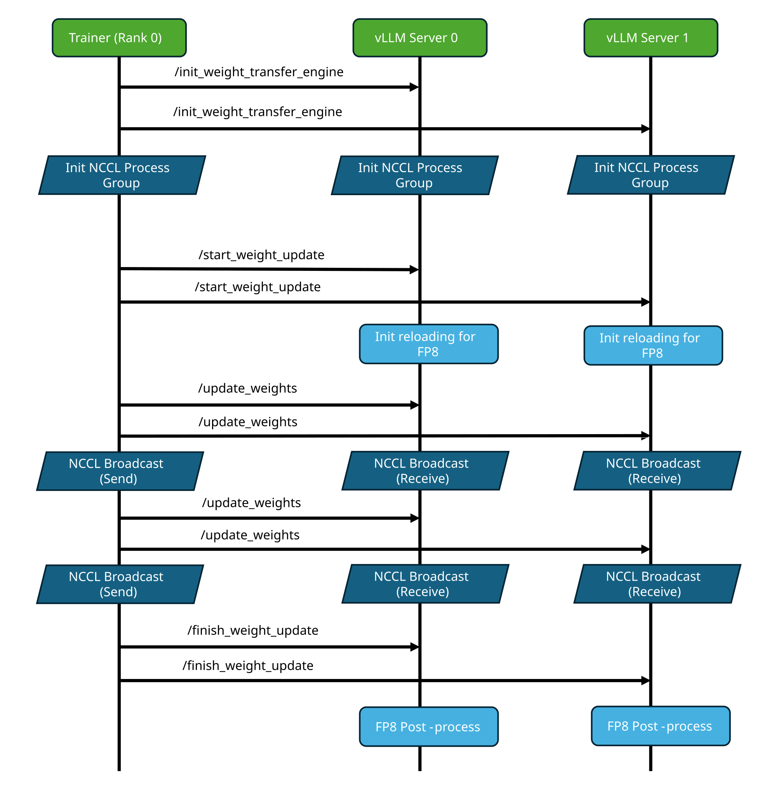
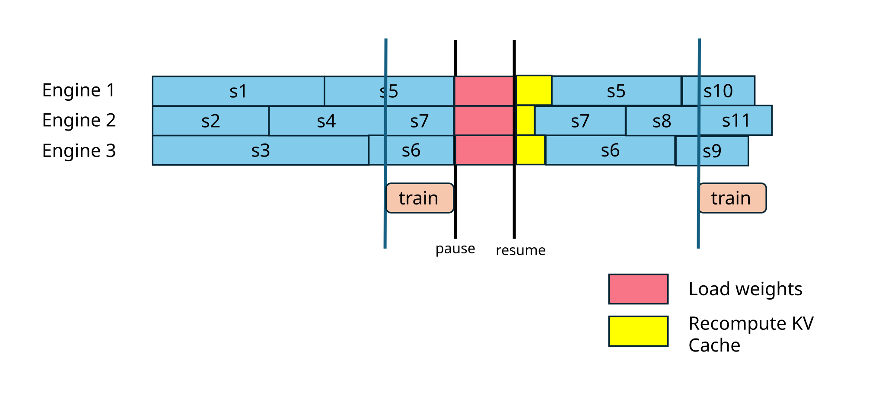
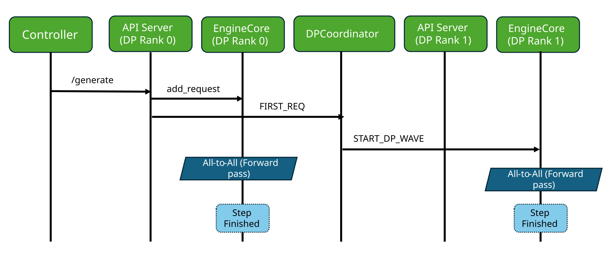
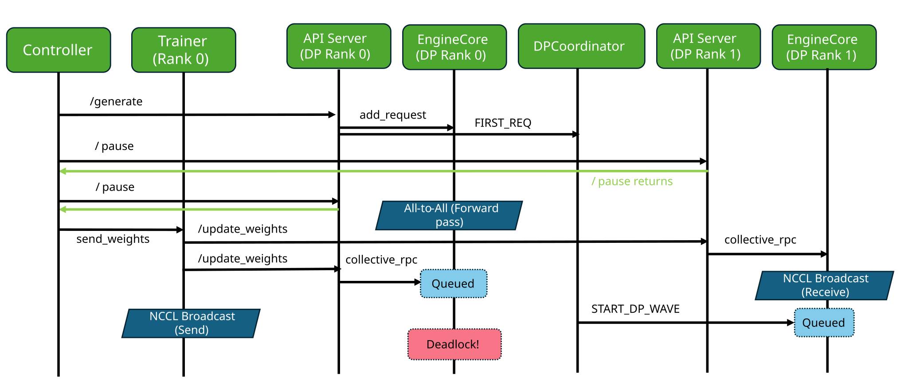
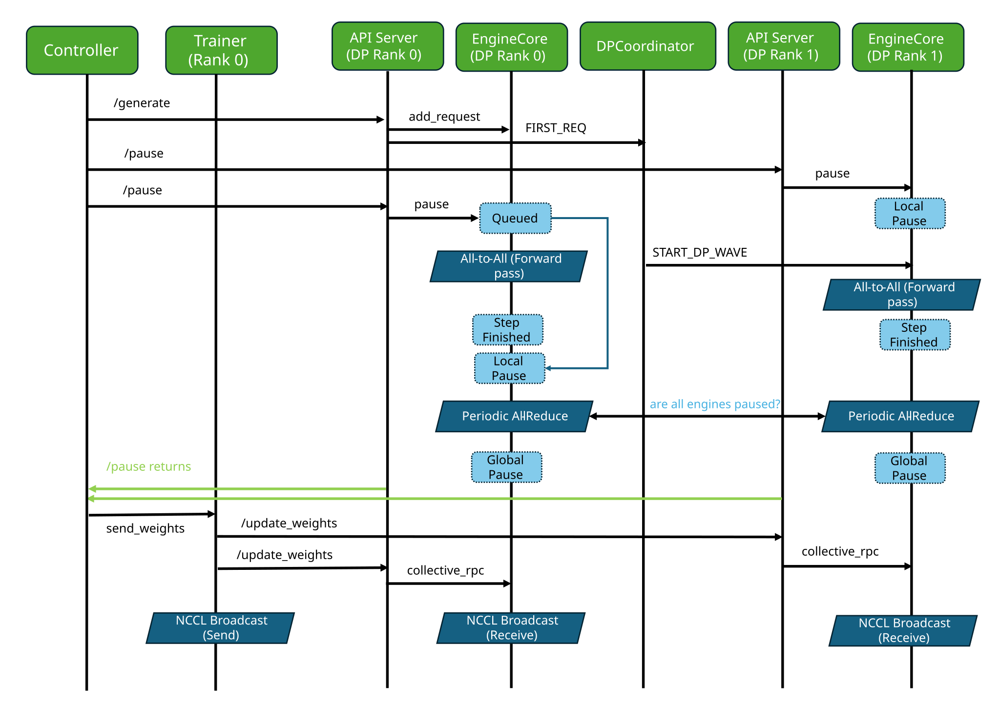
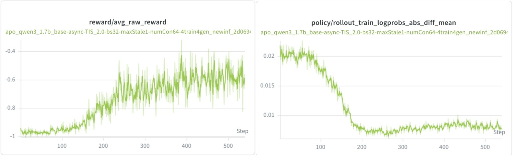
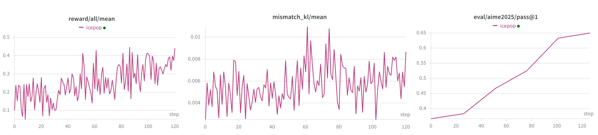

# Native RL APIs：权重同步别再每家写一套 worker 补丁

英文对照：[en/vllm/blog/serving/native-rl.md](../../../../en/vllm/blog/serving/native-rl.md)  
原文：https://vllm.ai/blog/2026-05-28-native-rl-apis  
2026-05-28。文档：Weight transfer、Async RL。例子在 vLLM `examples/rl`。HTTP 端点要 `VLLM_SERVER_DEV_MODE=1`。

两件反复出现的疼：训练↔推理的权重同步每家框架自己补 worker；异步 RL 在 P/D、DPEP 上容易卡死。这篇给原生 API。

本地图（原文版权仍归原站；学习对照用）：

## 权重传送四拍

可插拔 `WeightTransferEngine`：

1. `init_weight_transfer_engine` — 训练与推理建通道，循环开始前一次。
2. `start_weight_update` — 每步（或每几步）准备接收。
3. `update_weights` — 传全部或一部分，可分块多次。
4. `finish_weight_update` — 收尾（量化等后处理）。

后端：NCCL（分卡 broadcast）、CUDA IPC（同设备共享句柄）。都支持 packed，少付序列化。init / update 通常由框架定制传输；start / finish 是控制消息，预处理在 vLLM 里、与传输无关。可 `WeightTransferEngineFactory.register_engine(...)` 注册自己的引擎。Etha 风格的分片传送有原型。后来的 RDT 权重传送是这条路上更大规模的亲戚。

## Pause：多一个 `keep`

异步 RL 要在请求还在飞时换权重。旧两种：`abort`（客户端重试）、`wait`（等说完——不能重叠训练）。新的 **`keep`**：停下调度、保留请求与状态，客户端不必重试，仍能异步。HTTP：`POST /pause`、`POST /resume`。

## DPEP 死锁

`DPCoordinator` 要所有有活的 DP rank 一起 forward。pause 以前记在 `AsyncLLM`，DP 消息在 EngineCore 之间飞，两边对不上：有人已经 pause、有人还在等 all-to-all，NCCL 和对面的 wave 互相等。修法：pause 下沉到 EngineCore；**两阶段**——本地先停调度但仍响应 `START_DP_WAVE` 把这一拍 forward 做完；再在每 32 步的全局 all-reduce 里确认所有 rank 都 local-pause，一起进 global-pause，然后才开始传权重。

SkyRL 用这套 HTTP API 跑 Qwen3-1.7B DAPO。Prime-RL 在 16 台 8×H200 上 GLM-5.1-FP8，2 组 4P+4D、DPEP32，CPU KV offload 每机 1 TB，vllm-router 粘会话，对面 16 台 BF16 训练，100+ step 稳定。

Sleep Mode 让进程活着换模型；这篇让进程活着换**同一模型的新权重**。
