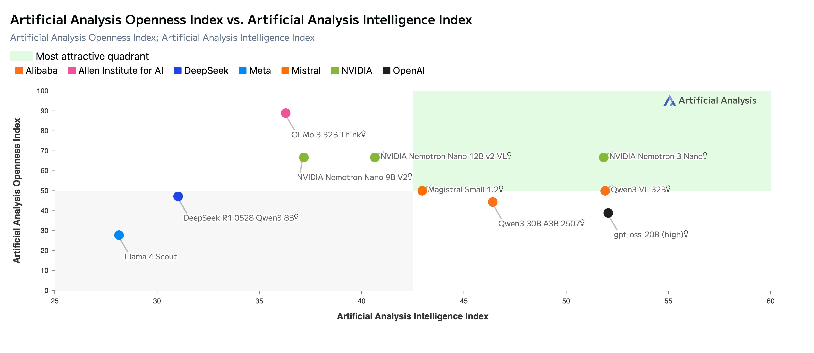
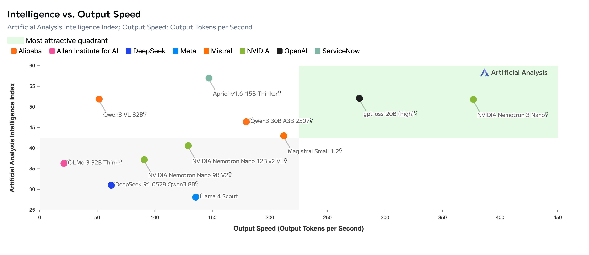
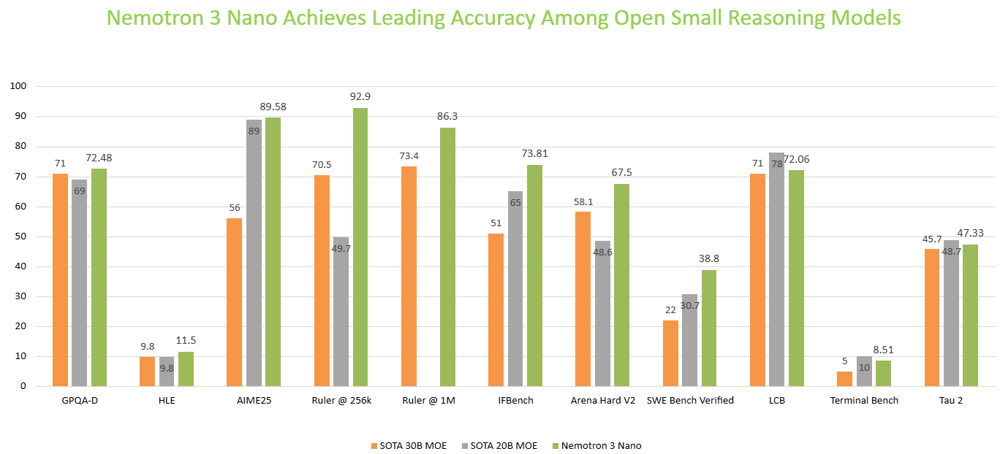

# Nemotron 3 Nano：30B/3B hybrid MoE，Thinking Budget，NVFP4 后补

英文对照：`en/vllm/blog/serving/nemotron-3-nano.md`  
原文：https://vllm.ai/blog/2025-12-15-run-nvidia-nemotron-3-nano  
1M 上下文。2026-01-28 补 NVFP4 + QAD，B200 相对 FP8-H100 他们报 **4×**。

相对 Nano 2：FFN→稀疏 MoE，多数 attention→Mamba-2。他们报最高约 **4×** token 吞吐。当时 `reasoning-parser deepseek_r1`（后来 Nemotron 3 系多用 `nemotron_v3`）。`VLLM_ATTENTION_BACKEND=FLASHINFER`。这篇是 day-0 上手，不是 kernel 深挖。更大号见 [nemotron-3-super](nemotron-3-super.md) / [nemotron-3-ultra](nemotron-3-ultra.md)。

本地图（原文版权仍归原站；学习对照用）：

