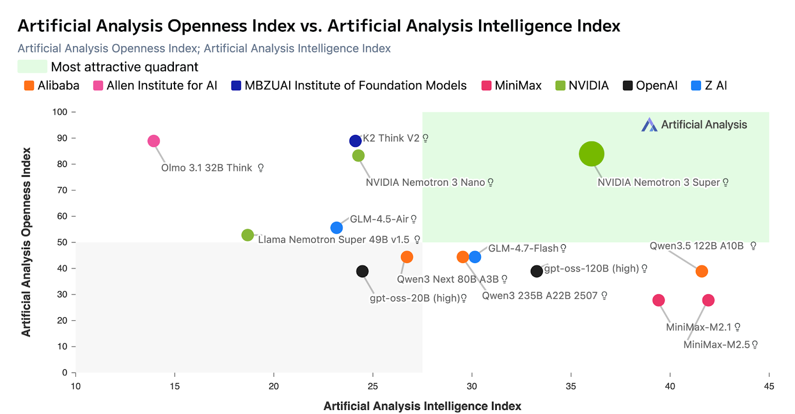
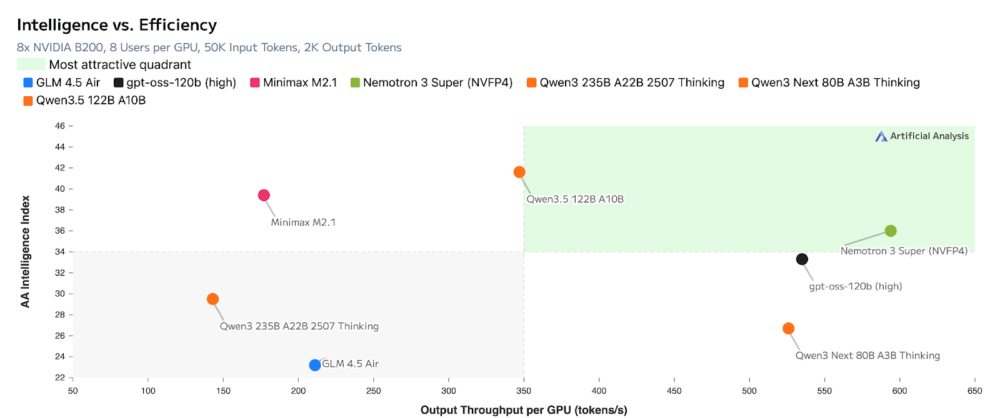

# Nemotron 3 Super：120B/12B，1M 上下文，Thinking Budget

英文对照：[en/vllm/blog/serving/nemotron-3-super.md](../../../../en/vllm/blog/serving/nemotron-3-super.md)  
原文：https://vllm.ai/blog/2026-03-11-nemotron-3-super  
v0.17.1。4×H100 BF16 示例。Spark 上的实测见 [dgx-spark](dgx-spark.md)。

Hybrid MoE + Mamba，MTP，Latent MoE（4 expert 的推理成本当 1）。BF16/FP8/NVFP4。他们说 Blackwell NVFP4 相对 H100 FP8 约 **4×** 吞吐、精度持平——看 cookbook，别当跨代铭牌。`--kv-cache-dtype fp8` `--reasoning-parser nemotron_v3` `--tool-call-parser qwen3_coder`。相对上一只 Super 他们报最高约 **5×** 吞吐、**2×** 精度。营销图在原文。

本地图（原文版权仍归原站；学习对照用）：

