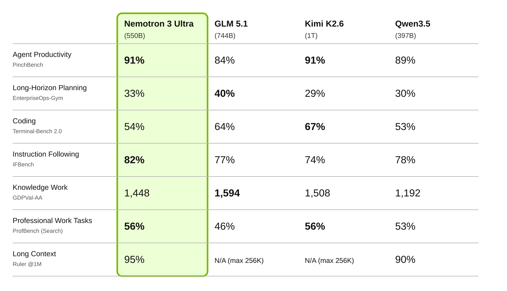
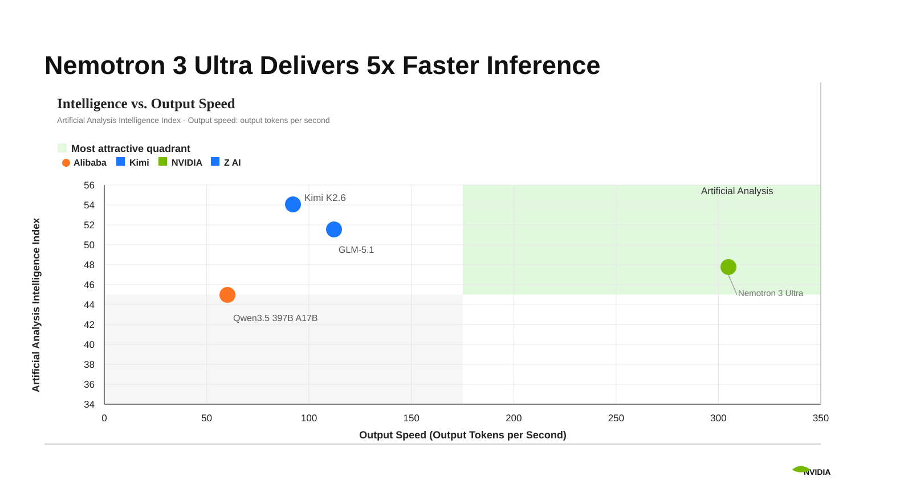
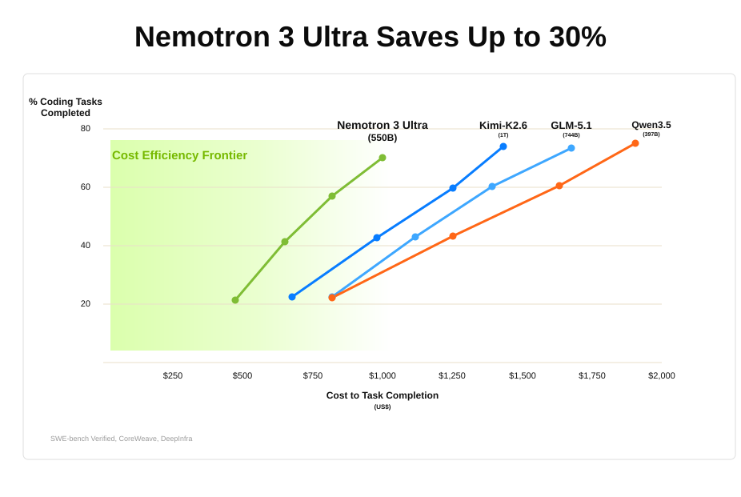

# Nemotron 3 Ultra：550B/55B hybrid MoE，训练 rollout 也走 vLLM

英文对照：[en/vllm/blog/serving/nemotron-3-ultra.md](../../../../en/vllm/blog/serving/nemotron-3-ultra.md)  
原文：https://vllm.ai/blog/2026-06-04-nemotron-3-ultra-vllm  
v0.22.0 镜像。8×B200 示例。cookbook 才是完整菜谱。

Hybrid Transformer-Mamba MoE，1M 上下文。BF16：8×GB200/B200/GB300/B300 或 16×H100 / 8×H200。NVFP4：4×Blackwell 或 8×H100。`VLLM_USE_FLASHINFER_MOE_FP4=1`。他们给的 8×B200 NVFP4：TP8，`--kv-cache-dtype fp8`，`--speculative_config.method mtp` `num_speculative_tokens 5`，`--mamba-backend triton` `--mamba-ssm-cache-dtype float32`，`--reasoning-parser nemotron_v3`，`--tool-call-parser qwen3_coder`。NeMo RL / Gym 用 vLLM 做 multi-node rollout。营销数字（30% 成本、领先吞吐）看原图，当宣传不是可复现 SLA。

本地图（原文版权仍归原站；学习对照用）：

