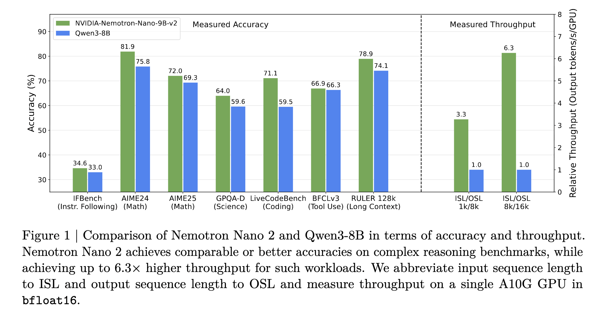
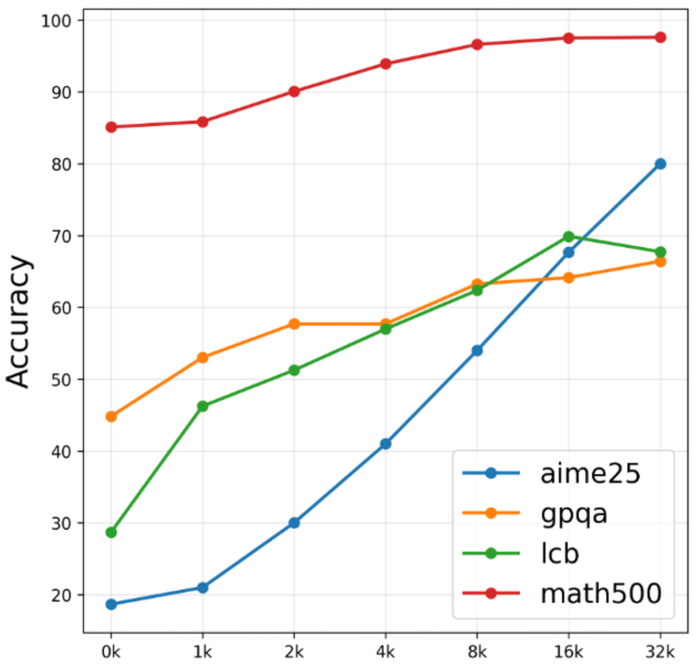

# Nemotron Nano 2：9B hybrid，Thinking Budget 是客户端两刀，不是引擎旋钮

英文对照：[en/vllm/blog/serving/nemotron-nano2.md](../../../../en/vllm/blog/serving/nemotron-nano2.md)  
原文：https://vllm.ai/blog/2025-10-23-now_serving_nvidia_nemotron_with_vllm  
他们报 thinking token 相对同尺寸 dense 最高约 **6×**。

```
vllm serve nvidia/NVIDIA-Nemotron-Nano-9B-v2 --trust-remote-code --mamba_ssm_cache_dtype float32
```

Budget：先 `max_tokens=budget` 拿到 reasoning，若无 `</think>` 就人工补上，再把这段塞回 assistant、`continue_final_message` 用 `/completions` 写答案。这是应用层协议，不是 `--thinking-budget`。后继 3 系见 [nemotron-3-nano](nemotron-3-nano.md)。

本地图（原文版权仍归原站；学习对照用）：




