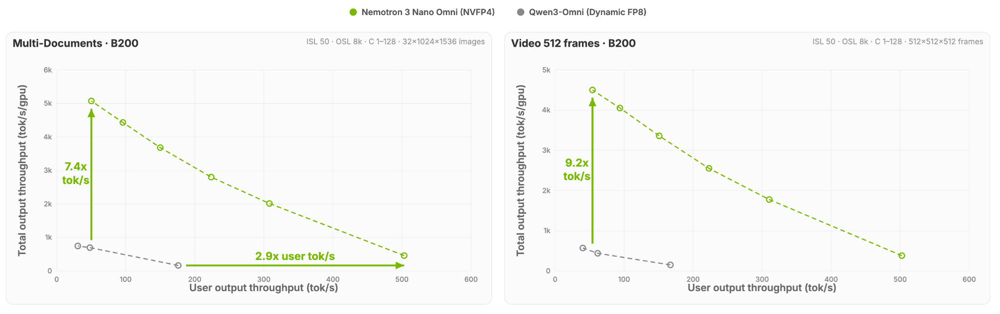
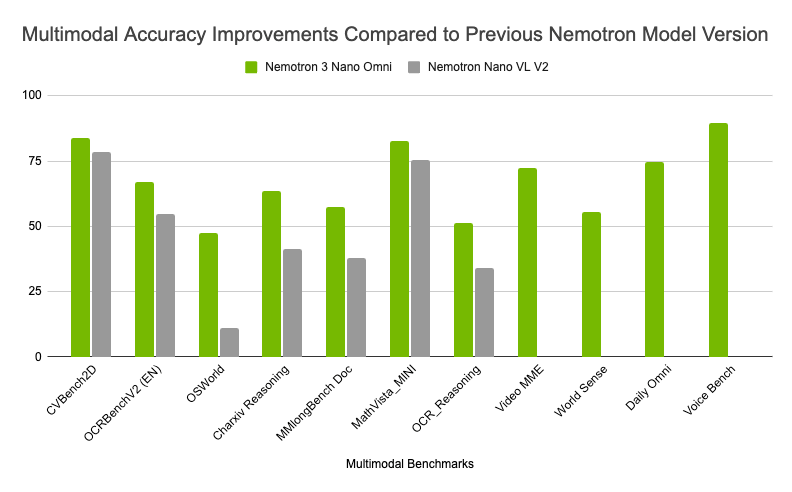
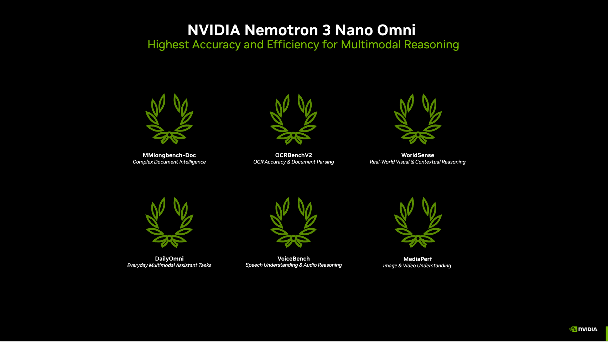

# Nemotron 3 Nano Omni：一只 30B/3B 吃图声视频，吞吐对比钉死每用户速率

英文对照：[en/vllm/blog/serving/nemotron-omni.md](../../../../en/vllm/blog/serving/nemotron-omni.md)  
原文：https://vllm.ai/blog/2026-04-28-nemotron-omni  
2026-04-28。署名 **NVIDIA Nemotron Team**。镜像 `vllm[audio]==0.20.0`。规格表上下文 **256K**；起服片段是 `--max-model-len 131072`。BF16 / FP8 / NVFP4。端口 **5000**。前身 VLM（没有音频）：[Nano 2 VL](nemotron-nano-vl.md)。文本亲戚：[Nano](nemotron-3-nano.md) / [Super](nemotron-3-super.md) / [Ultra](nemotron-3-ultra.md) / [Lightning](nemotron-35-lightning.md)。更早的 9B：[Nano 2](nemotron-nano2.md)。桌上 Spark 的坑：[dgx-spark.md](dgx-spark.md)。Mamba 拆分 serving：[hybrid-ssm.md](hybrid-ssm.md)。训练环挨着 [native-rl.md](native-rl.md)。这是 **perception 子代理**，不是 [vLLM-Omni](vllm-omni.md) 那条扩散/TTS 栈。引言 **9×** / 图上 **7.4×** / **9.2×** / 多模态智能 **20%** 是页上的演示，不是你的 SLA。

**原文 TL;DR：**

- Hybrid Transformer-Mamba MoE：**30B** 总参，**3B** 激活；上下文 **256K**；进：text / image / video / audio；出：文本。
- 视觉和音频 encoder 合一；视频时空走 **Conv3D**。**EVS** 让同样算力吃更长视频。
- BF16、FP8、NVFP4。`--media-io-kwargs '{"video":{"num_frames":512,"fps":1}}'` `--video-pruning-rate 0.5`。`--reasoning-parser nemotron_v3` `--tool-call-parser qwen3_coder`。
- 吞吐对比钉死**每用户 token 速率**：多文档约 **7.4×**，视频约 **9.2×**（相对另一只 open omni）。引言另写「同一 interactivity」下 **9×**。
- Post-train：NeMo RL + NeMo Gym，跨 text / image / audio / video。客户端读的是 `reasoning`，不是 `reasoning_content`。

## 为什么要这只

[Nemotron 3 Nano Omni](https://developer.nvidia.com/blog/nvidia-nemotron-3-nano-omni-powers-multimodal-agent-reasoning-in-a-single-efficient-open-model) 被写成效率最高、精度也带头的开源多模态，给 **子代理**：视觉、音频、语言在同一圈里感知再推理。

企业代理本来就把屏幕、文档、音频、视频、文本搅在同一趟。多数栈还是视觉 / 语音 / 语言各一只再拧：多跳推理、编排乱、上下文碎。

两条硬需求：

- **Fragmented Models。** 视觉再音频再语言，串着跑：延迟、钱、故障面、上下文按模态切开。Omni 的答：一只多模态推理环——屏幕、文档、音频、视频一起看。
- **Efficiency。** 常开感知（盯屏、文档、视频）得能放大。Hybrid MoE 每次前向只点亮 **3B / 30B**；带时间的感知再加 EVS，视频算力下去。

vLLM 是 serving 层：OpenAI-compatible API，BF16 / FP8 / NVFP4。

## TL;DR: About Nemotron 3 Nano Omni

- **Architecture：** MoE + Hybrid Transformer-Mamba
- **Model size：** 30B 总参，3B 激活
- **Context length：** 256K
- **视觉和音频 encoder 合一**——一只换掉碎掉的多模态栈。视频时空走 **Conv3D**。
- **Modalities：**
  - 输入：text、image、video、audio
  - 输出：文本
- **Efficiency：** 声称相对其他 open omni、同一 interactivity 下吞吐 **9×**。EVS：同样算力吃更长视频。部署可走 FP8、NVFP4。
- **Accuracy：** 声称相对最好的开源对照，多模态智能高 **20%**。
- **Post-training：** [NeMo RL](https://github.com/nvidia-nemo/rl) 和 [NeMo Gym](https://github.com/NVIDIA-NeMo/gym) 跨 text、image、audio、video 做多环境强化学习——instruction following，往对的多模态答案上收敛。
- **Supported GPUs：** NVIDIA B200、H100、H200、A100、L40S、DGX Spark、RTX 6000
- **上手：**
  - 权重：[BF16](https://huggingface.co/nvidia/Nemotron-3-Nano-Omni-30B-A3B-Reasoning-BF16)、[FP8](https://huggingface.co/nvidia/Nemotron-3-Nano-Omni-30B-A3B-Reasoning-FP8)、[NVFP4](https://huggingface.co/nvidia/Nemotron-3-Nano-Omni-30B-A3B-Reasoning-NVFP4)
  - Cookbook：[Nemotron-3-Nano-Omni/vllm_cookbook.ipynb](https://github.com/NVIDIA-NeMo/Nemotron/blob/main/usage-cookbook/Nemotron-3-Nano-Omni/vllm_cookbook.ipynb) 和 [Brev launchable](https://brev.nvidia.com/launchable/deploy?launchableID=env-3Cm2gB9j5ROkCbiNKH5SQhERqBV)
  - 技术报告：[NVIDIA-Nemotron-3-Omni-report.pdf](https://research.nvidia.com/labs/adlr/files/NVIDIA-Nemotron-3-Omni-report.pdf)

## 用 vLLM 跑优化过的多模态推理

BF16、FP8、NVFP4。FP8 / NVFP4 细节看 cookbook。

### Install vLLM

```bash
pip install vllm[audio]==0.20.0
```

### Serve the model

OpenAI-compatible API。页上是 `python3 -m vllm.entrypoints.openai.api_server`（不是 `vllm serve`）。旗标按原文抄。

和规格表对一下：`--max-model-len 131072` **不是** 256K；端口 **5000**（vLLM 默认 8000，除非你传 `--port`）；`--tensor-parallel-size 1`；下面客户端读 `reasoning`。

```bash
python3 -m vllm.entrypoints.openai.api_server \
    --model "nvidia/Nemotron-3-Nano-Omni-30B-A3B-Reasoning-BF16" \
    --served-model-name nemotron \
    --trust-remote-code \
    --dtype auto \
    --host 0.0.0.0 \
    --port 5000 \
    --tensor-parallel-size 1 \
    --max-model-len 131072 \
    --media-io-kwargs '{"video":{"num_frames":512,"fps":1}}' \
    --video-pruning-rate 0.5 \
    --enable-auto-tool-choice \
    --tool-call-parser qwen3_coder \
    --reasoning-parser nemotron_v3
```

客户端（`api_key="null"`；`temperature=1`，`max_tokens=1024`；先打 `reasoning` 再打 `content`——Lightning / Ultra 那套，不是 Super / Nano 3 的 `reasoning_content`）。页上这段是**纯文本**（“Write a haiku about GPUs.”）；视频参数在服务器旗标上。

```python
from openai import OpenAI

client = OpenAI(base_url="http://127.0.0.1:5000/v1", api_key="null")
resp = client.chat.completions.create(
    model="nemotron",
    messages=[
        {"role": "system", "content": "You are a helpful assistant."},
        {"role": "user", "content": "Write a haiku about GPUs."}
    ],
    temperature=1,
    max_tokens=1024,
)
print("Reasoning:", resp.choices[0].message.reasoning,
      "\nContent:", resp.choices[0].message.content)
```

省事：[cookbook](https://github.com/NVIDIA-NeMo/Nemotron/blob/main/usage-cookbook/Nemotron-3-Nano-Omni/vllm_cookbook.ipynb) 或 [NVIDIA Brev Launchable](https://brev.nvidia.com/launchable/deploy?launchableID=env-3Cm2gB9j5ROkCbiNKH5SQhERqBV)。

## 多模态代理：效率带头，精度也带头

硬件向的推理：FP8 / NVFP4、NVIDIA 优化过的 kernel、EVS。Conv3D 扛时空：多模态感知算力下去，从工作站到云。

**Figure 1 的比法（乘数前面先读这句）。** 他们钉死**每用户 token 速率**（interactivity / tokens/sec/user），再量在不伤这份实时体验的前提下，系统还能撑多大吞吐——多文档和视频各一条。不是峰值并发奖杯。TTFT / TPS 留在图轴上；正文 **没有** TPS / TTFT 表。

本地图（原文版权仍归原站；学习对照用）：



**Figure 1。** 固定每用户 interactivity（tokens/sec/user）下的系统吞吐：多文档 **7.4×**，视频 **9.2×**，对照另一只 open omni。



**Figure 2。** 多模态推理精度，对照前一只 [Nemotron Nano VL V2](nemotron-nano-vl.md)：文档智能、视频和音频推理。分数在图里。

正文声称：精度上去再加效率 → **六**条多模态榜占头。



**Figure 3。** 页上 caption：「Nemotron 3 Nano topping six leaderboards for multimodal efficiency and accuracy。」正文写的是 **Nemotron 3 Nano Omni**。点名的榜：MMlongbench-Doc、OCRBenchV2、WorldSense、DailyOmni、VoiceBench、MediaPerf。

文档智能：MMlongbench-Doc、OCRBenchV2。视频 / 音频：WorldSense、DailyOmni、VoiceBench。MediaPerf：声称每项任务吞吐最高，视频级 tagging 推理成本最低。正文 **没有** 分榜分数表。

多代理系统里的角色：**多模态感知和上下文子代理**——给屏幕、文档、音频、视频当眼睛耳朵；结构化理解往下游编排 / 执行代理送。够轻，能挨着别的模跑，不必再复制一套感知流水线。点名的活：computer-use、文档智能、音视频理解——不用养一堆碎掉的多模态栈。

## Get started

开源权重、数据、菜谱：从工作站到云都能微调、部署。

- 权重：[BF16](https://huggingface.co/nvidia/Nemotron-3-Nano-Omni-30B-A3B-Reasoning-BF16)、[FP8](https://huggingface.co/nvidia/Nemotron-3-Nano-Omni-30B-A3B-Reasoning-FP8)、[NVFP4](https://huggingface.co/nvidia/Nemotron-3-Nano-Omni-30B-A3B-Reasoning-NVFP4)
- Cookbook：[Nemotron-3-Nano-Omni/vllm_cookbook.ipynb](https://github.com/NVIDIA-NeMo/Nemotron/blob/main/usage-cookbook/Nemotron-3-Nano-Omni/vllm_cookbook.ipynb) 和 [Brev](https://brev.nvidia.com/launchable/deploy?launchableID=env-3Cm2gB9j5ROkCbiNKH5SQhERqBV)
- 技术报告：[NVIDIA-Nemotron-3-Omni-report.pdf](https://research.nvidia.com/labs/adlr/files/NVIDIA-Nemotron-3-Omni-report.pdf)

页上的订阅入口：[NVIDIA news](https://www.nvidia.com/en-us/preferences/email-signup/)，NVIDIA AI 的 [LinkedIn](https://www.linkedin.com/company/nvidia/)、[X](https://x.com/NVIDIAAI)、[YouTube](https://www.youtube.com/nvidia)，Discord 上的 Nemotron：[invite](https://discord.gg/nvidia)。

## Acknowledgement

感谢把 Nemotron 3 Nano Omni 接到 vLLM 的所有人。

NVIDIA：Nirmal Kumar Juluru, Anusha Pant。

vLLM team and community：Roger Wang, Michael Goin, Thomas Parnell, Kevin Luu, Robert Shaw, Tyler Michael Smith。
