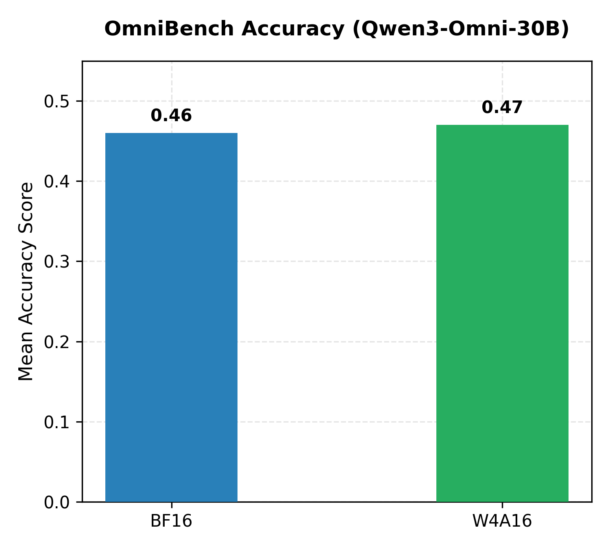
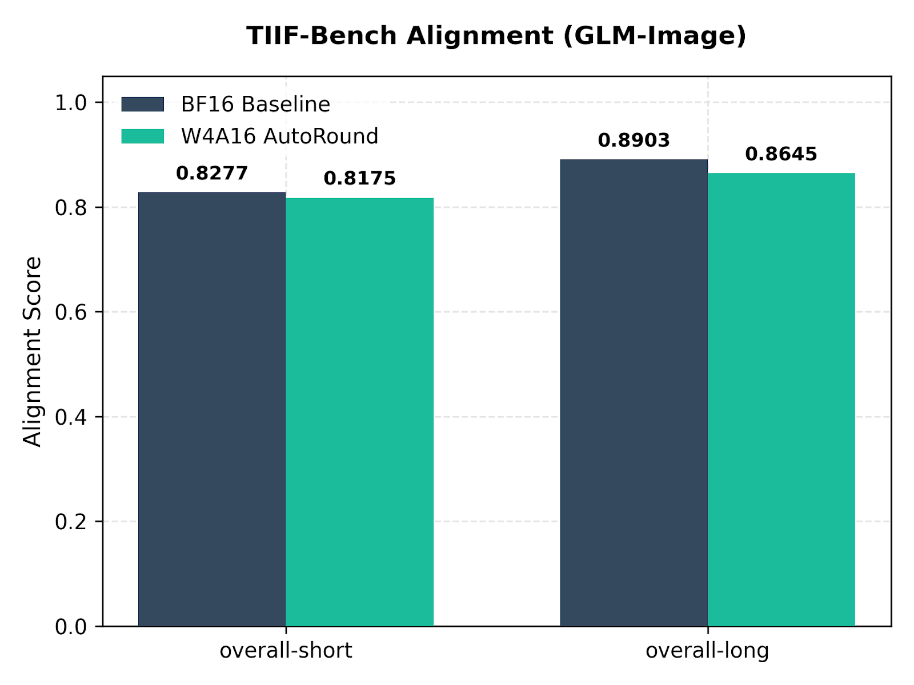
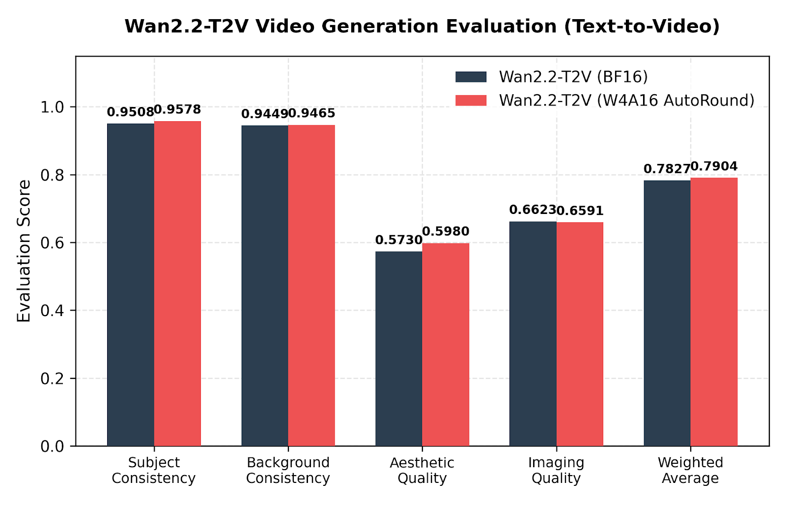
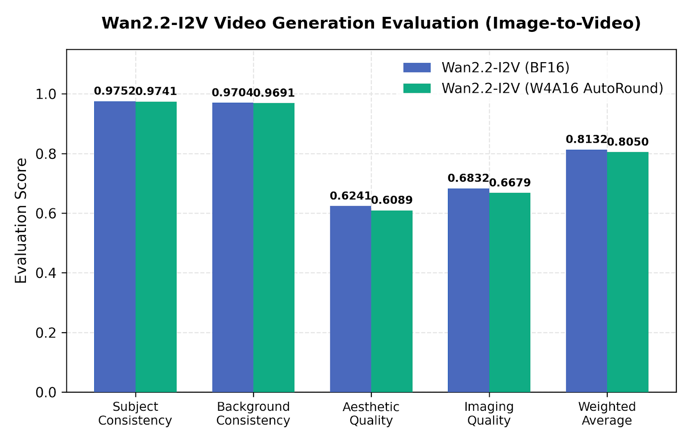
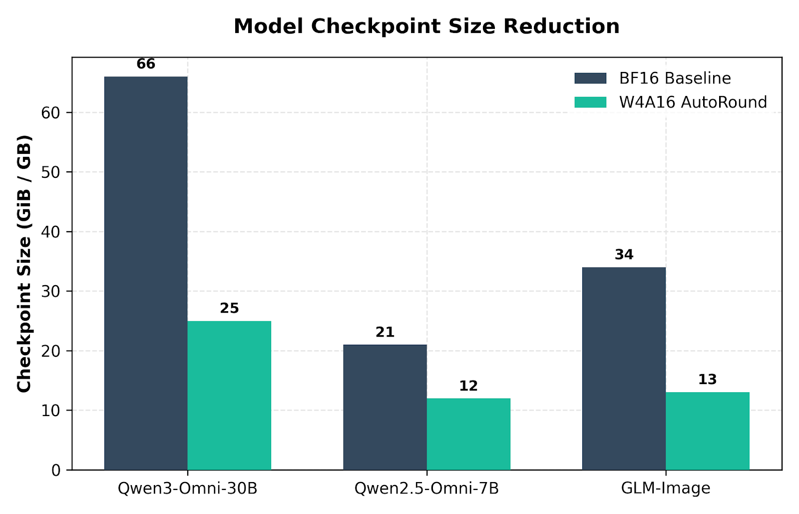
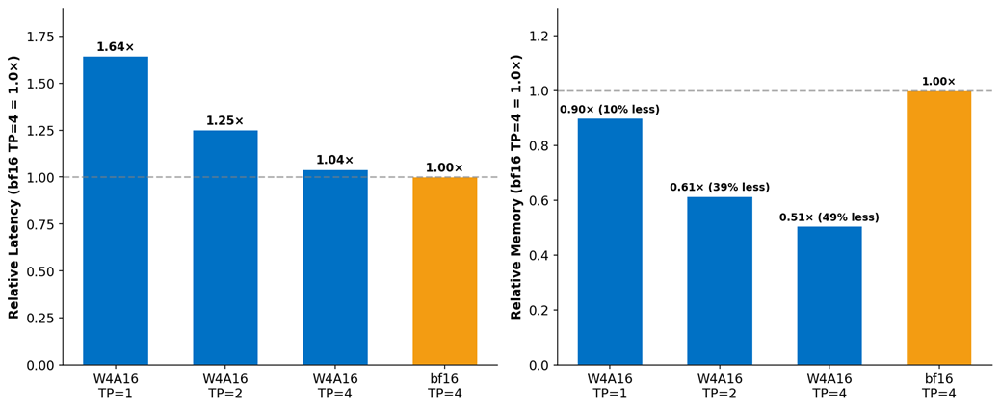
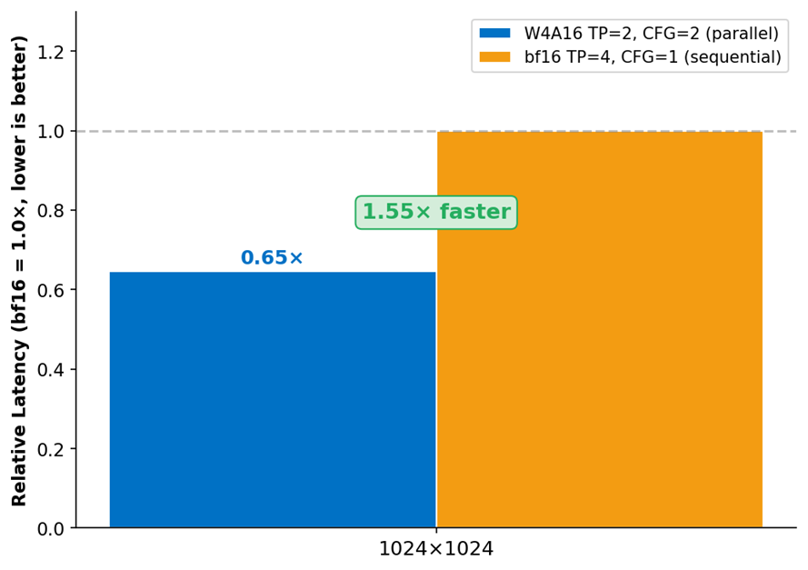

# Omni × AutoRound：W4A16 一次量化、直接 serve

英文对照：`en/vllm/blog/serving/omni-autoround.md`  
原文：https://vllm.ai/blog/2026-06-02-vllm-omni-autoround  
LLM Compressor 那条见另篇。

读 `quantization_config.quant_method = "auto-round"`，不必再加 `--quantization`。Qwen3-Omni-30B-A3B：66 GB → 25 GB（约 **62%**）。OmniBench 上 W4A16 略高于 BF16 对照；TIIF 平均漂约 **1.3%**。Intel B60：FLUX BF16 要 TP4，W4A16 单卡装得下；腾出的卡做 CFG Parallel，引导生成约 **1.55–1.67×**。Wan2.2 / GLM-Image / FLUX 已通；BAGEL / Ovis 当时 checkpoint 有、runtime 还在接。量化离线，热路径只推理。

本地图（原文版权仍归原站；学习对照用）：

