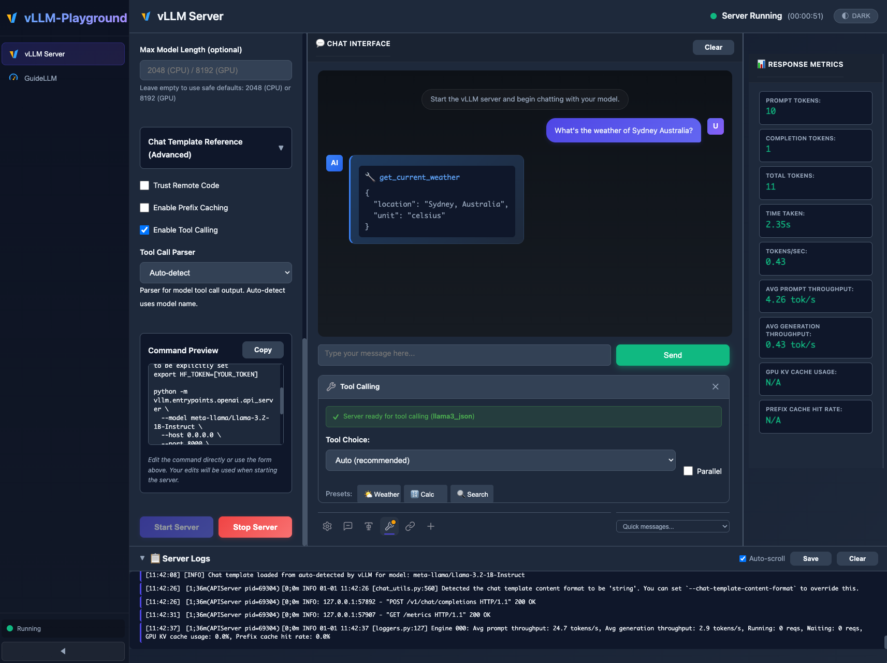
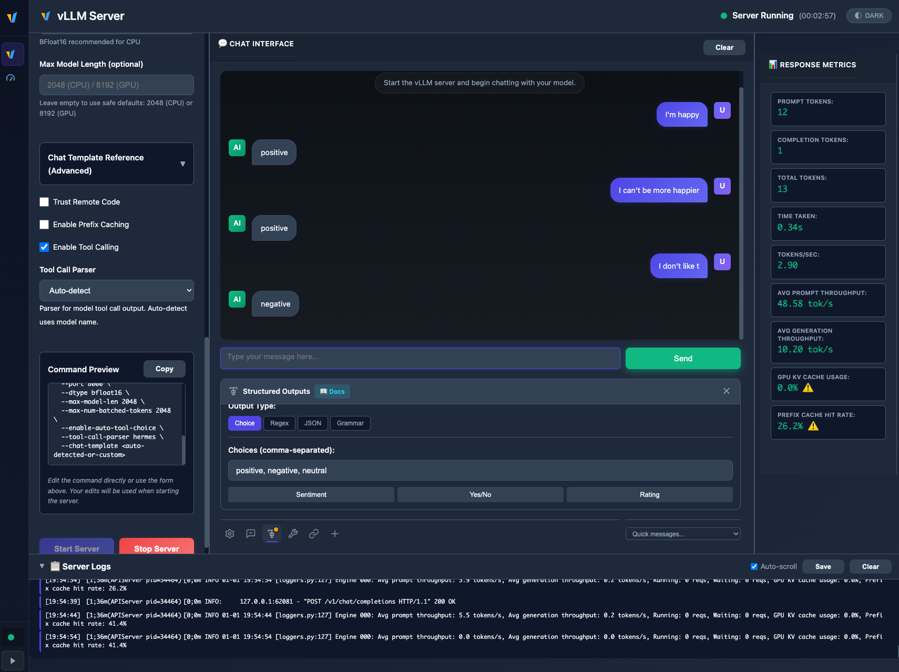
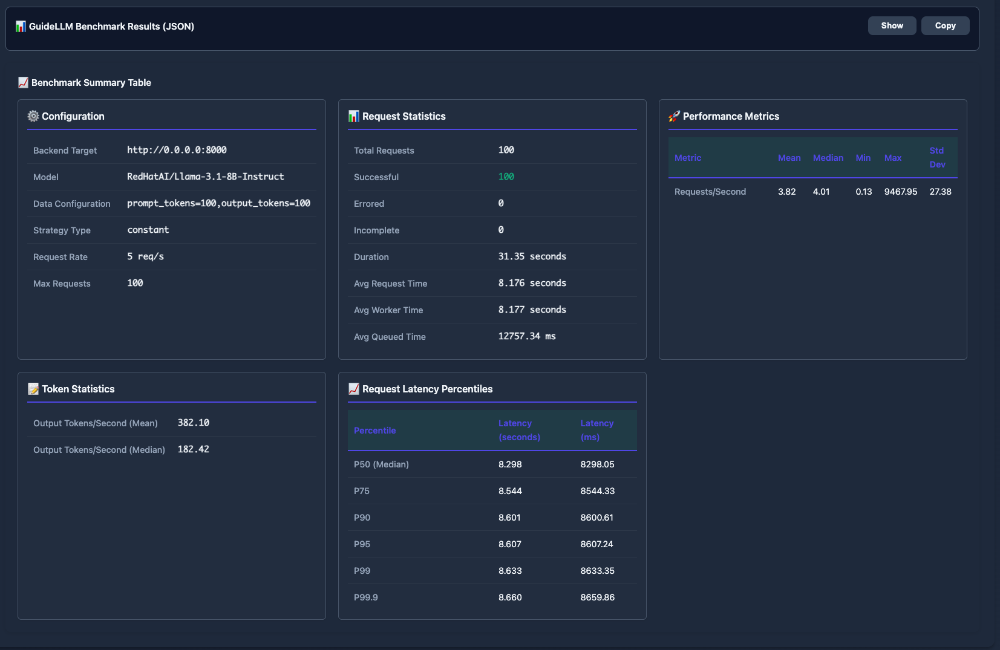
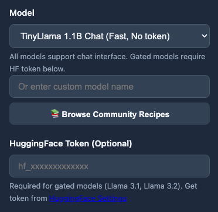

# vLLM Playground：容器里点一下起 server，CLI 仍是同一套旋钮

英文对照：[en/vllm/blog/serving/playground.md](../../../../en/vllm/blog/serving/playground.md)  
原文：https://vllm.ai/blog/2026-01-02-introducing-vllm-playground  
`pip install vllm-playground` → localhost:7860。Apache-2.0。当时镜像钉 v0.11.0。

本地 Podman，云上换成 K8s API，UI 同一套。macOS ARM CPU 镜像、Linux GPU/CPU、OpenShift。结构化输出四种：choice / regex / JSON schema / EBNF。Tool calling 自动选 Llama/Mistral/Hermes/Qwen… parser。内嵌 GuideLLM 百分位。Recipes 目录一键填 flag。不替代 `vllm serve`，是把 140+ 参数变成表单。作者社区项目，不是 vLLM 核心仓。

本地图（原文版权仍归原站；学习对照用）：

