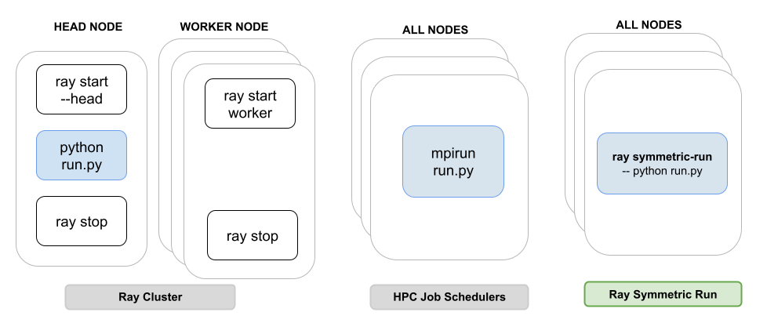

# `ray symmetric-run`：多机起 vLLM 不必先扮演 head/worker

英文对照：`en/vllm/blog/serving/ray-symmetric.md`  
原文：https://vllm.ai/blog/2025-11-22-ray-symmetric-run  
2025-11-22。面向 SLURM / `mpssh` 这类「每台机器敲同一条命令」的人。[Elastic EP](elastic-ep.md) 也依赖 Ray DP；这篇是把集群**先拉起来**的那条命令。

Ray 推荐的姿势是：head 跑入口，再把活派给 worker。生命周期和作业分开，两套命令。HPC / MPI 习惯的是对称执行——每节点同一入口。旧流程：head `ray start --block`；worker `ray start --address=ip:6379`；再回 head 开一个终端 `vllm serve ... -tp 8 -pp 2`；完了每台 `ray stop`。漏了 `VLLM_HOST_IP` 一类变量就要拆集群重来。

```bash
ray symmetric-run \
  --address <head>:6379 \
  --min-nodes 2 \
  --num-gpus 8 \
  -- vllm serve Qwen/Qwen3-32B --tensor-parallel-size 8 --pipeline-parallel-size 2
```

每台敲同一条。底下不同：worker 只加入集群并等到作业结束自杀；head 以 `--head` 启动、等到 `--min-nodes` 到齐、跑你的命令、收摊。环境变量写在命令前面会进 Ray runtime：`ENV=VAR ray symmetric-run ...`。文档：Ray SLURM 指南。

本地图（原文版权仍归原站；学习对照用）：


