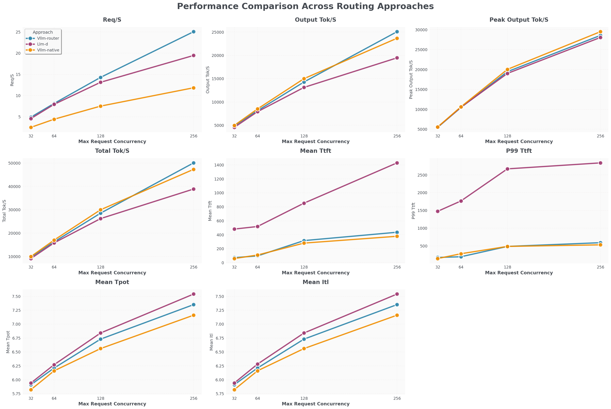
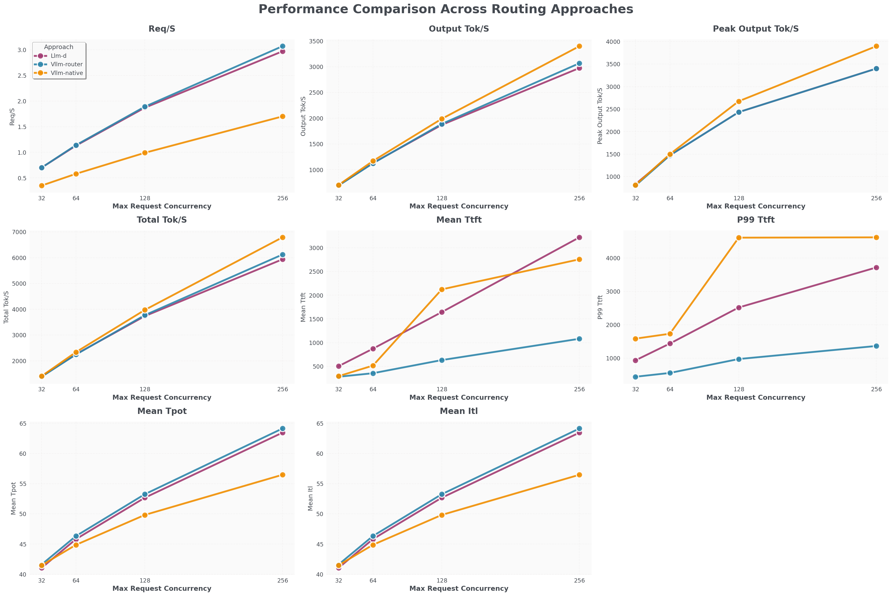

# vLLM Router：认得 KV、认得 Prefill/Decode 的负载均衡

英文对照：[en/vllm/blog/serving/router.md](../../../../en/vllm/blog/serving/router.md)  
原文：https://vllm.ai/blog/2025-12-13-vllm-router-release  
2025-12-13。仓库：[vllm-project/router](https://github.com/vllm-project/router)。Rust，尽量轻。坐在客户端和一队 vLLM worker 之间，K8s 或裸金属都行。从 **[SGLang model gateway](https://github.com/sgl-project/sglang/tree/main/sgl-model-gateway)** fork 再简化；他们说可能并进 vLLM 主仓，大规模 gateway 功能也可能再和 SGLang 对齐。

普通负载均衡把 LLM 当无状态 HTTP。KV 是有状态的——下一句还想住在上一句住过的房间里。Prefill/Decode 分离更不是「所有 pod 长得一样」：一边是 compute-bound 的阅读，一边是 memory-bound 的说话。Router 要办的就是这两件事。production-stack 里的 prefix-aware routing 是同一直觉的 Helm 版；这一篇把它收成一只独立网关。

本地图（原文版权仍归原站；学习对照用）：

## 负载策略

对话要把同一用户后续请求粘到**还握着他 KV** 的那台 worker。粘错了，prefix cache 等于没开。

- **Consistent hashing**：同一 routing key（session / user）粘住。性能主策略。
- **Power of Two**：低开销随机，分布仍好。
- Round robin / random：无状态兜底——benchmark 里的反面教材，也是「完全没有共享前缀」时的老实选择。

粘住本地 KV 是第一层。粘不住时，[Mooncake](mooncake.md) 那种分布式池才是第二层。文中当时还没有把 cache-aware routing 和分布式池做成一件事；Mooncake 那篇把「先送本地、池子当退路」写进了下一步。

## Prefill/Decode 分离

compute-bound 的 prefill 和 memory-bound 的 decode 分成两组 worker。Router：新请求进 prefill 组 → 完成后把状态交给 decode 组。发现与路由支持 **NIXL** 以及 **NCCL + ZMQ discovery**。

这是**文本**的 P/D。下一篇 EPD 的「分离」是视觉编码器，不要混。DistServe（Hao AI Lab, 2024）是文本这条路的名字；[大规模 serving](large-scale.md) 解释了为什么 MoE + Wide-EP 更需要它——一条胖 prefill 可能拖住整组 EP 的 combine。

## 生产

K8s label selector 自动发现 pod。重试（指数退避 + jitter）+ 熔断；健康检查失败立刻踢出池子。`/metrics` Prometheus：量、延迟、错误、每台 worker 健康。控制面可以是 AIBrix 或 production-stack 或 llm-d；网关认的是 worker 的状态，不是哪家 Helm chart。

## 当时的基准（演示）

排除了 vLLM 自带 DP/EP coordinator（文档里的 [external load balancing](https://docs.vllm.ai/en/stable/serving/data_parallel_deployment.html#external-load-balancing)；当时吞吐只有别人的 1/8，已知问题 [#24461](https://github.com/vllm-project/vllm/issues/24461)）。对手：[llm-d](https://github.com/llm-d/llm-d)（默认 queue-aware）、K8s 原生 round-robin（**不认 P/D**）。

Llama 3.1 8B，8 prefill + 8 decode pod：Router 的 req/s 比 llm-d 高约 **25%**，比 K8s 原生高约 **100%**；TTFT 接近原生，比 llm-d 快约 **1200 ms**。

DeepSeek V3，1 prefill TP8 + 1 decode TP8：req/s 接近 llm-d，比原生高约 **100%**；TTFT 比两者快约 **2000 ms**。

数字是这一天、这一套拓扑上的。K8s 原生 RR 不认 P/D，当反面教材很合适，拿去羞辱 2026 年的 llm-d 不合适。

致谢：Phi 与 AWS 提供集群；Naman Lalit 做性能与正确性基准；SGLang Model Gateway 团队提供可 fork 的 API / 服务框架；Tyler Michael Smith、Robert Shaw 分享 llm-d 经验，把基准从卡住里救出来。

读完 production-stack / AIBrix 再读这一篇：集群里真正决定「下一句话去哪张卡」的，是这只认得记忆的路由器。P/D 的编排从这里开始；下一篇 EPD 把**视觉编码器**也拆出去。
