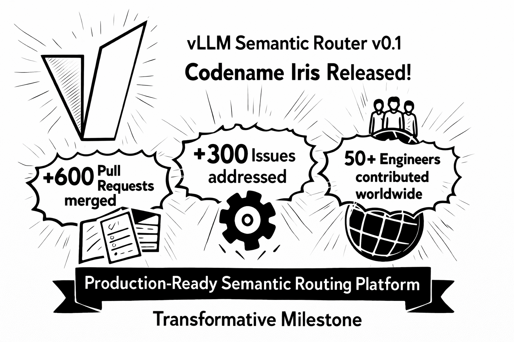
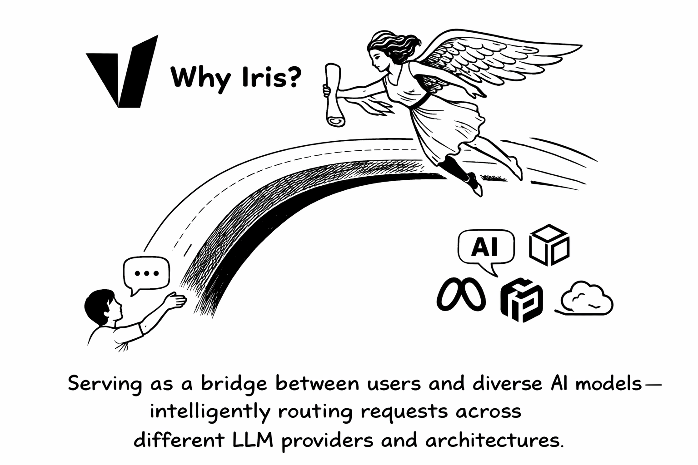
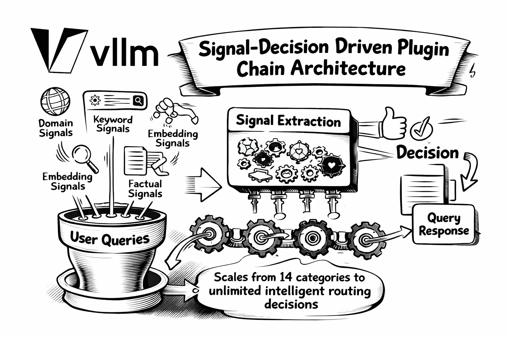
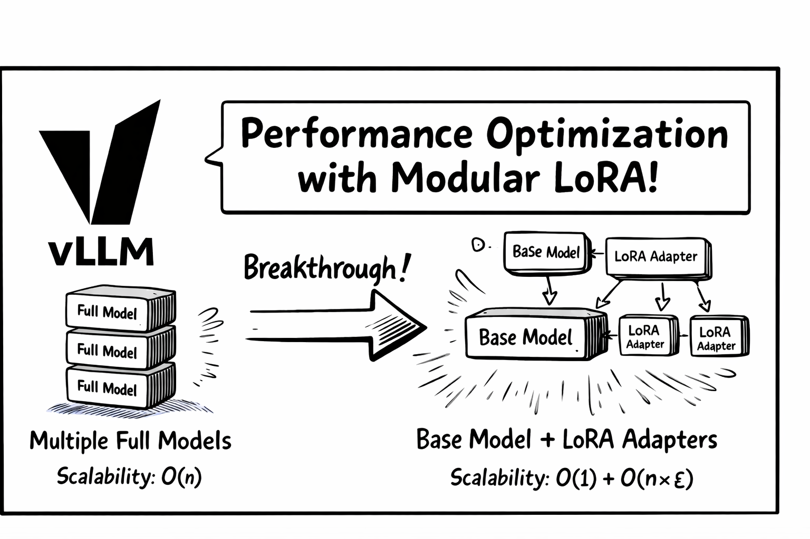
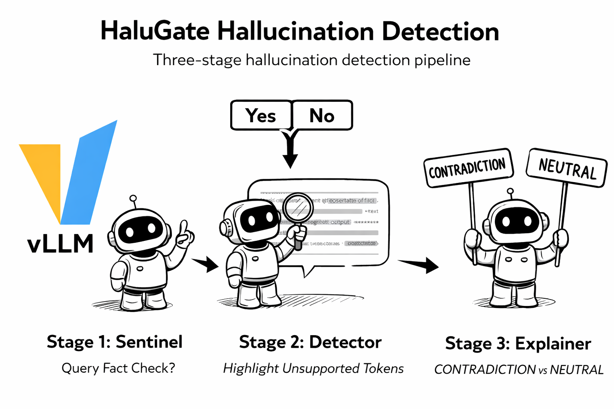
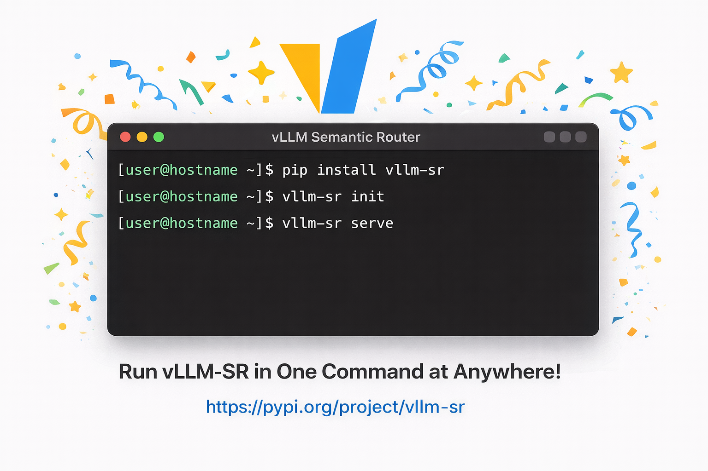
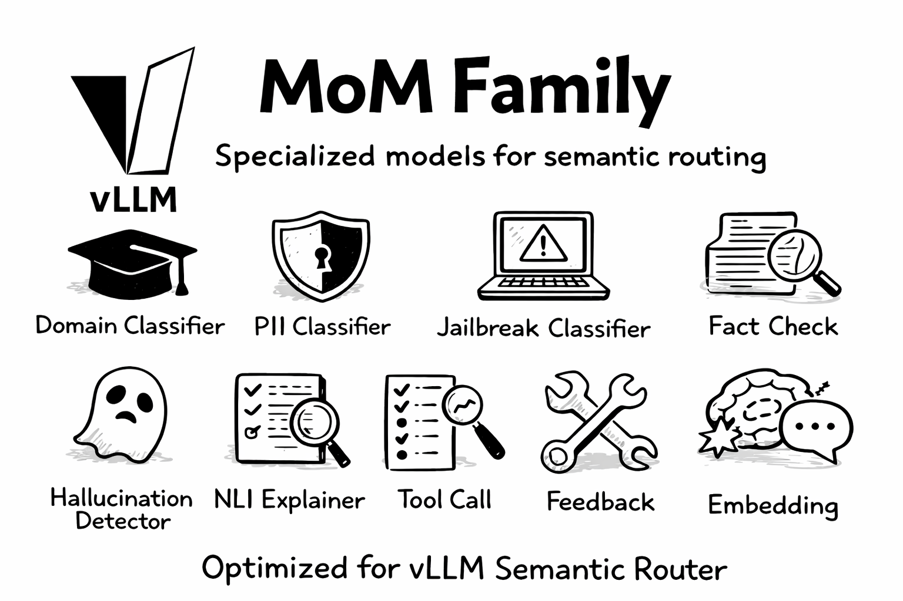
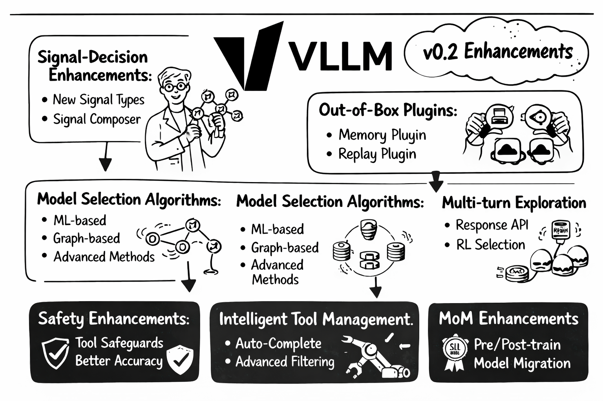
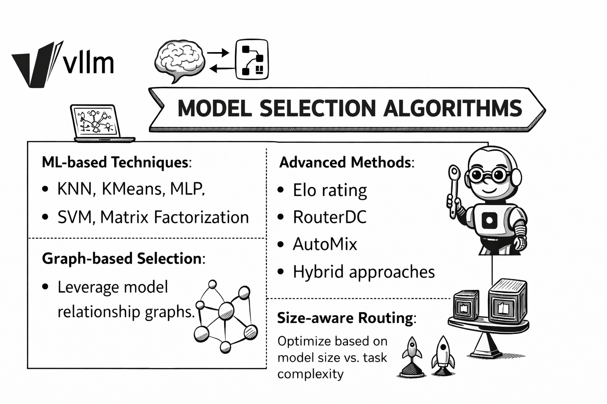

# Semantic Router v0.1 Iris：从 14 类到信号链

英文对照：[en/vllm/blog/serving/semantic-router-iris.md](../../../../en/vllm/blog/serving/semantic-router-iris.md)  
原文：https://vllm.ai/blog/2026-01-05-vllm-sr-iris  
2026-01-05。署名 **vLLM Semantic Router Team**。仓库：[vllm-project/semantic-router](https://github.com/vllm-project/semantic-router)。立项：[semantic-router](semantic-router.md)。信号 / 决策骨架：[semantic-router-signal](semantic-router-signal.md)。分类核上的 LoRA：[semantic-router-modular](semantic-router-modular.md)。HaluGate 专篇：[halugate](halugate.md)。不要和引擎里的 [Router](router.md) 混。页上的社区数字和架构图是发版时的快照。

后来的笔记（若还要往下读）：[mom-amd](semantic-router-mom-amd.md)、[athena](semantic-router-athena.md)、[vision](semantic-router-vision.md)、[session](semantic-router-session.md)、[themis](semantic-router-themis.md)、[fusion](semantic-router-fusion.md)、[micro-agent](semantic-router-micro-agent.md)、[mom](semantic-router-mom.md)。中间还有一篇 AMD 上的路由：[semantic-router-amd](semantic-router-amd.md)。

[vLLM Semantic Router](https://github.com/vllm-project/semantic-router) 自称 Mixture-of-Models（MoM）的 **系统级智力**：坐在用户和模型之间，从请求、响应、上下文里抽信号，再做路由——选模型、安全过滤（jailbreak、PII）、semantic cache、幻觉检测。背景仍是 [立项文](semantic-router.md)。

v0.1 代号 **Iris**，第一次正式发版。从 2025-09 试验到这篇：超过 **600** 个 PR 合入，**300+** issue，**50+** 工程师。2026 开头交出的是他们称为 production-ready 的语义路由平台。

本地图（原文版权仍归原站；学习对照用）：



## 为什么叫 Iris

希腊神话里 Iris（Ἶρις）是神与人之间的信使，沿着彩虹走。原文把 v0.1 写成同一件事：**用户和各家 AI 模型之间的桥**，按 provider 和架构智能地送请求。



## v0.1 新了什么

### 1. 架构翻新：信号 → 决策 → 插件链

**以前：** 一只分类器把查询打进 **14** 个 MMLU 域；jailbreak、PII、semantic cache 静态编排。

**现在：** **Signal-Decision Driven Plugin Chain**。从 14 个固定类，长成不限数量的路由决策。细节：[signal-decision](semantic-router-signal.md)。



查询上抽 **六种信号**：

- **Domain：** MMLU 训过的分类，LoRA 可扩展
- **Keyword：** 快、可解释的正则
- **Embedding：** 神经 embedding 上的语义相似
- **Factual：** 为幻觉检测做的事实分类
- **Feedback：** 用户满意 / 不满意
- **Preference：** 用户自己定的偏好

信号进决策引擎：AND/OR，带优先级。从前写死的 jailbreak、PII、semantic cache，变成按决策可开关的 **插件**：

| Plugin | 用途 |
| --- | --- |
| `semantic-cache` | 相似查询走 cache，省钱 |
| `jailbreak` | 提示注入 |
| `pii` | 敏感信息 |
| `hallucination` | 实时幻觉检测 |
| `system_prompt` | 注入自定义指令 |
| `header_mutation` | 改 HTTP header，把 metadata 传下去 |

新信号、新插件、新的选模型算法，不必改脊柱。

### 2. 性能：模块化 LoRA

和 **Hugging Face Candle** 一起改了路由的推理核。以前每个分类任务独立加载、独立前向，代价随任务数线性涨。细节：[modular LoRA](semantic-router-modular.md)。



**突破：** LoRA 让所有分类任务共享基座计算：

| 做法 | 工作量 | 伸缩 |
| --- | --- | --- |
| 以前 | N 次完整模型前向 | O(n) |
| 现在 | 1 次基座 + N 只轻量 LoRA | O(1) + O(n×ε) |

> **原文注：** ε 是一只 LoRA 前向相对整模的代价，通常 ε ≪ 1，多出来的开销可以当很小。

同一输入上的多任务分类，时延宣称明显下降。

### 3. 安全：HaluGate

请求侧已有 jailbreak、PII。v0.1 加上 **HaluGate**——三截幻觉检测，盯的是 **响应**。专篇：[halugate](halugate.md)。

**Stage 1: Sentinel。** 二分类：这句要不要核事实（创意写作、代码不必）。

**Stage 2: Detector。** token 级：响应里哪些 token 没被给定上下文撑住。

**Stage 3: Explainer。** 基于 NLI：被标出来的 span **为什么**有问题（CONTRADICTION vs NEUTRAL）。



和 function calling 接在一起：工具结果当 ground truth。检测结果走 HTTP header，下游自己决定拦还是标。

### 4. UX：一条命令

**本地：**

```bash
pip install vllm-sr
```



包里带着 quickstart 要的核心依赖。装完先 `vllm-sr init`，写出默认 `config.yaml`，再在 `providers` 里配 backend：

```yaml
providers:
  models:
    - name: "openai/gpt-oss-120b"       # Local vLLM endpoint
      endpoints:
        - endpoint: "localhost:8000"
          protocol: "http"
      access_key: "your-vllm-api-key"
    - name: "openai/gpt-4"              # External provider
      endpoints:
        - endpoint: "api.openai.com"
          protocol: "https"
      access_key: "sk-xxxxxx"
  default_model: "openai/gpt-oss-120b"
```

配置文档：[installation](https://vllm-semantic-router.com/docs/installation/)。

**Kubernetes：**

```bash
helm install semantic-router oci://ghcr.io/vllm-project/charts/semantic-router
```

Helm chart 带他们称为 sensible 的默认值和一长串可改项。

**Dashboard：** 网页控制台——路由策略、模型配置、交互式 chat playground，当场看路由决定。路由流、时延分布、分类阈值，都在浏览器里拧。

### 5. 生态

**推理框架：**

- [vLLM Production Stack](https://github.com/vllm-project/production-stack)（笔记：[production-stack](production-stack.md)）——生产 vLLM 的参考栈：Helm、请求路由、KV offload
- [NVIDIA Dynamo](https://github.com/ai-dynamo/dynamo)——机房规模的分布式推理，多 GPU / 多节点，P/D 分离
- [llm-d](https://github.com/llm-d/llm-d)——K8s 原生的分布式推理栈，跨 NVIDIA / AMD / Google TPU / Intel XPU
- [vLLM AIBrix](https://github.com/vllm-project/aibrix)（笔记：[aibrix](aibrix.md)）——可扩展 LLM serving 的基础设施积木

**API 网关：**

- [Envoy AI Gateway](https://github.com/envoyproxy/ai-gateway)——Envoy Gateway 上的生成式 AI 统一入口
- [Istio](https://github.com/istio/istio)——服务网格：流量、安全、可观测

### 6. MoM 家族

专门为语义路由训的小模型套件：



| Model | 用途 |
| --- | --- |
| `mom-domain-classifier` | 基于 MMLU 的域分类 |
| `mom-pii-classifier` | PII |
| `mom-jailbreak-classifier` | 提示注入 |
| `mom-halugate-sentinel` | 要不要核事实 |
| `mom-halugate-detector` | token 级幻觉 |
| `mom-halugate-explainer` | NLI 解释 |
| `mom-toolcall-sentinel` | 工具选择分类 |
| `mom-toolcall-verifier` | 工具调用校验 |
| `mom-feedback-detector` | 用户反馈 |
| `mom-embedding-x` | 语义 embedding |

原文的保证：这些模型为 Semantic Router 特训，路由场景上的表现一致。后来的 MoM 专篇：[mom](semantic-router-mom.md)、[mom-amd](semantic-router-mom-amd.md)。

### 7. Responses API

支持 OpenAI **Responses API**（`/v1/responses`），会话状态放内存里：

- **Stateful conversations：** `previous_response_id` 串起来
- **Multi-turn context：** 多轮上下文自动留着
- **Routing continuity：** 意图分类的历史跟着会话走

给 agent 框架和多轮应用用的路由。

### 8. 工具选择

给 agentic 工作流管工具：

- **Semantic tool filtering：** 送进 LLM 之前先滤掉不相干的工具
- **Context-aware selection：** 看会话历史和任务
- **少 token：** 目录变小，推理更快、更便宜

立项文里已经警告过 tool catalog bloat；Iris 把过滤收成一等能力。

## 往前看：v0.2

v0.1 当地基。v0.2 当时列的增强（后来的发版笔记是 [athena](semantic-router-athena.md)）：



**信号–决策**

- 更多信号类型
- 现有信号算得更准
- Signal Composer：复杂信号的组合层

**选模型算法**



- ML：KNN、KMeans、MLP、SVM、矩阵分解
- 更绕的：Elo、RouterDC、AutoMix、混合
- 基于图：模型关系图
- Size-aware：模型尺寸对任务复杂度

**开箱插件**

- Memory：持久会话记忆
- Router Replay：调试、回放路由决定和反馈

**多轮**

- Responses API 增强：状态后端可换 Redis、Milvus、Memcached
- Context engineering：压缩和记忆
- RL：按用户偏好选模型

**MoM**

- 预训练基座：更长上下文，用来抽信号
- 后训练 SLM：抽人的偏好
- 把现有模型迁到自己训的替代品

**安全**

- 工具调用上的 jailbreak
- 跨会话的 multi-turn guardrail
- 幻觉检测更高精度

**工具管理**

- Tool completion：按意图补全工具定义和调用
- 更细的相关性过滤

**UX 和运维**

- Dashboard 更强的可视化和管理
- Helm chart 更多配置和部署形态

**评估**

- 和 RouterArena 一起做路由评测框架

## 致谢

原文写成一次全球合作。点名的组织：**Red Hat**、**IBM Research**、**AMD**、**Hugging Face**，以及未列完的其他家。

Committer 名单（原文照抄）：

*Senan Zedan, samzong, Liav Weiss, Asaad Balum, Yehudit, Noa Limoy, JaredforReal, Abdallah Samara, Hen Schwartz, Srinivas A, carlory, Yossi Ovadia, Jintao Zhang, yuluo-yx, cryo-zd, OneZero-Y, aeft*

另有 **50+** 贡献者。

## 上手

```bash
pip install vllm-sr
vllm-sr init
```

装完记得按上面的 `providers` 段改 `config.yaml`。K8s 用那条 Helm。

## 社区

原文欢迎三类人：要把智能路由接进基础设施的公司、做语义理解的研究者、在乎开源 AI 的个人开发者。

**贡献方式（原文四条）**

- **组织：** 集成合作、赞助、出工程人力
- **研究者：** 一起写论文、提算法、帮忙跑评测
- **开发者：** PR、issue、文档、社区插件
- **社区：** 用例、教程、翻译、答疑

改一个错字也算。链接：

- 文档：[vllm-semantic-router.com](https://vllm-semantic-router.com)
- GitHub：[vllm-project/semantic-router](https://github.com/vllm-project/semantic-router)
- 模型：[Hugging Face](https://huggingface.co/llm-semantic-router)
- Slack：[vLLM Slack](https://vllm-dev.slack.com/archives/C09CTGF8KCN)

原文收束：*The rainbow bridge is now open. Welcome to Iris.*
