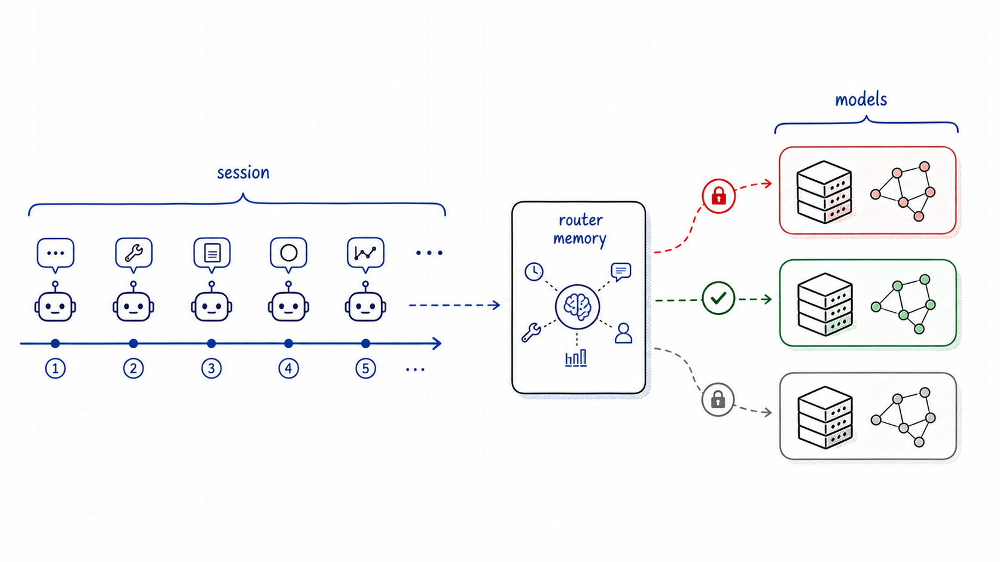
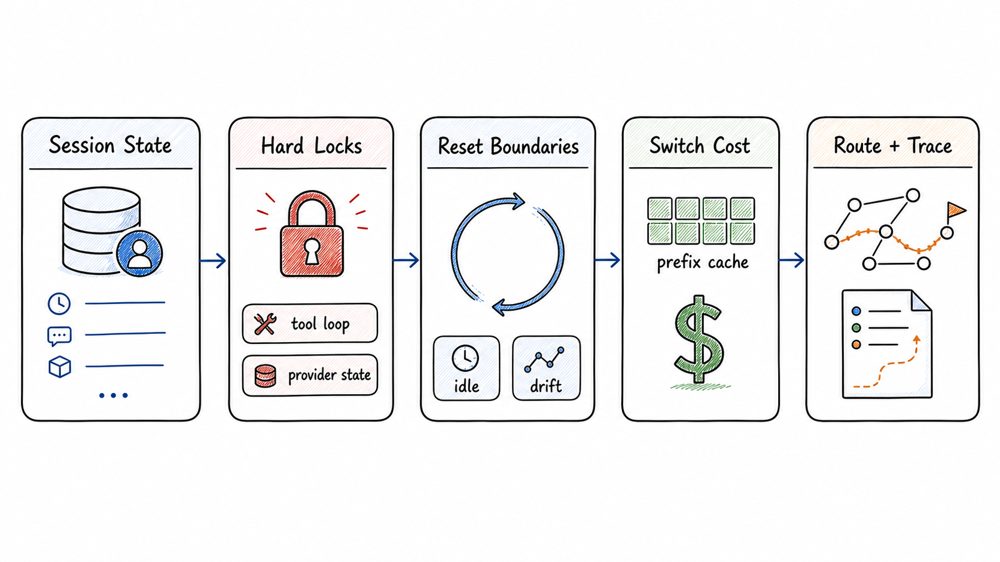
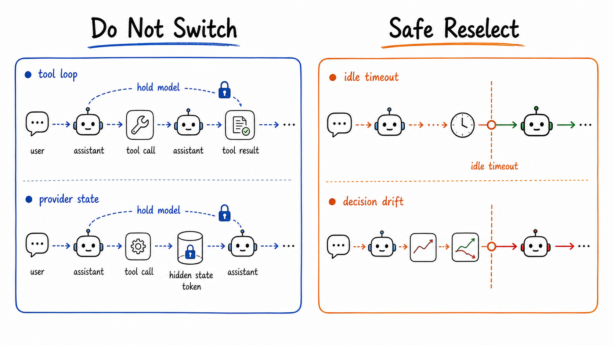
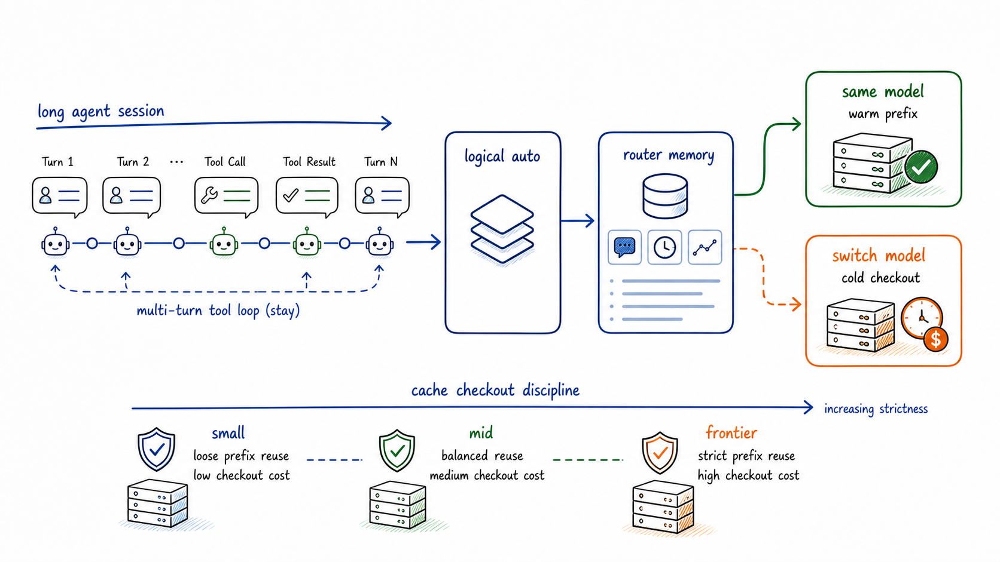
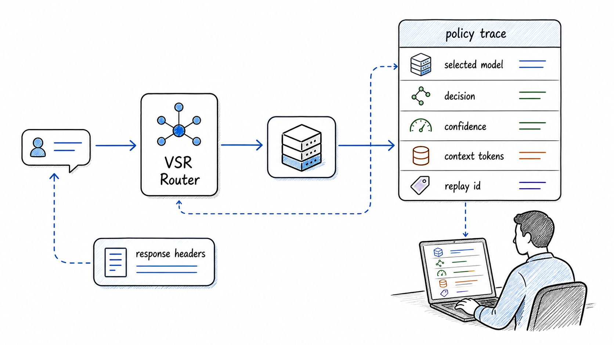
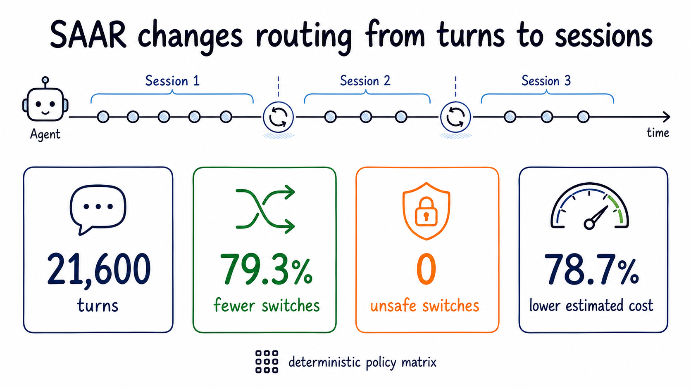
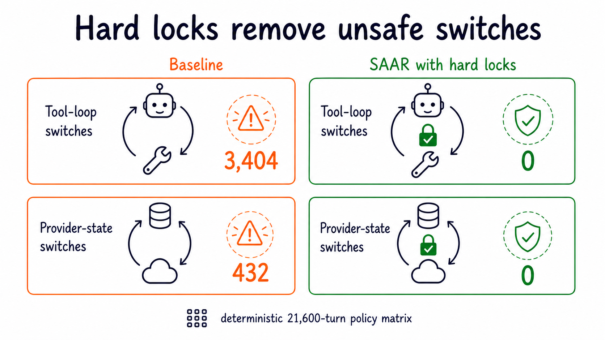
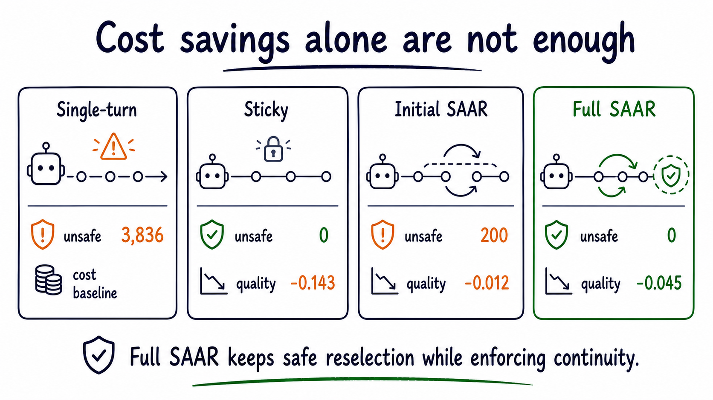
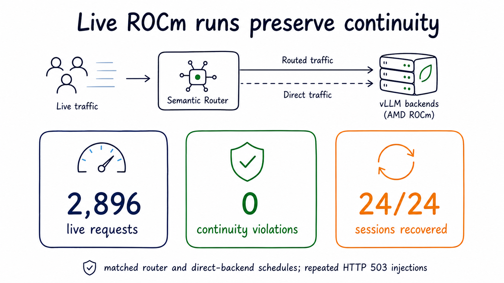

# SAAR：长程 agent 问的是「现在能不能换模」

英文对照：[en/vllm/blog/serving/semantic-router-session.md](../../../../en/vllm/blog/serving/semantic-router-session.md)  
原文：https://vllm.ai/blog/2026-06-02-session-aware-agentic-routing  
2026-06-02。署名 **Xunzhuo Liu, Bowei He, Huamin Chen, Haichen Zhang (AMD), Andy Luo (AMD), and the vLLM Semantic Router Team**。仓库：[vllm-project/semantic-router](https://github.com/vllm-project/semantic-router)。立项：[semantic-router](semantic-router.md)。脊柱：[semantic-router-signal](semantic-router-signal.md)。v0.1：[iris](semantic-router-iris.md)。v0.2：[athena](semantic-router-athena.md)。产品化写进 [Themis](semantic-router-themis.md)。视觉信号：[vision](semantic-router-vision.md)。后来的 MoM 专章：[mom](semantic-router-mom.md)。Looper：[micro-agent](semantic-router-micro-agent.md)。AMD 现场池：[mom-amd](semantic-router-mom-amd.md)。不要和引擎里的 [Router](router.md) 混。数字是确定性矩阵 + AMD ROCm 现场跑，当演示。

同目录还有：[modular](semantic-router-modular.md)、[amd](semantic-router-amd.md)、[fusion](semantic-router-fusion.md)、[halugate](halugate.md)。

长程 agent 给路由出了一道单轮 prompt router 没设计过的题。还要问这句该哪只模型；还要问 **此刻换模会不会把 session 弄断**。

**Session-Aware Agentic Routing (SAAR)** 仍走语义路由，外面加：router 自管的 session memory、工具环和不可移植 provider 状态上的 hard lock、安全 reset 边界、prefix-cache 感知的切换定价、可 replay 的迹。

**21,600** 确定性 turn：切换 **−79.29%**，不安全切换 **3,836** 清到 0，估算物理模型成本 **−78.71%**。现场 AMD ROCm **2,896** 请求：**0** 次连续性违规。

本地图（原文版权仍归原站；学习对照用）：



**Figure 1.** 长程 agent 要的是认得轨迹的路由，不只认得最新那句 prompt。

## 从 prompt 路由到 session 路由

Semantic Router 起手：不是每条请求都该走同一条路。Iris 让信号可组合。Athena 更战略——选模、记忆、replay、长上下文信号、多模态原语、AMD ROCm。

Agent 又把路由单位换了。coding / 研究 agent 是一次 **session**：计划、调工具、收工具结果、改文件、跑测试、从错里爬、暂停、再开，然后短跟句 "continue" / "fix it" / "run that again"。这些 turn 只因为前面的轨迹才有意义。

路由不再只答：*这句该哪只模型？* Agent 流量还要答：**此刻在这个 session 里换模安不安全？**

## 单轮为什么会断

局部对、session 错。典型工具环：

| Turn | 客户端发什么 | 单轮 router 看见 | session router 必须记得 |
| --- | --- | --- | --- |
| 1 | "Refactor this module and run the tests." | 编码任务 | session 已经钉在一只物理模型上 |
| 2 | 模型吐出 tool call | 一条模型响应 | 下一份工具结果属于同一只模型 |
| 3 | 客户端送回工具结果 | 一句很短的观察 | 开口要工具的那只模型该收下结果 |
| 4 | "fix the failing case" | 短跟句 | 靠前面的代码、测试、路由状态 |
| 5 | 闲一阵再回来 | 又一句短消息 | 可以再问旧模型还值不值得握着 |

最新消息单独拿出来，会踩这些：

- 工具结果甩给没开口要工具的模型。
- 不可移植的 continuation id 送到另一台物理 backend。
- 暖了很久的 session 因为这句很短就把 prefix locality 扔掉。
- 逻辑模型 `auto` 不好查：到底哪只物理模型伺候了这一轮。

Agent **该**换模：任务变难就从便宜走到强，碰到安全边界再走回来。要 session 上下文才知道哪些瞬间能换。

## SAAR 设计

信号仍抽、决策仍匹配、算法仍在命中的决策里排候选。SAAR 在结果外面加一层 **session 控制**。



**Figure 2.** 记忆、hard lock、reset、切换经济学、replay，再选物理模型。

| 件 | 存什么 / 判什么 | 为什么要紧 |
| --- | --- | --- |
| Router memory | 上次物理模型、命中决策、phase、切换次数、idle、cache 证据、replay metadata | 有 session 上下文，又不做成应用记忆 |
| Hard lock | 工具环进行中、或带着不可移植的 provider 状态，不许切 | 正确性排在成本和质量前面 |
| Reset 边界 | idle timeout 或决策漂移后重选 | 免得 session-aware 退化成粘会话 |
| 切换经济学 | handoff 成本、切换史、剩余轮次先验、prefix-cache checkout | 不同档、不同长度，切换代价不对称 |
| Replay | 为何 stay / switch / 拒绝 | `auto` 变得可检查 |

这是 **选模策略**，不是 endpoint 负载均衡。Semantic Router 经 gateway 合同选模型或集群。集群里的成员、健康、LB 仍是基础设施——[Router](router.md) / Envoy。

## 有时不许换



**Figure 3.** 工具环和 provider continuation 是硬约束；idle 和决策漂移才允许重选。

两道 **hard lock**：

- **工具环连续。** 物理模型开口要了工具，结果必须回到同一只物理模型。那句观察不是新 prompt。
- **Provider 自管状态。** 不可移植的 continuation（属于一台 backend 的 response id）就钉住上一只物理模型。

不安全，就不许靠更便宜的模型「买」出去。

反面边界：idle timeout 和决策漂移重新打开选择。停久了连续性会淡；命中决策从改代码漂到综合，旧选择不该永远粘着。

| 情形 | SAAR | 理由 |
| --- | --- | --- |
| 工具还在等结果 | 钉上一只物理模型 | 局部推理环 |
| 不可移植的 provider 状态 | 钉上一只物理模型 | 换 backend 状态可能作废 |
| idle 过了配置边界 | 允许重选 | 连续性压力淡了 |
| 命中的路由决策变了 | 允许重选 | 任务形状变了 |
| 贵模型上暖了很久 | 抬高切换门槛 | prefix locality 值钱 |
| 小模型上的便宜短重试 | 降低切换门槛 | checkout 便宜 |

## Router memory 不是用户记忆

不是对话摘要、不是检索记忆、不是用户画像。不为模型记事实。每个 session 只盯：

- 逻辑名后面上次的物理模型
- 上次命中的路由决策
- phase：normal / tool-loop / provider-state / idle-reset / drift-reset
- 最近切换次数
- 最新上下文长度和 cache 证据
- 把响应接到决策迹上的 replay id

应用记忆留在应用。检索留在检索栈。SAAR 记忆只为跨 turn 的路由连贯。

## Prefix cache 让切换不对称



**Figure 4.** 同一刀切换，档位、session 长度、物理 prefix 复用不同，代价就不同。

便宜模型上的短重试，和前沿模型上暖了 40 轮的 session，不是一类事。后者攒了值钱的 prefix；换走之后，下一只物理模型可能要付很大的输入账，哪怕用户这句很短。

SAAR 给 **cached-input checkout 差价**：当前考虑的物理模型，普通 prompt 输入价和 cached-input 价之间的缝。越长越贵的 session，越舍不得丢掉 prefix locality。

用户调 `auto`，逻辑名后面的物理模型可以随时间换。一台 backend 报的 cache hit 是 **那一台的物理证据**，不能自动转给另一台。SAAR 把 backend 报的 cached tokens 和 router 估的复用分开，**不改写**上游 usage 字段。

## 一条请求怎么走

客户端打 OpenAI 兼容 gateway，通常逻辑名 `auto`，再带稳定 session id（`x-session-id`）。

1. 读请求、session id、工具上下文、provider-state 标记、候选集。
2. 正常的 Semantic Router 信号和决策管线。
3. 基座选模（例如 hybrid）。
4. 从 router memory 载入上一轮路由状态。
5. 工具环和 provider 状态 hard lock。
6. idle timeout 和决策漂移边界。
7. 用 prefix-cache checkout 和切换史调切换分。
8. 选物理模型，吐诊断。
9. 更新 router memory，写 replay。

```yaml
routing:
  decisions:
    - name: agentic_routing
      modelRefs:
        - model: qwen3-8b
        - model: qwen3-32b
      algorithm:
        type: session_aware
        session_aware:
          base_method: hybrid
          idle_timeout_seconds: 300
          tool_loop_hard_lock: true
          context_portability_hard_lock: true
          decision_drift_reset: true
          prefix_cache_weight: 0.20
          switch_history_weight: 0.04
```

政策旋钮，不是万能常数。短客服可以 idle 松一点；长 coding agent 可以把工具环和 prefix cache 锁死一点。

## 可观测是功能的一部分



**Figure 5.** 逻辑模型后面的物理选择，变成迹和响应 header。

诊断：选中的模型、决策、replay id、session phase、置信、context-token 数。有用的迹能答：

- 基座选择器本来会选谁？
- 是因为工具环 lock 才钉住？
- provider 状态让切换不安全？
- 跨过 idle 或漂移边界了吗？
- prefix-cache 证据怎么改了调后分数？
- 最终是 stay、switch，还是 locked stay？

没有 replay，`auto` 不好查。有了，运营能审计：这一刀是保连续，还是判切换安全。

## 他们怎么评

三层证据，一个问题：更对 agent 友好，又不把正确性藏起来？

1. **确定性政策矩阵**——把控制逻辑从 serving 噪声里拆开；压工具环、provider 状态、idle、漂移、模型档、切换史。
2. **现场 OpenAI 兼容 serving**，走 AMD ROCm——header、session id、诊断、故障处理过真实路径。
3. **确定性 agent 任务迹**——模拟工具观察，最终答案精确打分（没有 judge 模型）。

目标不是「切换越少越好」。粘会话也能做到。目标是：去掉不安全切换，留下有用的动，尊重贵的 prefix locality，现场仍可观测。

## 结果 1：控制单位从 turn 收到 session

balanced / 工具重 / 前沿重 / idle 重 / provider-state 重 / 漂移重。五粒种子，每粒 40 个 session，每个 18 turn → **21,600** turn。



**Figure 6.** 21,600 确定性 turn 的头条。

| Policy | Switches | Unsafe switches | Estimated cost reduction | Quality delta |
| --- | ---: | ---: | ---: | ---: |
| Single-turn | 9,709 | 3,836 | 0.00% | +0.0000 |
| Sticky session | 340 | 0 | 98.65% | −0.1433 |
| Initial SAAR | 1,810 | 200 | 70.92% | −0.0122 |
| Full SAAR | 2,011 | 0 | 78.71% | −0.0453 |

单轮又切又不安全。粘会话几乎不动，质量让太多。Full SAAR 站在中间：不安全的动没了，idle 和漂移仍能重开决策。

## 结果 2：hard lock 清掉正确性失败



**Figure 7.** 工具环和不可移植 provider 状态上的不安全切换清掉。

工具环违规：**3,404 → 0**。Provider 状态违规：**432 → 0**。工具结果不是普通 prompt；不可移植 continuation id 不是普通文本字段。

## 结果 3：不是换了名字的粘会话



**Figure 8.** 连续，但仍能动；不是纯粘。

| Variant | Switch reduction | Unsafe switches | Cost reduction | 读法 |
| --- | ---: | ---: | ---: | --- |
| No tool lock | 74.96% | 760 | 60.05% | 工具环违规回来 |
| No provider-state lock | 77.98% | 200 | 69.82% | 不可移植状态违规回来 |
| No drift reset | 83.14% | 0 | 81.31% | 任务漂了还粘 |
| No idle boundary | 83.98% | 0 | 80.14% | 停了还粘 |
| No frontier cost | 73.96% | 0 | 54.75% | 贵的暖 session 太容易丢掉 |
| Full SAAR | 79.29% | 0 | 78.71% | lock 加上安全重选 |

Lock 管正确。Reset 管活。Prefix-cache checkout 管账。

## 结果 4：现场 AMD ROCm 上不变量还在

OpenAI 兼容流量穿过 router 和 AMD ROCm backend；routed 和直打 backend 用匹配的日程。



**Figure 9.** 现场 ROCm：长 session 和注入故障下的连续性。

**2,896** 现场请求，**0** 次连续性违规。

| Workload | Requests | Success rate | p95 overhead | Continuity violations |
| --- | ---: | ---: | ---: | ---: |
| balanced-32x64 | 2,048 | 100.00% | 6.181 ms | 0 |
| stateful-16x48 | 768 | 100.00% | 26.805 ms | 0 |
| idle-16x5-75s | 80 | 100.00% | 283.463 ms | 0 |

idle 工作负载带着真实墙钟 sleep；那个 p95 **不是**热路径路由开销。

## 结果 5：backend 故障后 session 能回来

| Fault phase | Requests | Injected 503s | Affected sessions | Recovery | Continuity violations |
| --- | ---: | ---: | ---: | ---: | ---: |
| provider state | 360 | 48 | 8 | 100.00% | 0 |
| tool loop | 360 | 72 | 8 | 100.00% | 0 |
| topic drift | 432 | 48 | 8 | 100.00% | 0 |

一次性扰动：**32/32** 受影响 session 后来恢复。反复失败矩阵：**168** 次注入 HTTP 503 之后 **24/24** 恢复。瞬时 503 不该让 router 忘掉正在进行的工具环、不可移植的 provider 状态、或可 replay 的历史。

## 结果 6：任务迹把 agent 环跑一遍

确定性多轮任务迹，模拟工具观察，最终答案精确打分（该有的标签有没有；没有 judge）。AMD serving 任务跑：**18/18** 精确打分实例完成；**96/96** 被路由的 turn 有 replay header；没有连续性违规。比宽的 coding-agent 基准小；比只数切换强。

## 对 vLLM 用户改了什么

逻辑模型名后面藏着一篮子模型时，SAAR 更有用。用户：调 `auto`，带稳定 session id。运营：配何时必须连续、idle 何时可 reset、prefix locality 多重、决策怎么留迹。

尤其：候选模型成本 / 延迟 / 能力不同；agent 跨 turn 用工具；客户端依赖 provider 自管 continuation；长 session 攒了 prefix-cache locality；运营要查每一轮实际是哪只物理模型。

边界清楚：Semantic Router 管政策级选模。Envoy、Kubernetes、serving backend 仍管成员、健康、负载均衡。

## 更大的方向

Iris 让决策可组合。Athena 往系统脑走。[Vision](semantic-router-vision.md) 把证据面从文本扩到请求级。SAAR 把 **时间** 拉长：不只这条请求，还要看它落在长交互的哪一段。

Router 不成 agent。它只认得伺候 agent 所需的最少 session 事实。`auto` 后面的路由该知道：何时允许换、何时禁止、暖了很久的 session 换一刀要付多少。

## 一起做

他们列的开口：真实 agent 流量上的 session 政策；多轮 / 工具环评测；AMD ROCm serving 验证；可观测 / replay / 生产调试；把政策从 endpoint LB 里分开的 Envoy / Kubernetes / gateway 集成。

- GitHub：[vllm-project/semantic-router](https://github.com/vllm-project/semantic-router)
- 文档：[vllm-semantic-router.com](https://vllm-semantic-router.com)
- Slack：[vLLM Slack](https://vllm-dev.slack.com/archives/C09CTGF8KCN) 的 `#semantic-router`
