# 信号–决策：14 类不够用之后

英文对照：`en/vllm/blog/serving/semantic-router-signal.md`  
原文：https://vllm.ai/blog/2025-11-19-signal-decision  
落地见 [Iris](semantic-router-iris.md)。

「帮我紧急审一段认证代码的安全漏洞」会被 14 类 MMLU 收成 computer science，送到通用 coding 模型——urgency、jailbreak、推理预算全丢了。医疗「紧急患者数据泄露」可能到医疗模型，却没有 PII 插件。

新脊柱：先抽多维 **信号**（域 / 关键词 / embedding / 事实 / 反馈 / 偏好），再用 AND/OR + **优先级** 合成 **决策**，决策挂插件链。多决策命中取最高优先级；都不中走 default。当时五只内置插件（cache / jailbreak / PII / hallucination / system_prompt 一类），按决策开关、按序执行，可改请求、可拦、可写 metadata。企业 50+ 用例塞不进 14 个学术标签——这是控制面，不是 [Router](router.md) 那只 P/D 负载均衡。

本地图（原文版权仍归原站；学习对照用）：

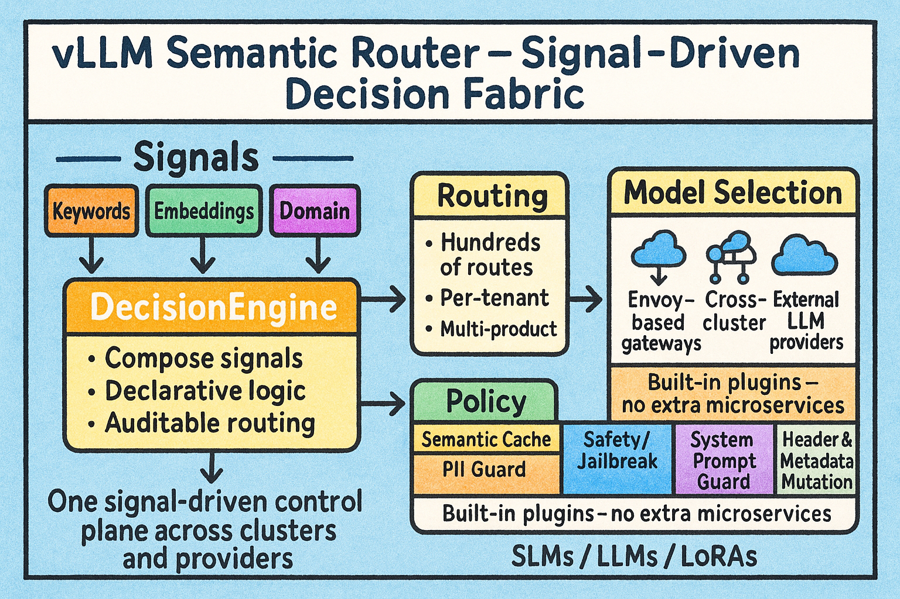

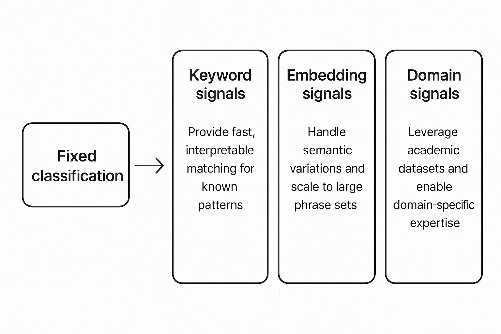

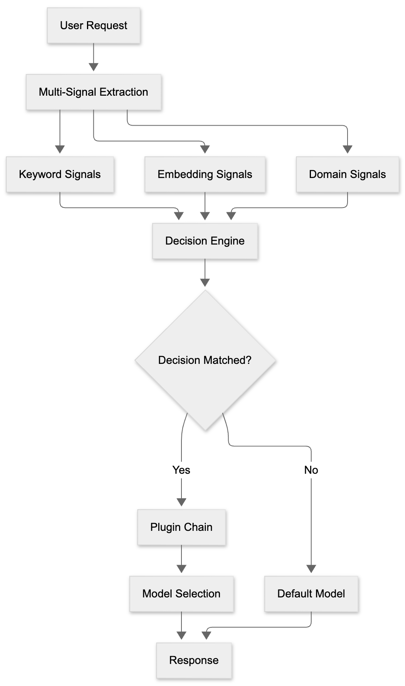

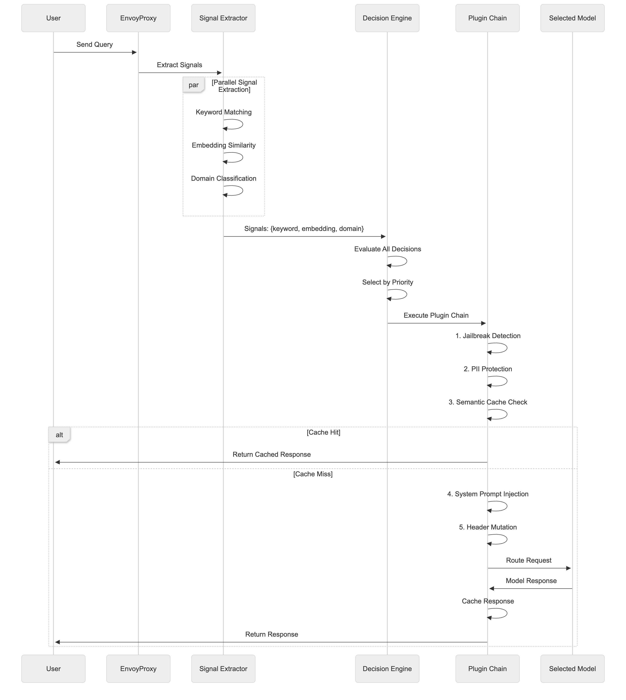

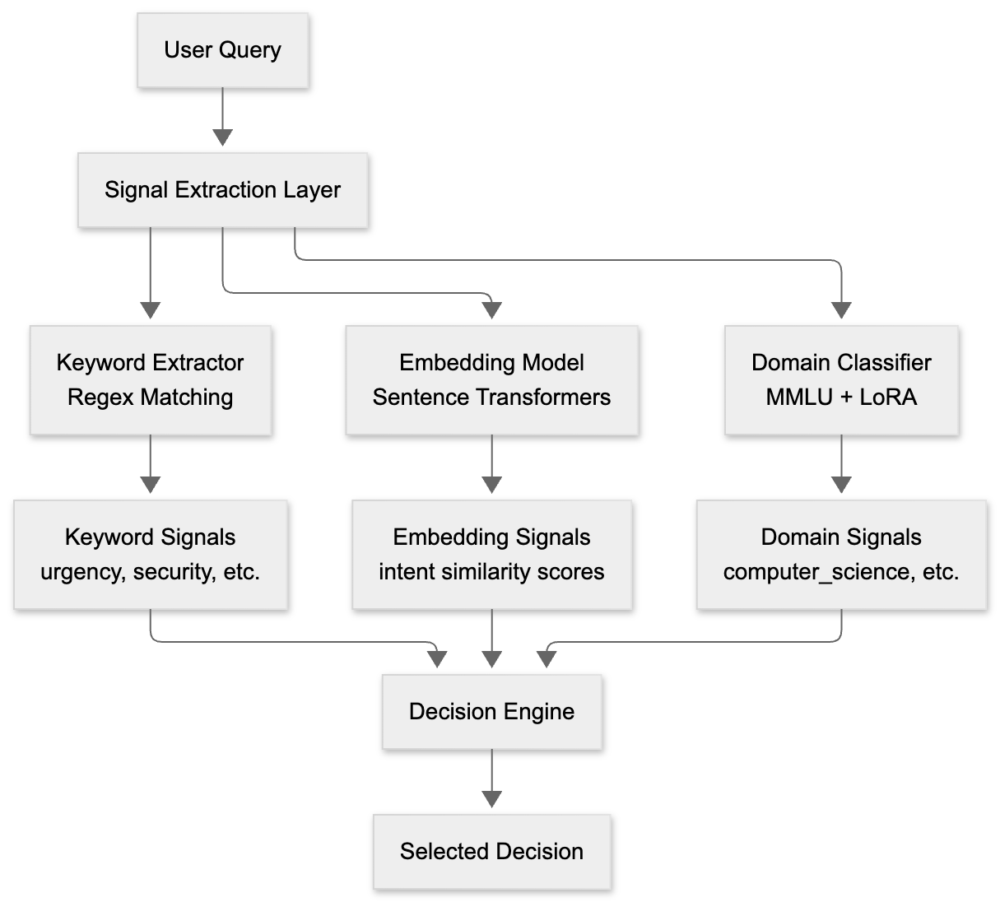

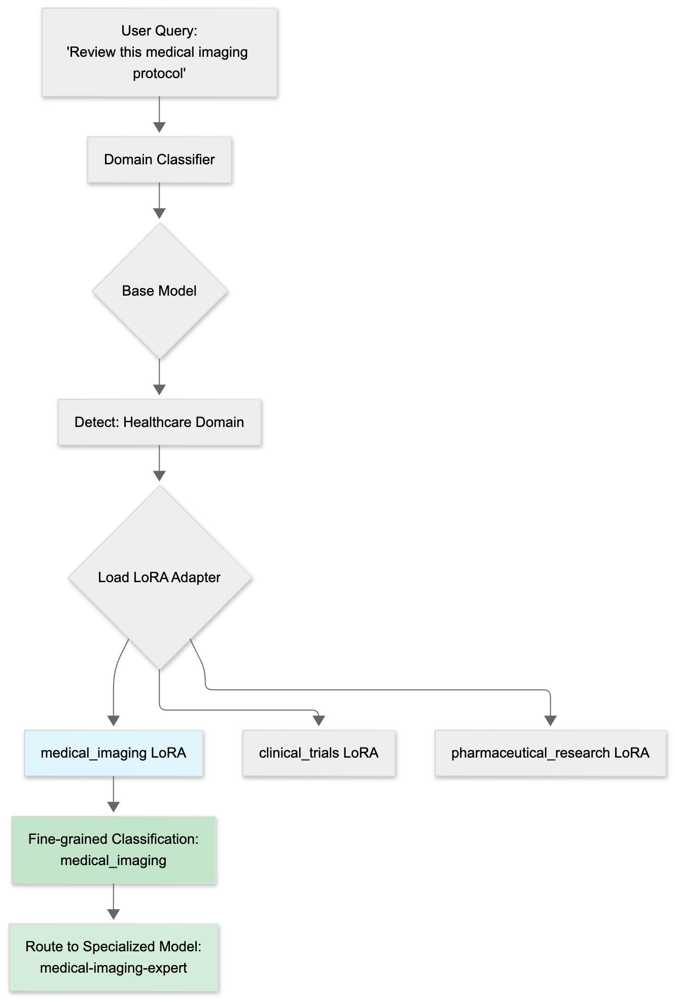

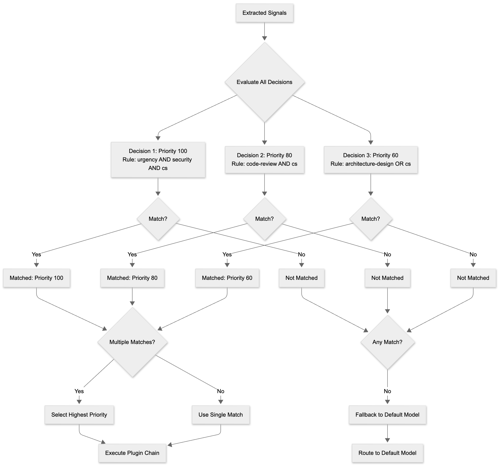

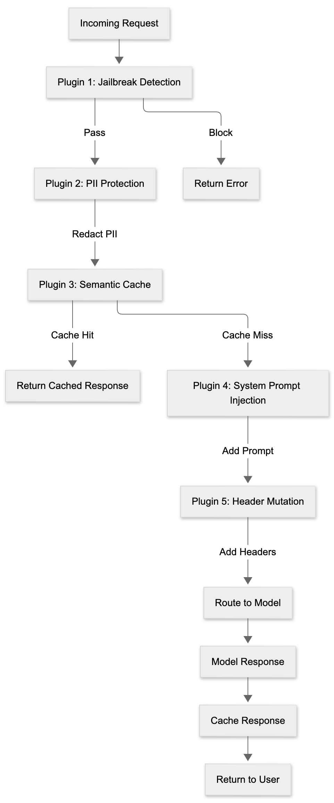

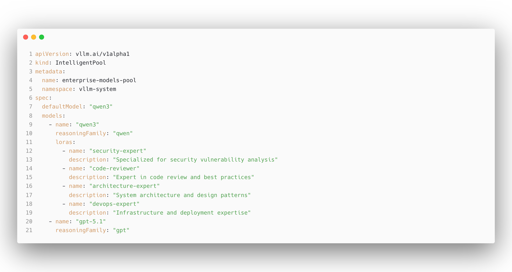

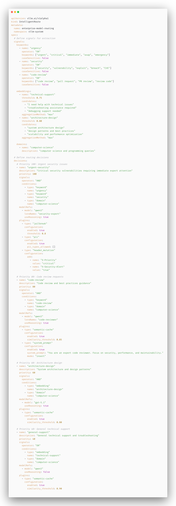

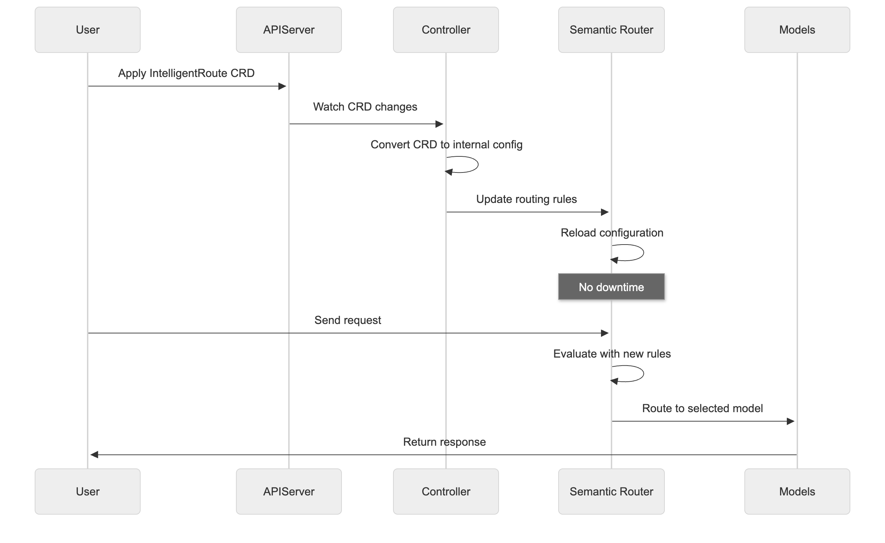

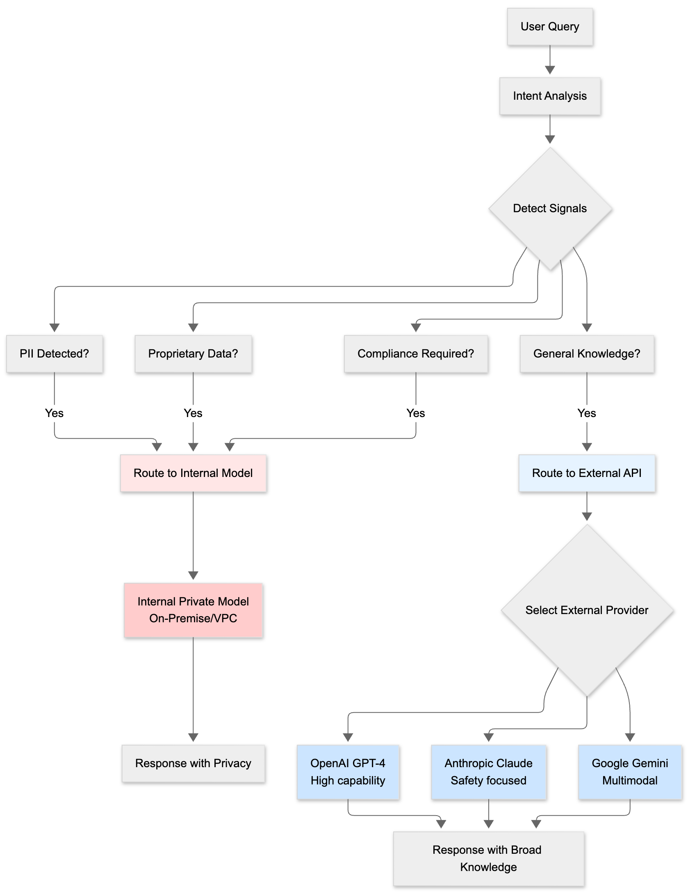
