# Semantic Router v0.3 Themis：从信号到可运营的有状态路由

英文对照：[en/vllm/blog/serving/semantic-router-themis.md](../../../../en/vllm/blog/serving/semantic-router-themis.md)  
原文：https://vllm.ai/blog/2026-06-05-v0.3-vllm-sr-themis-release  
2026-06-05。署名 **vLLM Semantic Router Team**。仓库：[vllm-project/semantic-router](https://github.com/vllm-project/semantic-router)。立项：[semantic-router](semantic-router.md)。脊柱：[semantic-router-signal](semantic-router-signal.md)。v0.1：[iris](semantic-router-iris.md)。v0.2：[athena](semantic-router-athena.md)。SAAR 专篇：[session](semantic-router-session.md)。后来的 MoM 专章：[mom](semantic-router-mom.md)。不要和引擎里的 [Router](router.md) 混。页上的 commit 数和 RouterArena 快照是发版时的。

同目录还有：[modular](semantic-router-modular.md)、[amd](semantic-router-amd.md)、[mom-amd](semantic-router-mom-amd.md)、[vision](semantic-router-vision.md)、[fusion](semantic-router-fusion.md)、[micro-agent](semantic-router-micro-agent.md)。

v0.3 代号 **Themis**。原文写成：语义路由在这里变成有状态、可观测、能扛真实 AI 流量。Iris 让决策可组合。Athena 换模型底座，把记忆、安全、选模、长上下文信号、OpenClaw、AMD ROCm 铺开。Themis 走下一步：更好运、更好查、更难误用。

相对 v0.2.0：超过 **350** 个 commit，覆盖 router 核、CLI、dashboard、DSL、Kubernetes、协议兼容、选模、安全、replay、发版就绪。最大的价值不是某一项功能，是收成一条稳定合同：

> 信号变成 projection，projection 喂决策，决策选算法，算法选模型。

这条合同现在同时出现在 router、CLI、dashboard、DSL、Helm、面向 operator 的部署面上。

本地图（原文版权仍归原站；学习对照用）：

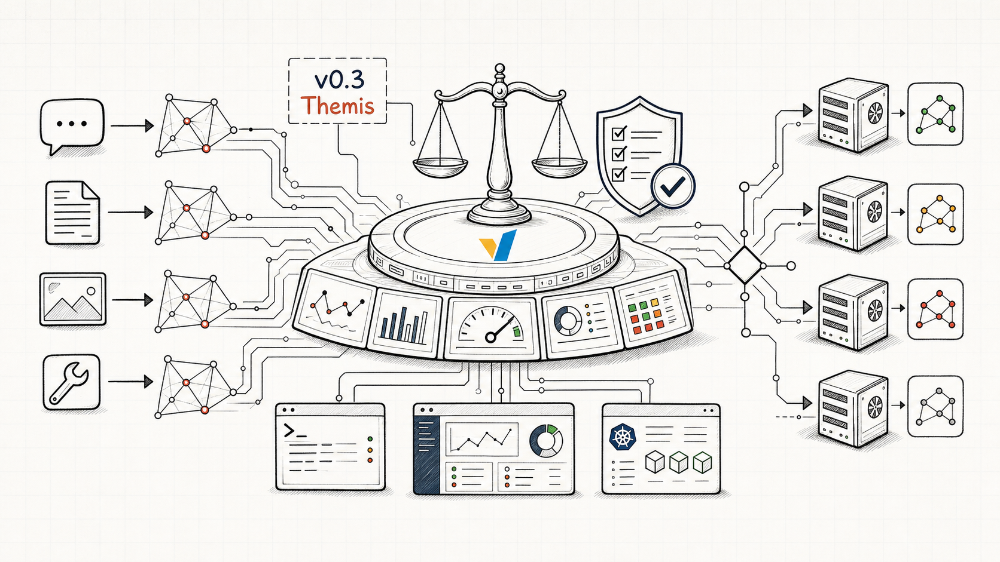

**Figure 1.** Themis 把信号、策略、operator、模型后端收成一块可检查的路由控制面。

## 为什么叫 Themis

Themis 是秩序、规则、判断。生产里语义路由有用，前提是运营能回答：

- 哪些信号响了？
- 哪条决策命中？
- 哪个选模算法跑了？
- 选了哪只模型？
- 哪个安全 / replay 插件改过路径？
- 哪一版 config 造出这个行为？
- 同一份策略，本地、dashboard、Kubernetes 会不会长成三套系统？

Athena 的野心还在，runtime、API、操作流程的边界更硬。

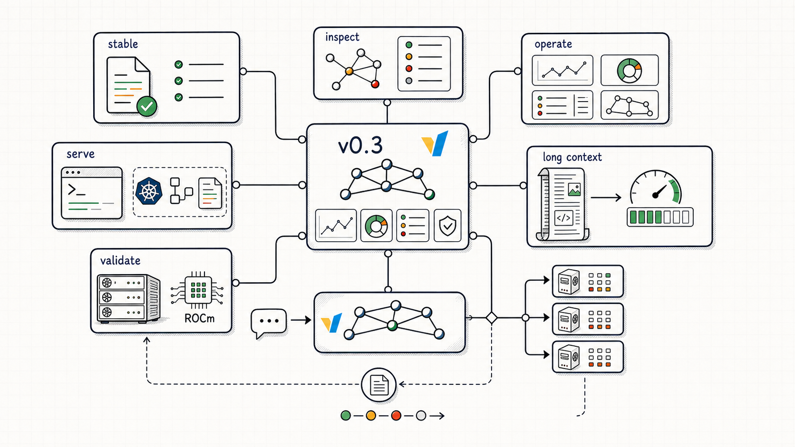

**Figure 2.** 价值是稳定合同、检查、运维、serving、长上下文、校验连在一起，不是孤立功能。

## v0.3 新了什么

### 1. 一份规范的 v0.3 配置合同

顶层形状：

```yaml
version: v0.3
listeners: []
providers: {}
routing: {}
global: {}
```

以前本地 Docker、dashboard 生成的 config、Helm values、CRD、例子、旧文档会叠出好几套 layout。Themis 让 `config.yaml` 当稳态文件，顶层结构对齐。

这一刀 **删掉 `vllm-sr init`**。新流程：

- 空目录里 `vllm-sr serve`：dashboard-first
- YAML-first：直接写规范 `config.yaml`
- 旧文件：`vllm-sr config migrate --config old-config.yaml`
- 支持的 provider 清单：`vllm-sr config import`

Breaking，但是原文说的那种该破：更少方言、所有权更清楚、公共合同更能活过 1.0 之前。

边上更严：未知 YAML 字段警告；规范加载有测试盖着；Python CLI 模型跟现代 Pydantic 对齐；classifier 资源闸更显式。拼写错误和过期形状，要在静默路由漂移之前被抓住。

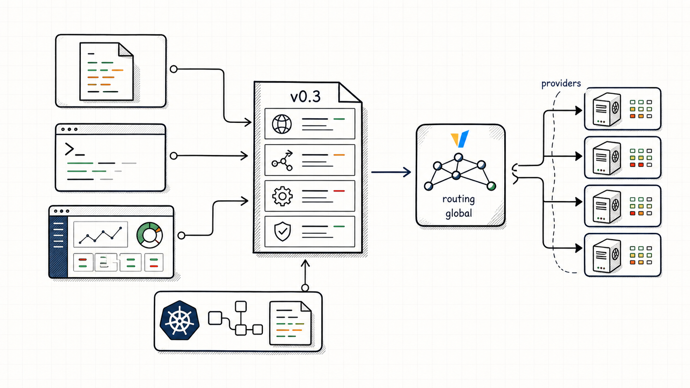

**Figure 3.** 本地 YAML、CLI、dashboard、Kubernetes 收成同一份 v0.3 形状。

### 2. 信号、Projection、决策、算法、模型

| Layer | 管什么 |
| --- | --- |
| Signal | 从请求、响应、工具、语言、域、上下文、modality、身份、安全分类器抽证据 |
| Projection | 把生证据收成策略能用的概念：verification、urgency、feedback、balance |
| Decision | 带优先级、可解释条件的命名路由策略 |
| Algorithm | 命中决策之后，在候选模型里挑 |
| Model | 用选中的 backend alias / provider 伺候请求 |

信号族更富、有 projection trace、选模算法更绕、还有响应侧插件——隐式行为不再能接受。目录不只看最新那句 prompt，还看安全姿态、工具环、用户角色、多模态意图、会话形状、结构化事件、可 replay 的知识库证据：

| Signal family | 抓住什么 | 典型用途 |
| --- | --- | --- |
| `authz` | 用户 / 组上下文里的角色和 subject | 高价 / admin 路由、策略闸模型 |
| `complexity` | 学来的或组合出来的推理难度 | 难合成、多步推理升级 |
| `context` | 估出来的 context-window 需求 | 长上下文路由、成本和延迟 |
| `conversation` | 消息和工具环的形状 | 多轮、正在用工具、developer 消息、非用户上下文很重 |
| `domain` | 学来的或配好的域标签 | 商务、法律、健康、计算机 |
| `embedding` | 相对候选锚点的语义相似，含文 / 图 / 音频查询 | 支持意图、临床意图、多模态匹配 |
| `event` | 结构化事件 metadata、严重度、action code、时间紧迫 | 事故、支付、审计、运维事件 |
| `fact_check` | 要不要核事实 | 法律、医疗、事实主张升级 |
| `jailbreak` | 提示注入 / jailbreak，含看历史 | 安全路由、响应侧护栏 |
| `kb` | 知识库组或标签匹配 | 隐私政策、containment、前沿推理、本地标准路由 |
| `keyword` | 字面、fuzzy、BM25、n-gram | 快闸、紧急词、敏感词 |
| `language` | 检出的语言，置信度可配 | 按 locale 路由、多语言模型 |
| `modality` | AR、diffusion、或文图混跑 | 纯文本、生图、多模态路径 |
| `pii` | 敏感实体策略，含看历史 | 脱敏、deny/allow、隐私路由 |
| `preference` | 用户风格 / 行为偏好例子 | 短答、细答、领域腔 |
| `reask` | 重复或改写的用户轮 | 上一轮可能不满意 |
| `structure` | regex、count、sequence、密度 | 很多问、编号流程、格式很重的 prompt |
| `user_feedback` | 用户说答错了或要澄清 | 找回不满意，或换更强模型 |

Projection 输出用 `type: projection` 引用。它们是 **派生** 的路由面，不是又一族生信号：信号抽证据，projection 收成命名的策略带，例如 `support_fast`、`support_balanced`、`support_escalated`。

原文点名的可组合：`conversation` 能认出 agentic 请求形状；`event` 能路由运维 payload；embedding 规则能查非文本 modality；projection 能把吵证据收成策略带。

Dashboard topology、DSL 编辑器、compiler/decompiler、runtime 指标都改成认识这些 v0.3 面，不再默默丢掉。

DSL 加了冲突检测、`SIGNAL_GROUP`、`TEST`、`TIER`、自然语言到 DSL 的管线、`EMIT retention`、动态工具检索。Themis 的策略是带测试、能留输出、生成路径更安全的路由程序，不只是被 parse 的 YAML。

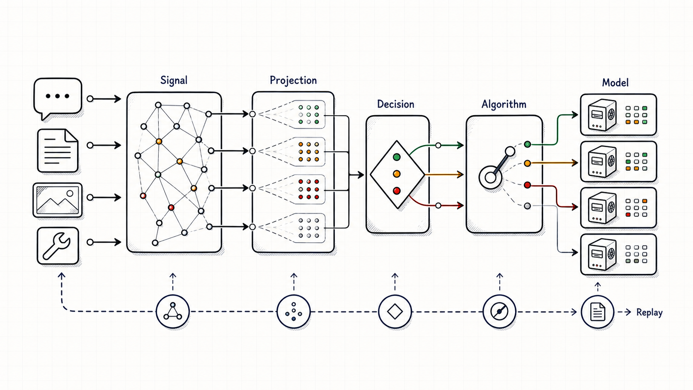

**Figure 4.** 从请求证据到信号、projection、决策、算法、模型、replay。

### 3. Session-Aware Agentic Routing

第一次称为 production-ready 的 **Session-Aware Agentic Routing (SAAR)**。专篇：[session](semantic-router-session.md)。

单轮问：这句 prompt 该哪只模型。Agent 还要问：**此刻在这个 session 里换模安不安全。**

SAAR 加上 router 自己管的 session memory、工具环上的 hard lock、provider 状态可移植性检查、idle / 决策漂移的 reset 边界、切换经济学、可 replay 的诊断。正常 Semantic Router 管线还在，包的是选模最后一英里。

对 coding agent 和长程工具环尤其要紧：工具结果通常该回到开口要工具的那只模型；provider 管的 continuation id 不该送到另一台物理 backend；暖了很久的 session 不该因为最新用户消息很短就把 prefix locality 扔掉。

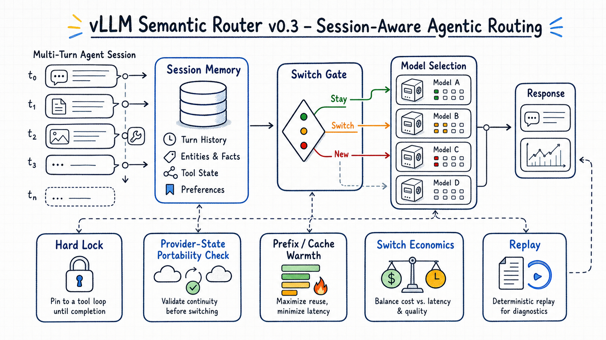

**Figure 5.** Router 自管记忆、hard lock、可移植性检查、切换经济学、replay 诊断。

几件：

- `conversation` 信号认多轮形状、正在用工具、developer 消息、非用户上下文很重
- `session_aware` 选模看质量差、switch margin、stay bias、prefix locality、剩余轮次先验，再决定值不值得换
- Hard lock 拦住工具环进行中、或带着 provider-state continuation 时的不安全切换
- Router 自管记忆能检索、存 route-local 的事实、偏好、上下文，不必另搞一套 session-state DSL
- Replay 记下 session 为何 stay / switch / reset

记忆是耐久的补：用户或 session 范围里的事实、偏好、检索到的上下文。Agent 能保持连续，又不必把每一轮钉死在最贵的模型上。

参考策略就是普通 YAML：

```yaml
routing:
  signals:
    conversation:
      - name: active_tool_use
        feature:
          type: count
          source:
            type: assistant_tool_cycle
        predicate:
          gte: 1

  decisions:
    - name: agentic_session_route
      rules:
        operator: AND
        conditions:
          - type: conversation
            name: active_tool_use
      algorithm:
        type: session_aware
        session_aware:
          base_method: hybrid
          tool_loop_hard_lock: true
          context_portability_hard_lock: true
          prefix_cache_weight: 0.20
          handoff_penalty_weight: 1.0
      plugins:
        - type: memory
          configuration:
            enabled: true
            retrieval_limit: 6
            auto_store: true
            hybrid_search: true
```

Themis 对 agent 工作负载最要紧的一块：router 能想连续性，不只分类。

### 4. Projection 把证据收成策略

没有 projection，复杂策略要在许多决策里重复底层信号细节。有了它，生证据算一次，派生出 `support_fast` 或 `support_escalated`，决策直接走这个概念。

三种核心：

- `partitions`：互斥家族里选出一个赢家（例如互相竞争的 support 意图）
- `scores`：把声明的信号或知识库度量合成一个连续值
- `mappings`：用校准过的阈值把这些值收成策略带

v0.3 还加 `multi_emit`：一步 projection 可以放出多个命名路由概念，replay 里仍可追溯。

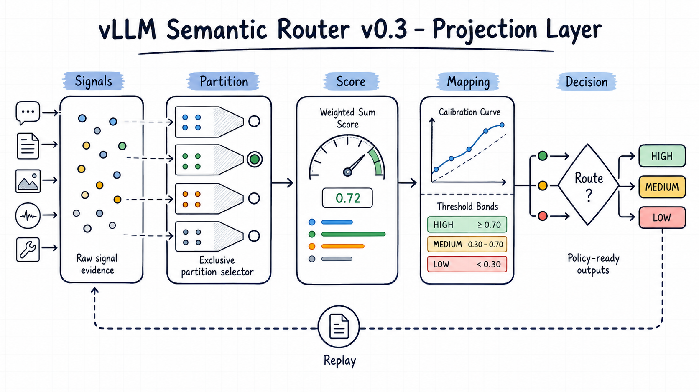

**Figure 6.** 吵的信号证据 → 决策能直接引用的命名输出。

压缩例子：

```yaml
routing:
  signals:
    embeddings:
      - name: technical_support
        threshold: 0.75
        aggregation_method: max
        candidates:
          - installation guide
          - troubleshooting steps
      - name: account_management
        threshold: 0.72
        aggregation_method: any
        candidates:
          - password reset
          - billing information
    context:
      - name: long_context
        min_tokens: 32K
        max_tokens: 256K

  projections:
    partitions:
      - name: support_intents
        semantics: exclusive
        members:
          - technical_support
          - account_management
        default: technical_support
    scores:
      - name: request_difficulty
        method: weighted_sum
        inputs:
          - type: embedding
            name: technical_support
            weight: 0.18
            value_source: confidence
          - type: context
            name: long_context
            weight: 0.18
    mappings:
      - name: request_band
        source: request_difficulty
        method: threshold_bands
        outputs:
          - name: support_fast
            lte: 0.20
          - name: support_escalated
            gte: 0.45

  decisions:
    - name: escalated_support_route
      rules:
        operator: AND
        conditions:
          - type: projection
            name: support_escalated
```

Projection trace 跟着 replay 存，dashboard 能解释：最终路由是哪条派生策略带造成的。

### 5. 协议兼容变成发版面

不再只是基本的 OpenAI Chat Completions：

- 原生 Anthropic `/v1/messages` 入口，走内部 request envelope
- Anthropic streaming，译成 OpenAI SSE
- 自定义 Anthropic 上游路由和 tool-calling
- 非流式路径向外发 Anthropic 响应
- 从请求 path header 做协议探测
- session-id 镜像、header 透传控制
- 响应 header 说明协议翻译何时是 **lossy**
- Responses API 的 tool-trace 保真、跟 OpenAI SDK 对齐的消息处理
- OpenAI reasoning-effort mutation 修复
- identity-encoded 上游响应，躲开透明解压的意外
- 更强的 Responses API 状态和持久化路径

目标不是把每家 provider 抹成同一个样子。翻译要显式、可观测、够安全，让逻辑模型 `auto` 能坐在多种协议前面，不吓到运营。

### 6. Dashboard 变成 operator 控制台

不只是 config 编辑器。首跑 setup、topology 图、靠 replay 的 insights、日志、status、评测流、auth、模型清单都拧紧了。Operator 可以导入 profile、校验、激活、发测试 prompt、看信号路径、读 router 日志、核 replay，不必离开 dashboard。

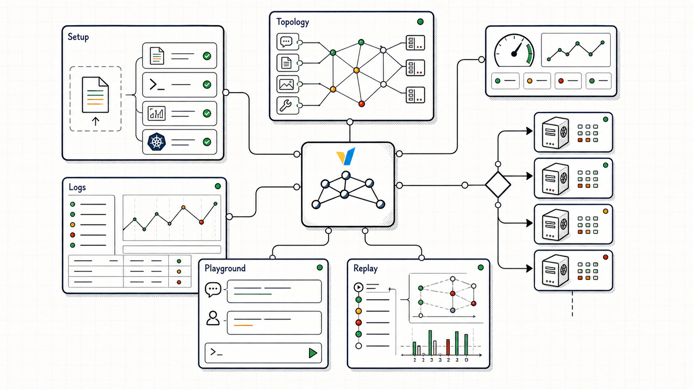

**Figure 7.** Setup、topology、日志、playground、replay、模型健康。

点名的改进：

- 内置路由模式、缺模型补全
- Topology dry-run：命中的信号、projection、决策、模型
- 经 dashboard proxy 的 router replay 和聚合 insights
- 自然语言 DSL builder、评测流修复
- Playground 里贴文件
- Auth 服务起不来时 **fail-closed**
- 策略版本生命周期：shadow、activate、revert
- 更安全的日志、对用户提供的 fetch/open-web 请求做 URL 脱敏
- 多语言内容 UTF-8 安全显示
- 更瘦的生产 route shell、更小的 backend runtime 依赖
- Dashboard 能感知的模型列表和 status

本地和远端同一套：setup 伺候首跑，topology 看策略，logs/status 做运维，insights 看真实流量。

### 7. CLI 和部署更可预期

`vllm-sr` 是支持的操作界面：

```bash
vllm-sr serve
vllm-sr serve --algorithm latency_aware
vllm-sr serve --algorithm session_aware
vllm-sr serve --platform amd
vllm-sr serve --platform nvidia
vllm-sr chat
vllm-sr eval
vllm-sr model list
vllm-sr config migrate --config old-config.yaml
```

本地 `vllm-sr serve` 仍是 Docker 工作流：Linux、macOS、WSL2。AMD ROCm 仍是 **发版验证过** 的 GPU 路径。`--platform nvidia` 给已经配好 NVIDIA container runtime 的人做本地 NVIDIA Docker 透传。**原生 Windows Docker serving 会被明确拒绝**，而不是后面才莫名其妙地炸。

检查 / smoke-test：`vllm-sr model list`（已配的模型清单）、`vllm-sr chat`（一次性 completion）、`vllm-sr eval`（评测端点）。`VLLM_SR_DNS` 让本地容器加入自定义 DNS，企业 / 实验室网络要用。

Kubernetes：Helm、发版默认值、OpenShift 部署修复、多个 `IntelligentRoute` 的 reconcile、CRD 的 modality 合同、可选 Gateway API `HTTPRoute` 入口、AgentGateway 安装指引。发版运维离开含糊的 `latest`，走向明确的制品合同、升级 / 回滚文档、发版检查。

### 8. 安全、Replay、记忆、检索更值得信

Athena 把这些带进 router。Themis 把它们拧硬。

**Replay 和可观测**

- Router replay 的 PostgreSQL insert 写对，dashboard insights 不会默默空着
- Projection trace 跟着 replay 存
- 响应侧 jailbreak 和 replay 路径收紧

**存储和检索**

- Qdrant 向量检索 provider
- Valkey 做 cache、向量库、记忆 backend，含 TLS 和 search-module 预检
- Redis 和 Responses API 存储默认值更贴本地和 Kubernetes
- Hybrid cache rebuild 少预分配
- 流式 Redis semantic-cache 写对，流式 chunk 内存有界
- O(N) 的 cache-LRU 读路径换成常数时间、list 托底的实现
- BM25 和 n-gram 分类缓存
- Hybrid HNSW entry-point 传播修复
- Replay、cache、memory、向量库共用 Milvus 生命周期

**Runtime 和安全加固**

- 对着先前用户轮做 history-aware 的 PII / jailbreak 扫描
- 选模 switch gate 修 previous-model 填充
- extproc 后台路径 goroutine panic recovery
- 选模随机数的并发 race
- Config rollback 版本的路径穿越保护
- Python、Go、Rust、前端依赖的安全更新

不炫，但这正是 Themis 要干的：真实流量、长 prompt、replay 存储、operator 改 config 时更安全。

### 9. 长上下文路由更便宜

三道控制：

1. Context token 估计能从观察到的响应 usage 学一个 **在线校准比**。精确分词没有时也能慢慢贴真实流量。Fallback 仍保守。

2. 原生 mmBERT embedding 给内存设界，又不变成默默截断。**#2007** native-binding 修复：attention 按 **query chunk** 处理，不再为整段序列物化一张密 attention 张量。

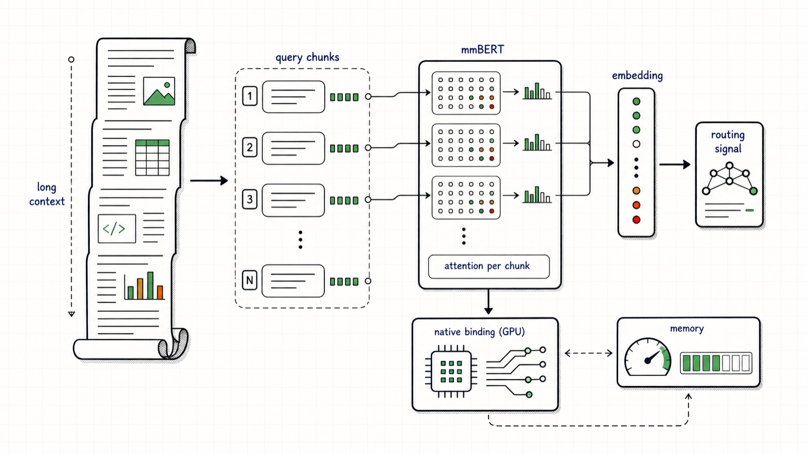

**Figure 8.** 分块的 mmBERT attention：长上下文信号还在，原生内存有界。

3. Prompt compression 变成命名 profile，只用于 **抽信号**：

| Profile | 用途 |
| --- | --- |
| `default` | 一般路由，平衡压缩 |
| `coding` | 保住像代码、实现很重的句子 |
| `medical` | 保住临床上相关的细节 |
| `security` | 保住安全和策略证据 |
| `multi_turn` | 保住会话连续 |

原始用户 prompt 仍送给选中的 serving 模型，除非决策自己的插件显式改它。路由优化不许默默改写用户意图。

### 10. 硬件 backend 路径变宽

四条：NVIDIA CUDA 和 AMD ROCm 伺候被 serve 的 vLLM backend；Intel OpenVINO 做 router 自管的分类器和 embedding 推理；CPU/local 做开发和 smoke test。

v0.3 加了最初的 **OpenVINO binding**：原生 C++ 和 Go，对接 ModernBERT 的 sequence classification、token classification、embedding，还有对比 OpenVINO 和 Candle 的 benchmark 入口。**这是 backend / binding 里程碑，不是全面生产对等声明。**

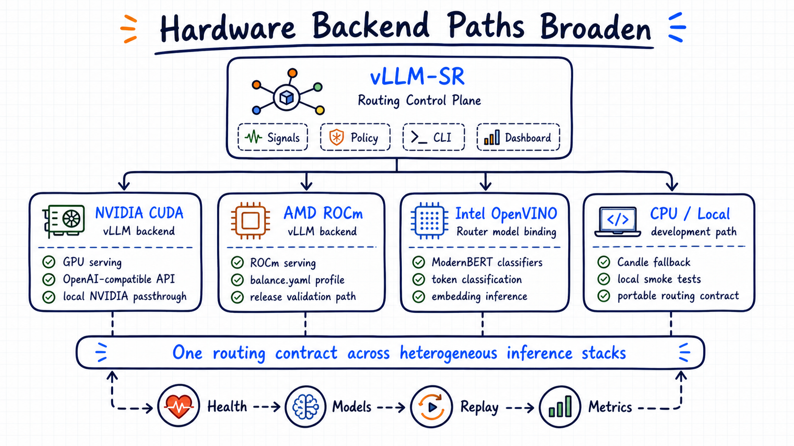

**Figure 9.** 一块路由控制面，穿过 NVIDIA CUDA、AMD ROCm、Intel OpenVINO、CPU/local。

Athena 带进来的 AMD 路径仍在 v0.3 合同里：

```bash
vllm-sr serve --platform amd
```

维护中的 profile：`deploy/recipes/balance.yaml`——ROCm vLLM backend 上多个 served alias，信号 → projection → 决策 → 选模，和 CPU/local 同一条。AMD 现场笔记：[mom-amd](semantic-router-mom-amd.md)。

发版就绪时在 AMD ROCm 栈上验证过：

- ROCm vLLM backend 露出期望的 served alias
- Dashboard setup：用参考 balance profile 做 import / validate / activate
- Router health，Envoy 上 OpenAI 兼容的 `/v1/models`
- 一次 coding/debug 请求的 topology dry-run
- 直接走 Envoy 的 chat completions：coding、math、legal
- Dashboard proxy 的 chat completions
- Router replay 列表和聚合 insight API

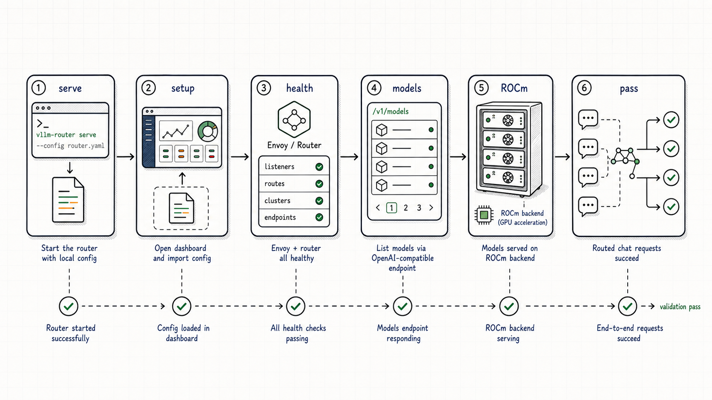

**Figure 10.** Serve、dashboard 导入、router health、列模型、ROCm backend serving、被路由的请求，一条流。

### 11. RouterArena SOTA 刷新

这篇发版更新抓到的 RouterArena 快照里，**vLLM-SR 回到 #1**。公开 [RouterArena leaderboard](https://routeworks.github.io/?p=/leaderboard)：按加权 Arena Score **75.4** 第一，前面是 Sqwish Router、AgentForge Router、Nadir Router 和其他已发布基线。同一快照：**76.0** accuracy，每 1K 查询 **$0.11**，robustness **73.1**。

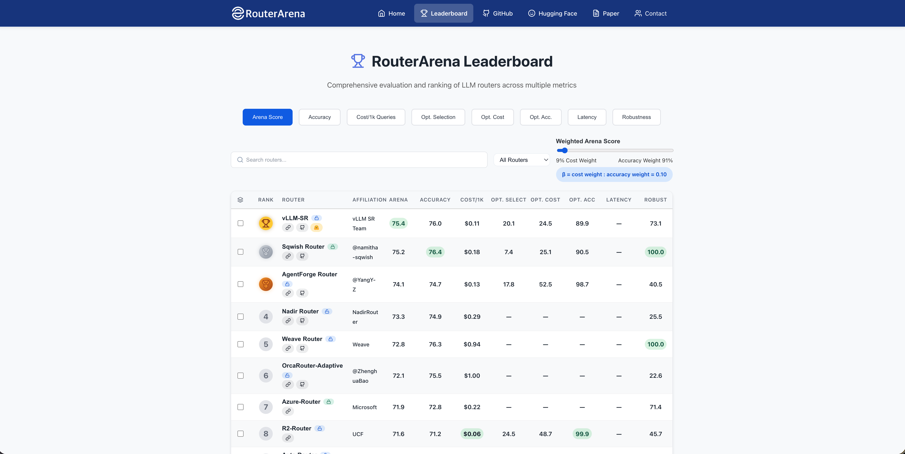

**Figure 11.** Leaderboard 快照：按加权 Arena Score，vLLM-SR 第一。

替代不了发版测试。只是外面的对照：Themis 在改策略、成本感知选模、协议兼容、运维可追溯的同时，独立 router 榜上还站得住。

## 相对 v0.2 改了什么

| 区域 | Themis 的价值 |
| --- | --- |
| API 和 config | 本地、dashboard、Helm、operator 路径上同一份 v0.3 合同 |
| Router 核 | 更富的信号、projection、响应状态、replay、安全、选模算法 |
| 选模 | Session-aware、多因子、latency-aware、RL-driven、hybrid 等 |
| 协议 | 更强的 OpenAI / Anthropic 兼容，翻译行为显式 |
| Dashboard | Setup、topology、status、日志、insights、replay、auth、模型清单拧硬 |
| CLI | 更清楚的 serve 模式、模型检查、chat/eval、config 迁移、平台边界 |
| 部署 | AMD ROCm、OpenVINO binding、NVIDIA 本地透传、Helm/OpenShift/Gateway API 修复、发版制品合同 |
| 存储和检索 | Valkey、Qdrant、Redis、Milvus、replay、cache、memory、向量库生命周期 |
| 可靠性 | 分块 mmBERT attention、UTF-8 显示、安全日志、流式 cache、replay 正确性、并发修复 |

更有能力，也在该硬的地方更受约束。

## 上手

macOS 或 Linux：

```bash
curl -fsSL https://vllm-semantic-router.com/install.sh | bash
```

手工：

```bash
pip install vllm-sr==0.3.0
vllm-sr serve
```

当前目录没有 `config.yaml`，`vllm-sr serve` 会把 dashboard 开在 setup 模式。YAML-first：

```bash
vllm-sr config migrate --config old-config.yaml
vllm-sr serve --config config.yaml
```

AMD ROCm：

```bash
vllm-sr serve --platform amd
```

本地 NVIDIA Docker 透传：

```bash
vllm-sr serve --platform nvidia
```

Kubernetes：

```bash
helm install semantic-router oci://ghcr.io/vllm-project/charts/semantic-router
```

资源：

- 文档：[vllm-semantic-router.com](https://vllm-semantic-router.com)
- GitHub：[vllm-project/semantic-router](https://github.com/vllm-project/semantic-router)
- AMD 参考 profile：[deploy/recipes/balance.yaml](https://github.com/vllm-project/semantic-router/blob/main/deploy/recipes/balance.yaml)
- 模型：[Hugging Face](https://huggingface.co/LLM-Semantic-Router)

## 往前看：v0.4 Hermes

下一版代号 **Hermes**。Themis 让合同稳到能运营。Hermes 该让 router 更快变好、更好评、在真实负载下更安全地适应。核心目标：**会自己变好的 router**。回路：GPU 规模上自动研究 router 性能，用 router 评测拧 DSL recipe，把验证过的证据喂回代码库和 encoder 微调。原文点名的高价值工作：

- **Self-improving router：** GPU 规模性能研究、DSL recipe 调、代码库加 encoder 微调。生成出来的改动仍要可审、可 replay、有版本、能回滚。
- **SAAR 当 agentic 路由层：** 切换经济学、工具环连续、provider 状态可移植、replay 诊断、router 记忆。
- **评测当发版闸：** 系统级和信号级评测，让每个信号、projection、算法、插件、dashboard 路径都能对着代表性流量 replay 再发版。
- **CLI-first：** 每一步都经 `vllm-sr` 闭环——写 config、迁移、serve、检查、评测、replay、策略生命周期、dashboard 导入导出、发版 smoke test。
- **更好的 router 自管模型：** embedding、分类器、多模态、安全信号。
- **更有用的信号：** 请求、响应、工具、modality、身份、新鲜度、延迟、成本、runtime 健康——DSL 不许长成应用代码。
- **Operator 调试环：** what-if 路由、策略 replay、评测驱动的调参、trace 对比，dashboard 一等能力。

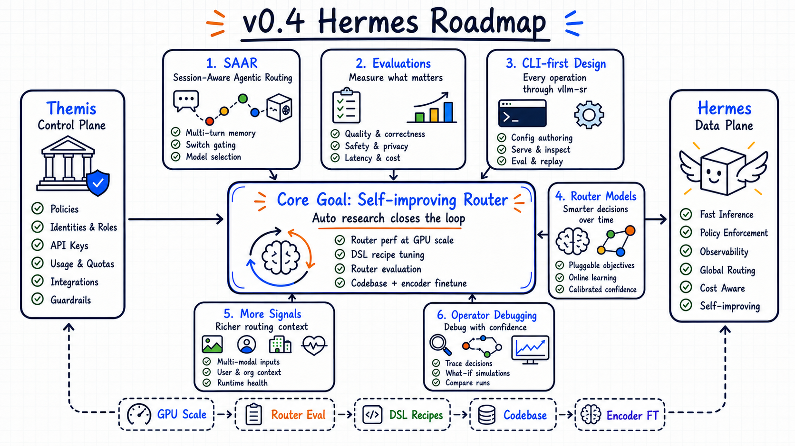

**Figure 12.** Hermes：GPU 规模性能研究、DSL recipe、router 评测、代码更新、encoder 微调。

## 致谢

v0.2.0 到 v0.3.0：超过 **350** 个 commit，**80+** contributor author identity。点名的研究合作：MBZUAI、McGill University、Mila、Rice University。更广的感谢：vLLM、AMD、Intel、Meta、Red Hat、Microsoft、Google、IBM、NVIDIA、Hugging Face、NASA、Nutanix、DaoCloud，以及开源社区。

原文收束：*Welcome to Themis: from signals to stateful production routing.*
