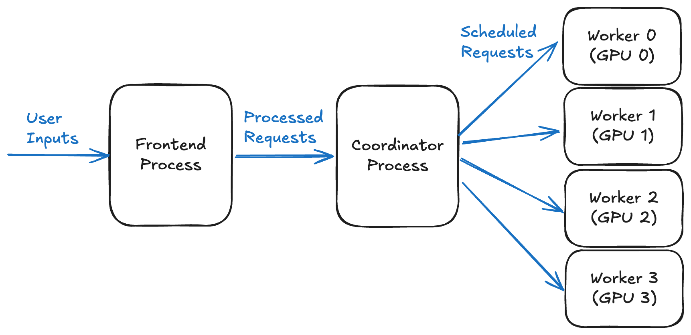
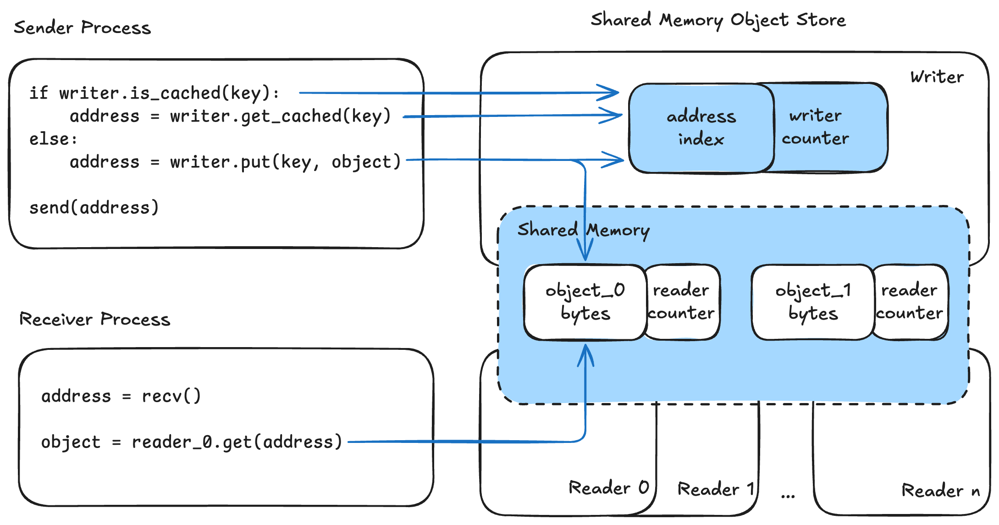
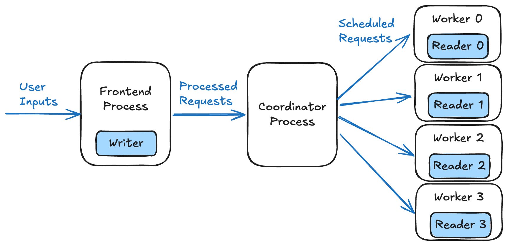

# Shared Memory IPC Cache：大图不要在进程之间复印

英文对照：[en/vllm/blog/serving/shm-ipc.md](../../../../en/vllm/blog/serving/shm-ipc.md)  
原文：https://vllm.ai/blog/2025-11-13-shm-ipc-cache  
2025-11-13。署名 **Donglu Wang (Cohere)**。先发在 [Cohere 博客](https://cohere.com/blog/making-data-transfer-in-llm-systems-faster-leaner-and-more-scalable)。进树：[PR #20452](https://github.com/vllm-project/vllm/pull/20452)。打开：`mm_processor_cache_type = "shm"`。文档：[User Guide 的 IPC caching](https://docs.vllm.ai/en/latest/configuration/optimization/#ipc-caching) / 本地 [optimization.md](../../optimization/optimization.md)。把 ViT 拆到另一栋楼的亲戚：[epd](epd.md)。

页上的头条数字（Command-A Vision、4×A100、VisionArena-Chat）：首次请求 Prefill **+11.5%**，TTFT **−10.5%**；KV 和图像都命中时 Prefill **+69.9%**，TTFT **−40.5%**。输入越大、TP 越宽，越值得开。

本地图（原文版权仍归原站；学习对照用）：







## LLM 推理里的进程间通信

典型的多进程栈三块：**front-end**（接请求、预处理）、**coordinator**（调度与编排）、推理 **worker**（跑模型）。

**Figure 1。** 四卡例子：前端把输入交给 coordinator，coordinator 再分给四个 worker，一卡一个。

每一段通常独占一个进程，才好伸缩、才好异步。数据就只能走 IPC。小输入时这点税可以当没有；输入一变大，IPC 时间会变成瓶颈。

## 问题：同一份大家伙反复传

多模态输入——图、音频、长上下文——可以很大。[`CohereLabs/command-a-vision-07-2025`](https://huggingface.co/CohereLabs/command-a-vision-07-2025) 里，一张最大 **1024×3072** 的图，存成 **int8** 大约 **9 MB**。模型还接受 **多图**，一个请求轻易到 **几十 MB**。

这么大的 IPC 不是免费的。多轮对话或 batch 里，**同一份** 输入可能再传一遍，税会叠。

## 旧方案：mirrored caching

vLLM 已经用 **mirrored caching** 少传重复 IPC。发送方和接收方各维护一份 **复制的** cache，**插入顺序和驱逐策略相同**。发送方命中，就 **假定** 对面也是同一状态，**不再传**。

要命的限制：**输入顺序必须严格一致**。两边处理顺序得一模一样。若把 mirrored cache 放在 worker 上，coordinator 按调度 **重排**，两边就对不齐，行为可能 **错**。

所以 vLLM 只把 mirrored caching 用在 **前端 ↔ coordinator**。coordinator ↔ worker 这条路上：

- **单个 worker：** 和 coordinator **同进程**，根本不必再 IPC。
- **多个 worker：** 退回 **socket** IPC：序列化、传送、反序列化。

## 新方案：Shared Memory IPC Caching

一份共享 cache，发送方和接收方直接看见。不必同序。不必再复印一份载荷。

### Shared Memory Object Store

数据结构：**一个 writer**、**多个 reader**，共用 **同一块** 内存。

**设计**

- **Writer：** 把对象放进共享 **ring buffer**，更新地址索引，把 **地址广播** 给关心的 reader。
- **Reader：** 拿地址从共享内存 **直接读**。

**Figure 2。** 发送进程握着 writer；每个接收进程握着一个 reader。

发一个 key–object（页上省了序列化 / 反序列化）：

1. `is_cached(key)` —— 店里有没有？
2. 命中：`get_cached(key)` → buffer 地址。
3. 未命中：`put(key, object)` 写入共享内存 → 地址。
4. 用默认 IPC 广播这个 **地址**（很小）。
5. 接收方：`get(address)` 从共享内存取对象。

**驱逐与安全**

空间不够，writer 从 **环头** 驱逐。**Reader 计数（共享）** 和 **writer 计数（本地）** 拦住还在用的数据。只有满足下面才赶走：

```
writer_counter × n_readers == reader_counter
```

**原文列的好处**

- **没有顺序假设** —— 进程按什么次序消费都可以。
- **一份共享 cache** —— 占用 **不随 reader 数倍增**。
- **并发读便宜** —— 多人读同一份，同步很少，不再复印。

落到原来的前端–coordinator–worker： **writer 在前端**，**每个 worker 一个 reader**。大图不必再经 coordinator 复印一份。

**Figure 3。** 还是四卡协作，底下换成 Shared-Memory Object Store。

## vLLM 上的成绩

实现：多模态输入，上面那个 PR。页上的配方：

- 模型：[`CohereLabs/command-a-vision-07-2025`](https://huggingface.co/CohereLabs/command-a-vision-07-2025)
- 硬件：**4× A100（80GB），TP=4**
- 数据：[VisionArena-Chat](https://huggingface.co/datasets/lmarena-ai/VisionArena-Chat?ref=cohere-ai.ghost.io)

**首次请求**

| 指标 | Baseline | Shared Memory IPC Cache | 差值 |
| --- | ---: | ---: | --- |
| Prefill 吞吐 | 581.34 tok/s | 648.22 tok/s | **+11.5%** |
| Mean TTFT | 3898.98 ms | 3491.15 ms | **−10.5%** |

快在「前端写一次、工人并发读」——少传重复数据，也少排队等 IPC。

**已缓存的请求**（KV 和图像都复用）

| 指标 | Baseline | Shared Memory IPC Cache | 差值 |
| --- | ---: | ---: | --- |
| Prefill 吞吐 | 2894.03 tok/s | 4917.57 tok/s | **+69.9%** |
| Mean TTFT | 790.18 ms | 470.60 ms | **−40.5%** |

这条路径上 IPC 税特别显眼。输入越大、TP 越宽，IPC 上搬的字节越多，这份 cache 越值钱。

## 当时怎么开

当时已经在 vLLM **main**。多模态缓存：

```
mm_processor_cache_type = "shm"
```

User Guide 见上。原文还说：不只 LLM 推理，凡是 IPC cache 能少传重复数据的地方，这套 store 都能用。

`optimization.md` 多写了一条博客正文没展开的运维边界：API server 横向扩展会关掉这条 **IPC cache**（它要 API 与 engine 一对一）；processor cache 本身不受影响。

## 致谢

Cohere 的 **Bharat Venkitesh**。vLLM 社区：[Cyrus Leung](https://github.com/DarkLight1337)（评审与接入）；[Nick Hill](https://github.com/njhill)、[Roger Wang](https://github.com/ywang96)（早期概念验证）；[Kero Liang](https://github.com/imkero)（报 bug 并帮忙修）。
