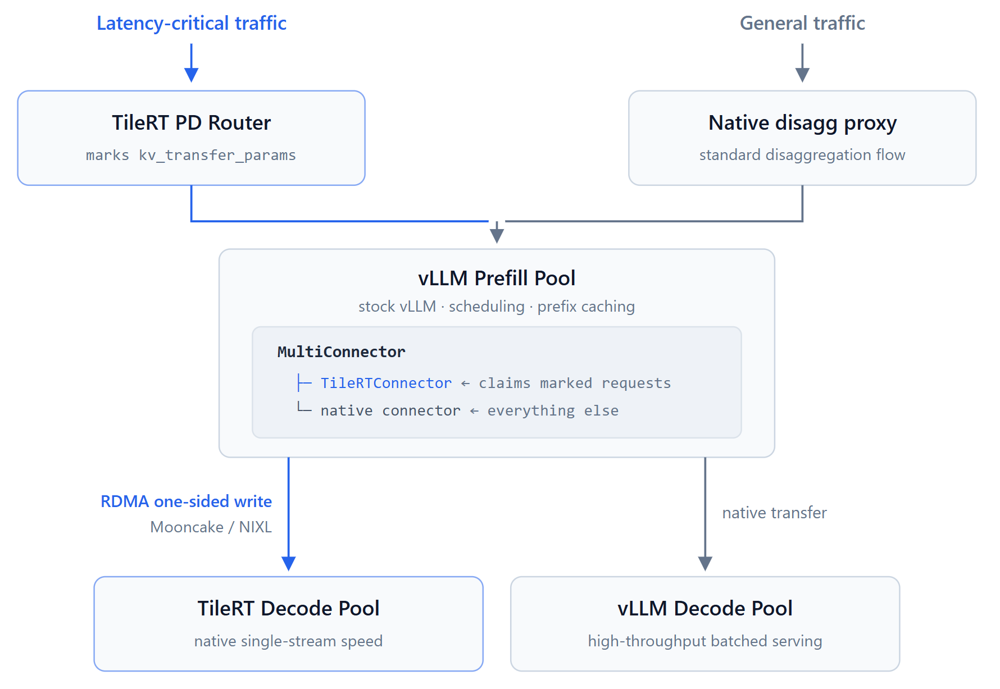
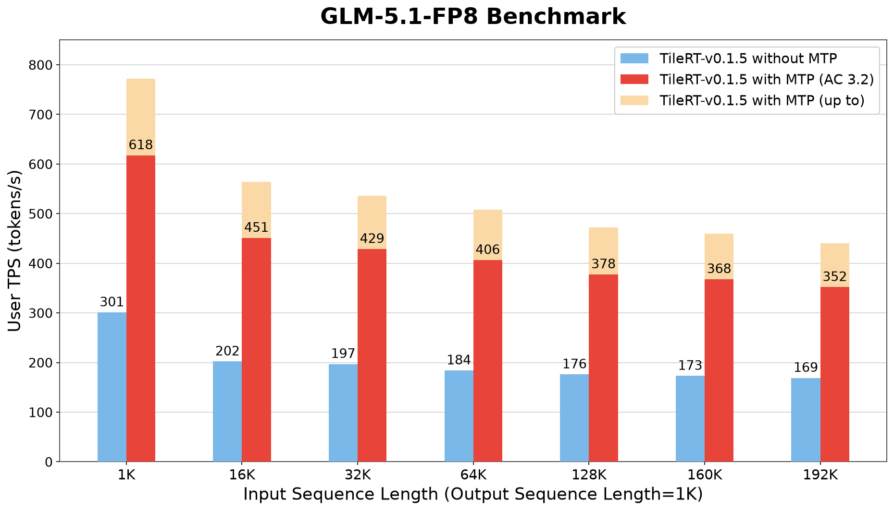

# TileRT：decode 侧零 fork 的 P/D

英文对照：`en/vllm/blog/serving/tilert.md`  
原文：https://vllm.ai/blog/2026-07-14-vllm-tilert-pd  
TileRT 0.1.5，V1 KV Connector。

Prefill 仍用库存 vLLM；decode 交给 TileRT。连接走 V1 connector，**不必 fork vLLM**。当时演示：GLM-5 / 5.1、DeepSeek-V3.2。Prefill 侧要开 MTP；decode 一次一只 in-flight 请求。双池用 MultiConnector + NIXL。

和 [Mooncake](mooncake.md)、[Router](router.md) 一起读：这里 decode 引擎换成 TileRT，不是再写一套 P/D 协议。数字、拓扑、是否生产默认以原文和当时 release 为准。

本地图（原文版权仍归原站；学习对照用）：

