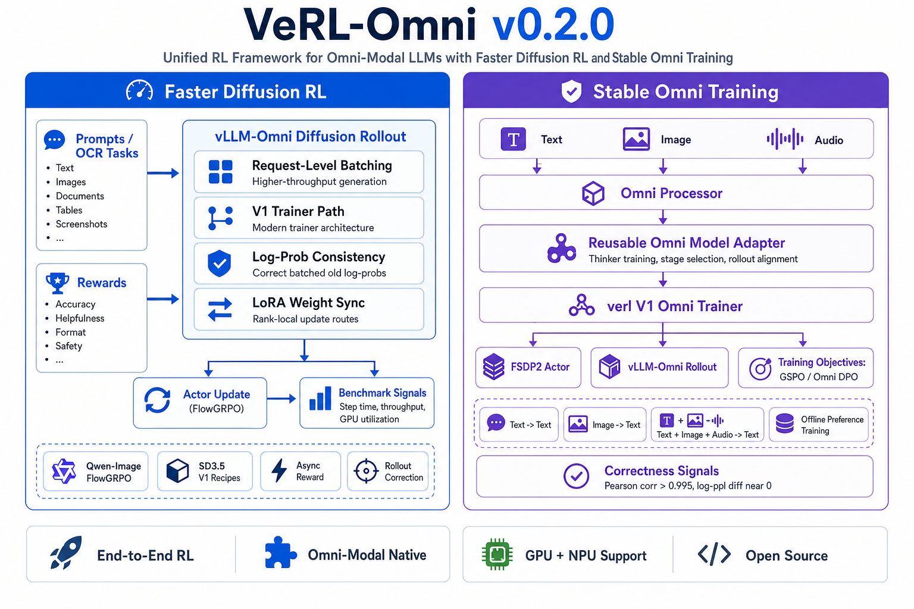
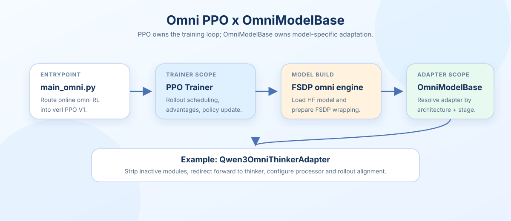

# verl-Omni v0.2：请求级 batch 把 gen 从 226s 压到 108s

英文对照：[en/vllm/blog/serving/verl-omni-v020.md](../../../../en/vllm/blog/serving/verl-omni-v020.md)  
原文：https://vllm.ai/blog/2026-08-20-verl-omni-v0-2-0  
上一篇：[verl-omni](verl-omni.md)。

v0.1 更像「能跑」；v0.2 把生成侧改成请求级 batch。他们报的生成墙钟 **226s → 108s**。MMK12 val **0.833**。RL 步里 rollout 往往是大头——调度从「整批等齐」改成「请求进、请求出」，墙钟才掉。数字仍以原图为准。

本地图（原文版权仍归原站；学习对照用）：

