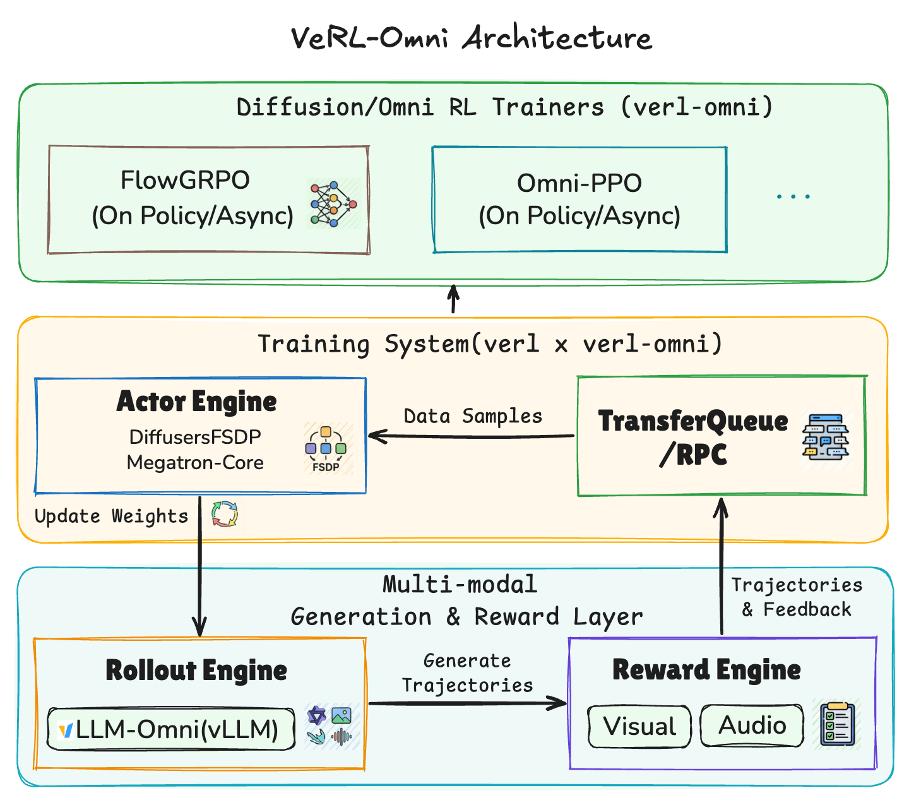
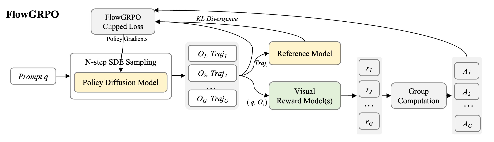
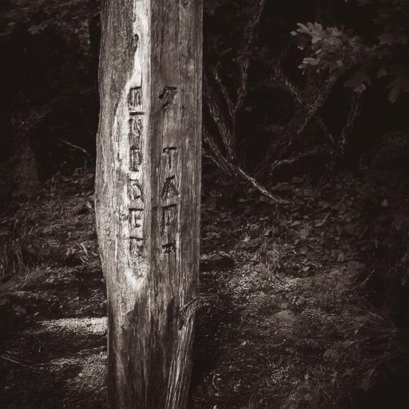
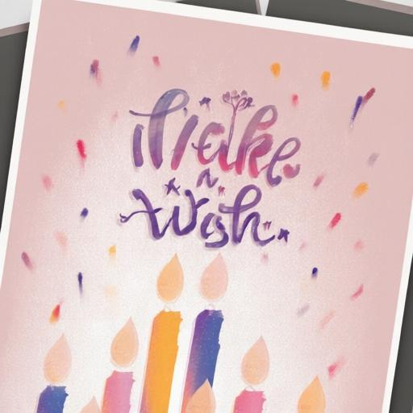
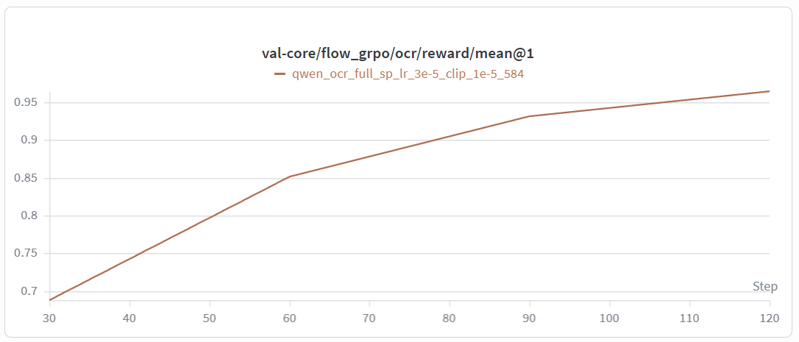
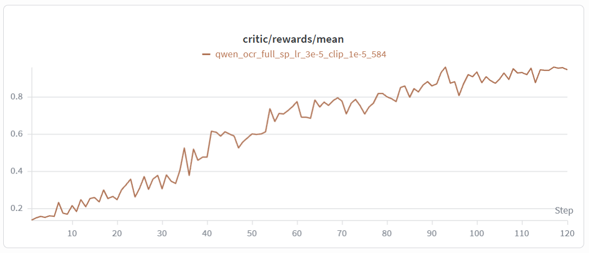
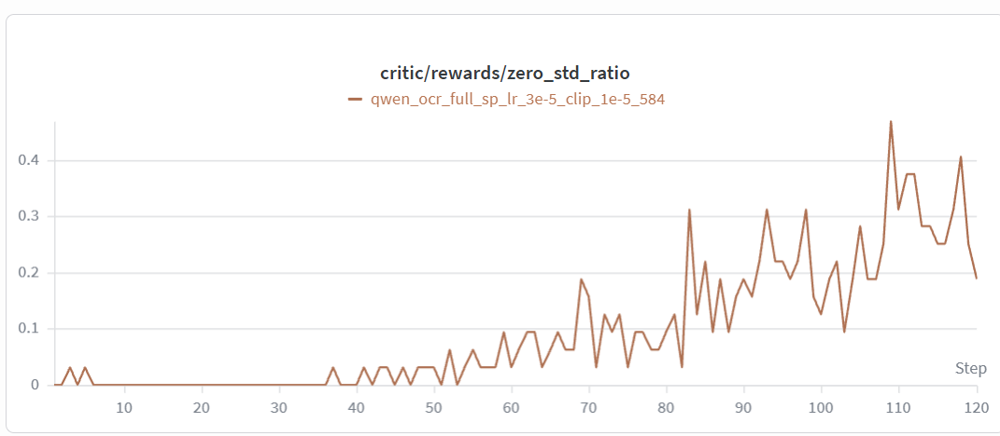
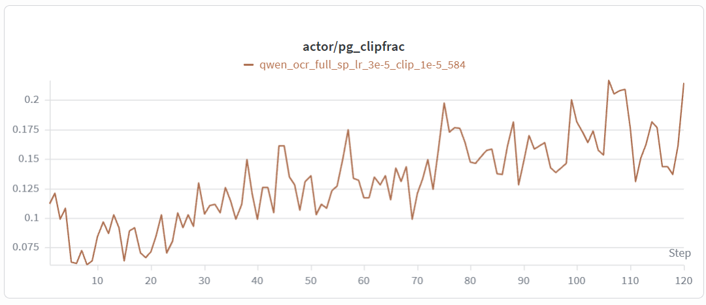

# verl × Omni：扩散 RL 的 rollout 不另起炉灶

英文对照：[en/vllm/blog/serving/verl-omni.md](../../../../en/vllm/blog/serving/verl-omni.md)  
原文：https://vllm.ai/blog/2026-05-14-verl-omni  
H800。v0.2 见 [verl-omni-v020](verl-omni-v020.md)。

训练还在 verl；扩散 rollout 走 vLLM-Omni。FlowGRPO 做 OCR 类奖励。同一套 serve 路径既给推理又给 RL 采样，避免「训练引擎一份权重、推理引擎另一份调度」。数字看原图：吞吐、步时、奖励曲线。接 [Omni](vllm-omni.md)。

本地图（原文版权仍归原站；学习对照用）：

