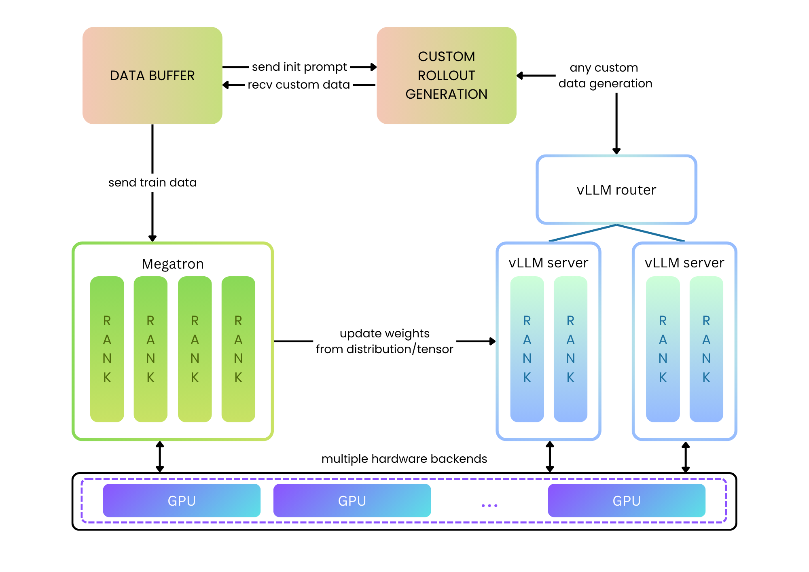
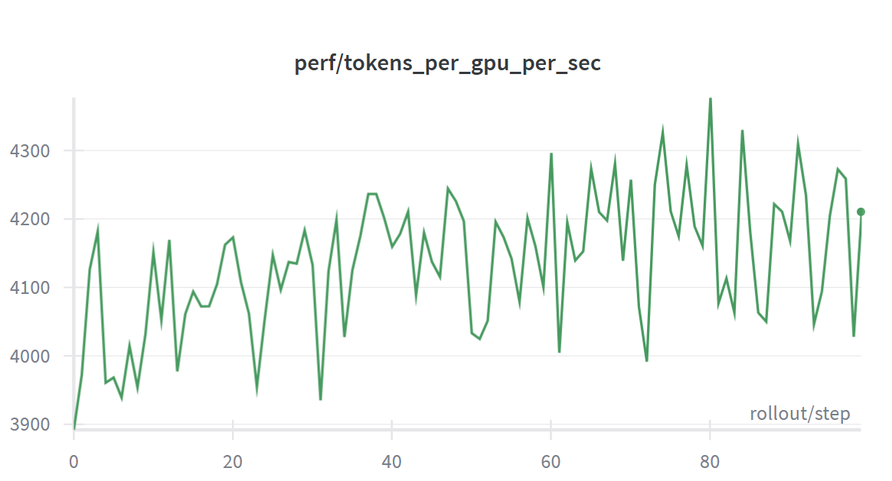
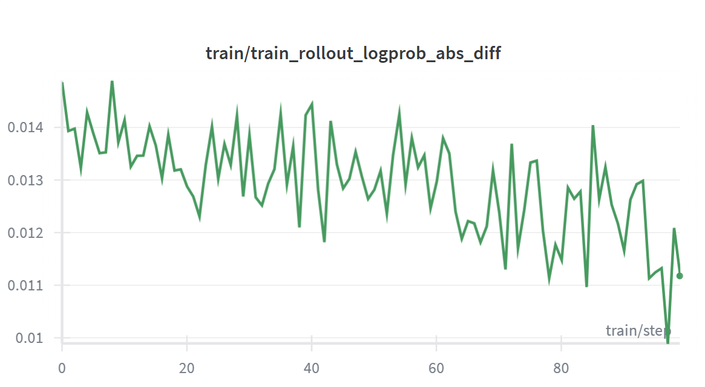
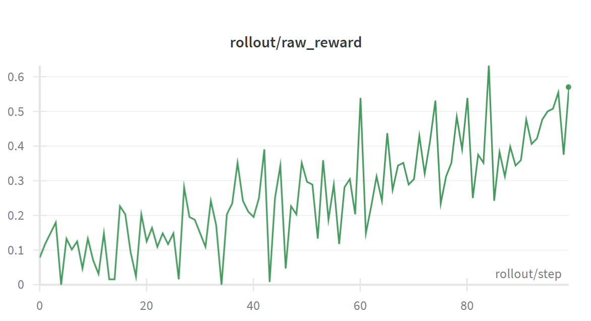

# vime on ROCm：`vllm/vime-rocm`，MI355X 上 Qwen3-8B ~4100 tok/gpu/s

英文对照：`en/vllm/blog/serving/vime-rocm.md`  
原文：https://vllm.ai/blog/2026-07-10-vime-rocm  
主线：[vime](vime.md)。

镜像 `vllm/vime-rocm`。MI355X 上 Qwen3-8B 约 **4100 tok/gpu/s**。logprob 差约 **0.012**——不是 bit-exact，是「训练侧还能认」的量级。ROCm 路径和 CUDA 路径 knobs 同名，不等于 kernel 同形。对表时看他们给的 logprob 差，不要默认 bitwise。

本地图（原文版权仍归原站；学习对照用）：

