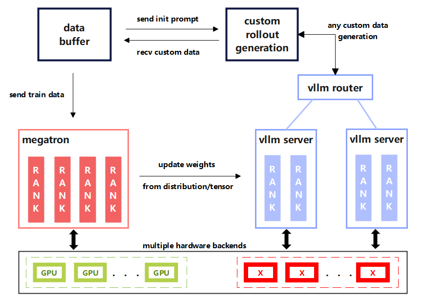
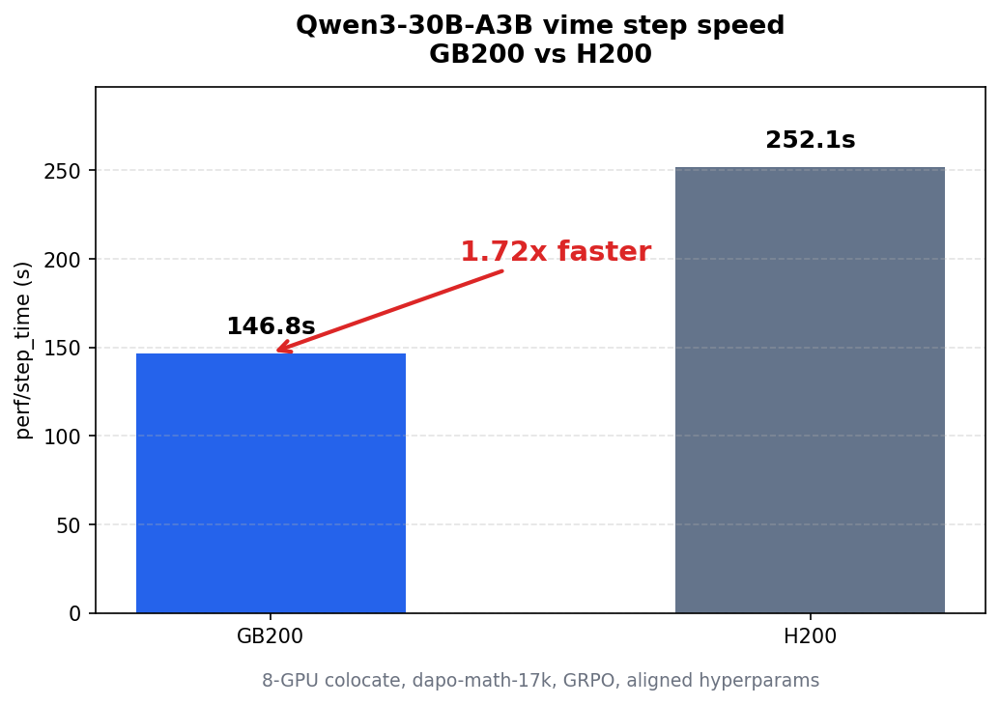
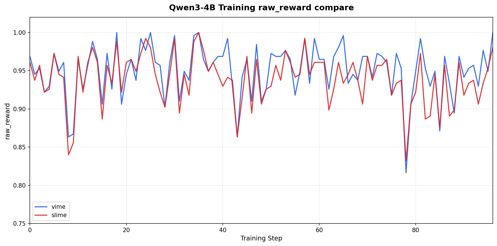
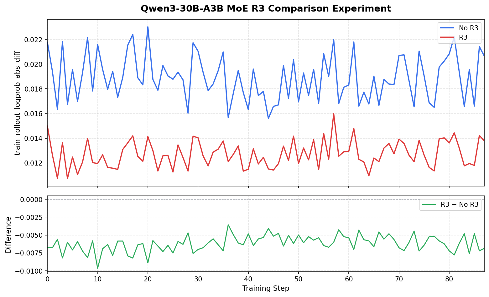
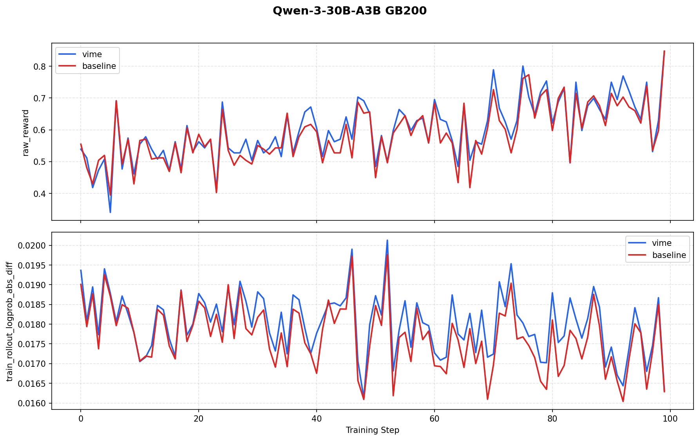
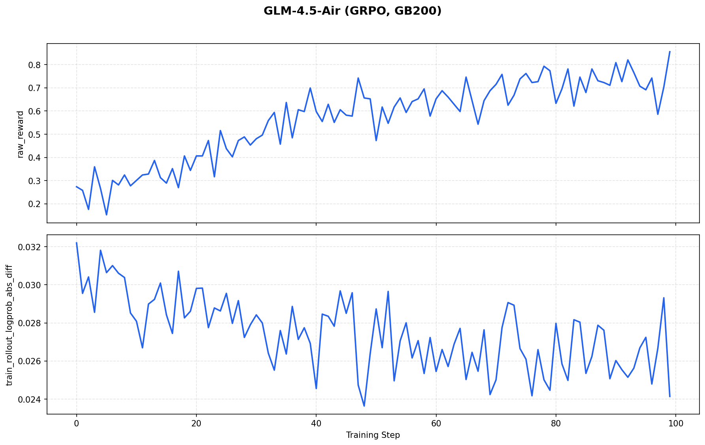

# vime：slime 训练 + vLLM rollout，CLI 用 `--vllm-` 前缀

英文对照：[en/vllm/blog/serving/vime.md](../../../../en/vllm/blog/serving/vime.md)  
原文：https://vllm.ai/blog/2026-06-09-announcing-vime  
ROCm 见 [vime-rocm](vime-rocm.md)。

slime 管训练；vLLM 管 rollout。参数不要两套词典——`--vllm-` 前缀把推理侧 knobs 钉在同一条 CLI。GB200 vs H200 他们报步时约 **1.72×**。RL 里「训练卡」和「采样卡」若各用各的引擎，权重同步和 logprob 对齐都会裂。vime 的主张是同一条 vLLM 路径。

本地图（原文版权仍归原站；学习对照用）：

