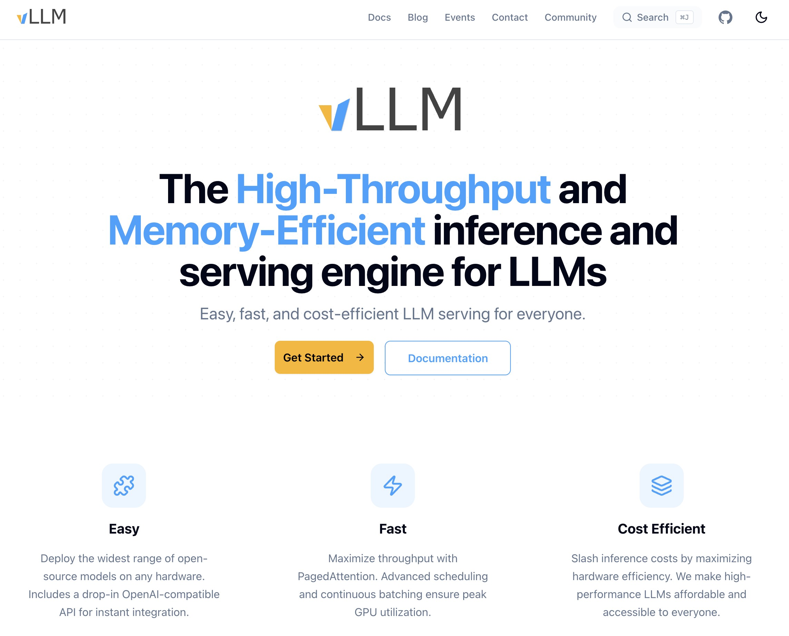
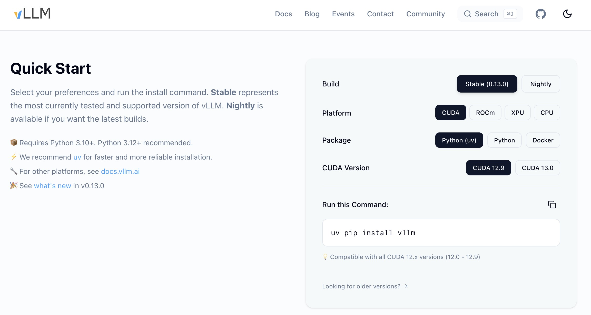
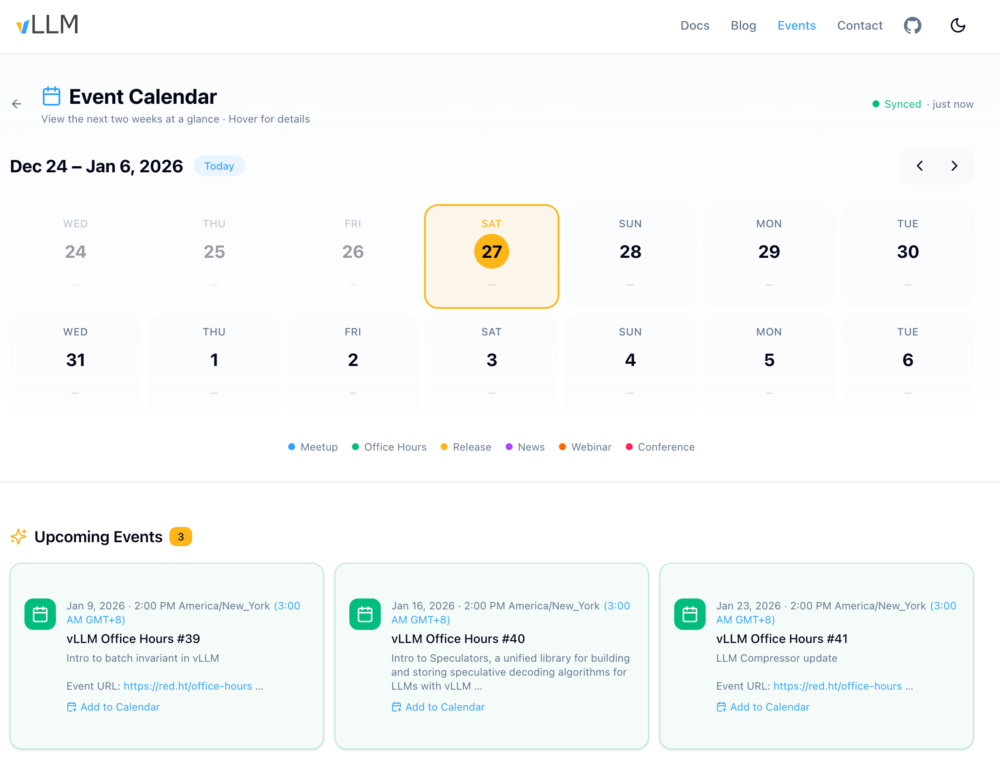

# vllm.ai 网站：活动从 GitHub PR 挪走，代码仓专心合代码

英文对照：`en/vllm/blog/serving/vllm-ai-website.md`  
原文：https://vllm.ai/blog/2025-12-27-vllm-ai-website  

以前 vllm.ai 跳 GitHub。新站有安装选择器和 Events。社区会务不再往主仓塞 PR。反馈 `website-feedback@vllm.ai`。另：`talentpool@` / `collaboration@` / `social-promotion@`。vLLM Daily 仓每日摘要，RSS 跟 commits atom。没有推理数字。

本地图（原文版权仍归原站；学习对照用）：

