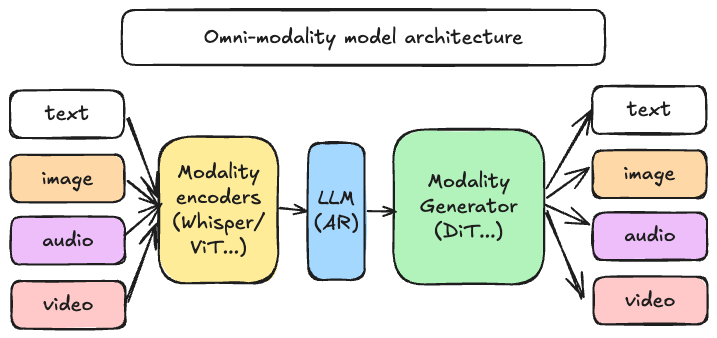
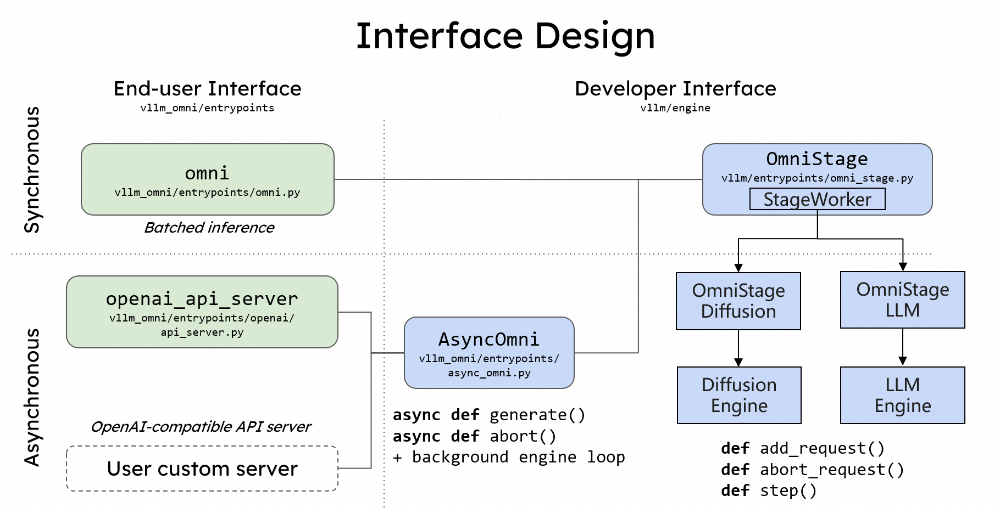
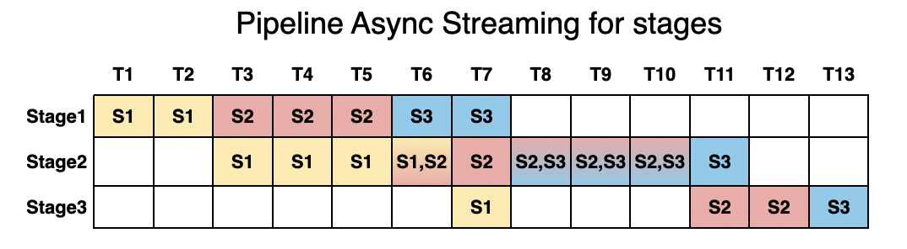
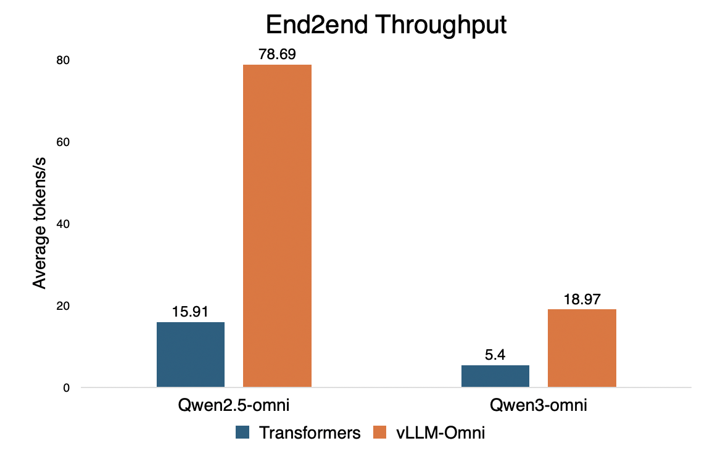
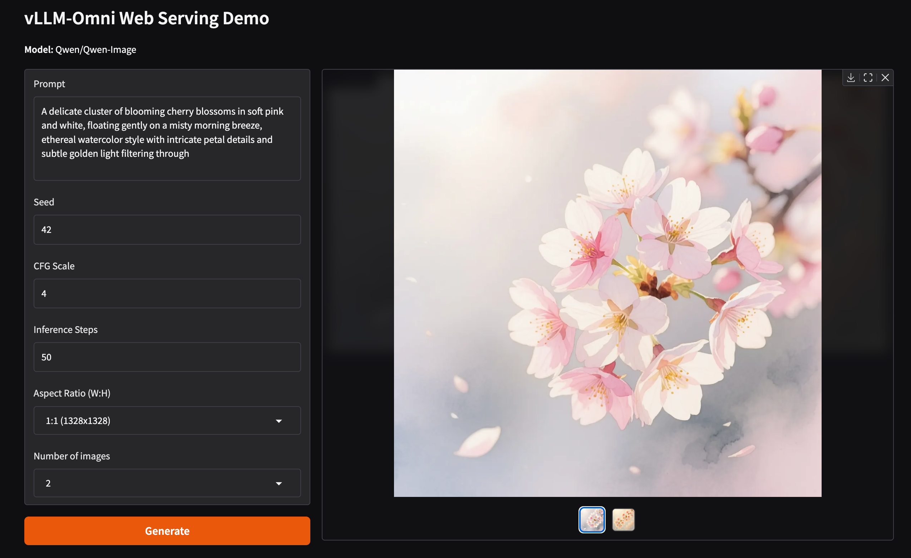

# vLLM-Omni：文本之外的流水线

英文对照：[en/vllm/blog/serving/vllm-omni.md](../../../../en/vllm/blog/serving/vllm-omni.md)  
原文：https://vllm.ai/blog/2025-11-30-vllm-omni  
首发叠在 vLLM v0.11.0 上（v0.11.0rc）。后续 TTS / 扩散 cache / AutoRound / Qwen3-Omni 优化另有专篇。

LLM serving 默认自回归文本。Omni 模型要看、听、说，还夹 DiT 一类非 AR。vLLM-Omni 把请求拆成可分离的 **OmniStage**：模态编码器（ViT / Whisper）→ vLLM LLM 核（文本 + hidden）→ 模态生成器（DiT 等）。阶段流水重叠，Hugging Face 模型 + OpenAI 兼容 API。当时对 Transformers 基线有吞吐对比，数字看原图。

路线图：encoder/prefill/decode/generation 全分离、扩散 DP/TP/TeaCache、硬件插件。Slack `#sig-omni`。这不是把 LLM 当万金油——**阶段异构** 才是这栋楼。

本地图（原文版权仍归原站；学习对照用）：

